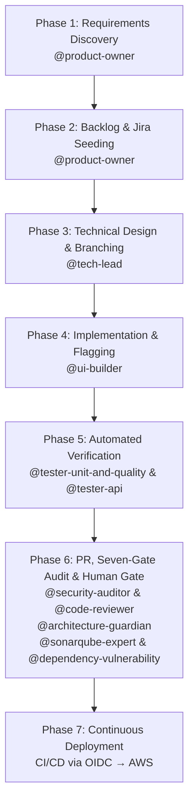

# OpenCode Autonomous Engineering System Blueprint

Architectural Blueprint, Decision Rationale, Multi-Model Diversity, and Operational Guardrail Protocols

---

## Table of Contents

- [1. Introduction & Core Objective](#1-introduction--core-objective)
- [2. Architectural Foundations & Delivery Paradigms](#2-architectural-foundations--delivery-paradigms)
  - [2.1 Walking Skeleton First](#21-walking-skeleton-first-story-1)
  - [2.2 Trunk-Based Development](#22-trunk-based-development-over-gitflow)
  - [2.3 Continuous Deployment](#23-continuous-deployment-deploy-every-passing-commit)
  - [2.4 Feature Flags](#24-decoupling-deployment-from-release-feature-flags)
  - [2.5 Continuous Flow over Timeboxes](#25-continuous-flow-over-timeboxes)
- [3. Multi-Agent Architecture & Model Allocation](#3-multi-agent-architecture--multi-model-allocation-strategy)
  - [3.1 Defence-in-Depth Model Allocation](#31-defence-in-depth-model-allocation)
   - [3.2 Agent Model Matrix](#32-agent-model-matrix)
   - [3.3 Agent Responsibilities](#33-agent-responsibilities)
   - [3.4 Provider Architecture](#34-provider-architecture)
     - [3.4.1 Amazon Bedrock Configuration](#341-amazon-bedrock-configuration)
     - [3.4.2 Provider Switching](#342-provider-switching-via-abstract-model-names)
- [4. Expert Advisory System](#4-expert-advisory-system--curation-strategy)
  - [4.1 Pruning Expert Noise](#41-pruning-expert-noise-why-less-is-more)
- [5. Knowledge Graph — Graphify](#5-knowledge-graph--graphify)
  - [5.1 Cost Optimisation Through Graphify](#51-cost-optimisation-through-graphify)
  - [5.2 Installation — Pinned Repo-Local](#52-installation--pinned-repo-local)
  - [5.3 The .graphify/ State Directory](#53-the-graphify-state-directory)
  - [5.4 Commands Worth Knowing](#54-commands-worth-knowing)
  - [5.5 How Agents Reach the Graph](#55-how-agents-reach-the-graph)
- [6. Context Hygiene & Optimisation](#6-context-hygiene--optimisation-protocols)
  - [6.1 Session Discipline](#61-session-discipline)
  - [6.2 Graphify Integration](#62-graphify-integration)
- [7. Ecosystem Integrations & Governance](#7-ecosystem-integrations--governance-rules)
  - [7.1 Documentation Strategy](#71-documentation-strategy)
  - [7.2 Jira Integration](#72-jira-integration)
  - [7.3 GitHub MCP Integration](#73-github-mcp-integration)
  - [7.4 AWS Security & OIDC](#74-aws-security--passwordless-oidc)
  - [7.5 Mandatory Git Commit Ticket Prefix](#75-mandatory-git-commit-ticket-prefix)
  - [7.6 Local Development Environment](#76-local-development-environment)
  - [7.7 Custom Commands](#77-custom-commands)
  - [7.8 Local Tool Permissions](#78-local-tool-permissions--bash-and-edit)
  - [7.9 Scratch Space — the .tmp/ Convention](#79-scratch-space--the-tmp-convention)
- [8. End-to-End Operational Workflow](#8-end-to-end-operational-workflow)
- [9. How to Adapt This Blueprint](#9-how-to-adapt-this-blueprint)
- [10. Prerequisites](#10-prerequisites)
- [11. Recommended Approach](#11-recommended-approach)
  - [11.1 Sample First Prompt](#111-sample-first-prompt)
- [12. Plugins](#12-plugins)
  - [12.1 Graphify](#121-graphify--knowledge-graph-installed-data-available)
  - [12.2 VibeGuard](#122-vibeguard--secret-redaction-active)
  - [12.3 DCP](#123-dynamic-context-pruning--dcp-active)
  - [12.4 Supermemory](#124-supermemory--cross-session-memory-active)
  - [12.5 Type Inject](#125-type-inject--typescript-type-context-installed)
   - [12.6 Notificator — REMOVED](#126-notificator--desktop-notifications-removed-2026-07-27)
  - [12.7 Scheduler](#127-scheduler--recurring-agent-jobs-installed)
  - [12.8 Goal Plugin](#128-goal-plugin--session-scoped-goals-installed)
  - [12.9 Smart Title](#129-smart-title--automatic-session-titles-installed)

## 1. Introduction & Core Objective

This document outlines the architectural blueprint, design philosophy, and operational guardrails of an enterprise-grade Multi-Agent Software Development System built inside OpenCode. The objective is to transform AI from a basic auto-complete snippet generator into a structured, highly disciplined, and autonomous engineering team capable of planning, executing, auditing, and continuously deploying production code.

Many AI coding setups fail because they treat the AI as a single omniscient developer. In reality, complex software engineering requires distinct division of labour, domain specialisation, rigorous governance, and automated verification. This framework establishes an interconnected ecosystem of sub-agents and expert advisory personas that mirror a high-performing human software organisation while maintaining strict human-in-the-loop safety controls.

**Core Philosophy:** The goal is not to eliminate human oversight, but to elevate human engineers from manual coders to strategic orchestrators — spending minutes reviewing pre-tested, fully compliant Pull Requests instead of hours writing baseline code.

---

## 2. Architectural Foundations & Delivery Paradigms

To avoid common pitfalls — scope creep, architectural drift, monolithic pull requests, and broken deployment pipelines — the system is governed by five non-negotiable delivery paradigms.

### 2.1 Walking Skeleton First (Story #1)

Story #1 of any new initiative is explicitly designated to build a minimal end-to-end slice: compiling code, running a passing test, building via CI/CD, and deploying a lightweight health-check endpoint to production. This establishes the delivery pipeline before any business logic is written, reducing integration risk from day one.

### 2.2 Trunk-Based Development over GitFlow

AI sub-agents perform best when feedback loops are extremely tight. All agent work is conducted on short-lived topic branches that merge directly back into `main` via small, frequent Pull Requests. Long-lived feature branches are strictly prohibited, avoiding merge conflicts, drift, and context staleness.

### 2.3 Continuous Deployment (Deploy Every Passing Commit)

Every commit merged to `main` automatically triggers the full testing suite. If unit, API, static analysis, and security checks pass, the CI/CD pipeline immediately executes a zero-downtime deployment to production.

### 2.4 Decoupling Deployment from Release (Feature Flags)

Incomplete user stories must never expose unready capabilities to end users. All incomplete features are wrapped in feature flags defaulting to `OFF` in production. This allows continuous deployment of passing code while granting the Product Owner complete control over when a feature is activated.

### 2.5 Continuous Flow over Timeboxes

Work is pulled continuously rather than batched into sprints. A sprint is a batching device that exists to give humans a commitment horizon and to protect their attention from mid-flight reprioritisation — costs an agent team does not incur, since agents retain nothing between sessions and so have no context-switch penalty to amortise. Batching work into a fortnight would therefore add latency without buying anything, and it contradicts §2.2 and §2.3, which already commit the system to small frequent merges and a deployment per passing commit. The tracker runs as a continuous-flow board with an explicit work-in-progress limit on *In Progress*, sized to the reviewer's capacity rather than to agent throughput; progress is measured by cycle time, not velocity. See [ADR-010](../../docs/adr/ADR-010-continuous-flow-over-sprints.md).

#### Why Scrum's Ceremonies Don't Transfer

Scrum's ceremonies are a coordination protocol for teammates who are **opaque** (their progress is invisible until spoken aloud), **forgetful over long horizons but continuous over short ones**, **fatigue-prone**, and **expensive to interrupt**. Agents are the inverse: transparent, stateless, tireless, and free to interrupt. Most of the protocol therefore addresses constraints that no longer exist — but not all of it, and the parts that survive are the parts that were never coping mechanisms in the first place.

| Scrum element | The human constraint it exists to address | Transfers? |
|---|---|---|
| Sprint timebox | Humans need a commitment horizon; switching context across days is costly | **No** — agents have no continuity between sessions, so there is no switch cost to amortise |
| Sprint Planning | Working memory can't hold a whole backlog; a small committed set is digestible | **No** — but prioritisation survives; the timebox goes, not the ordering |
| Daily Standup | A teammate's progress and blockers are invisible until spoken aloud | **No** — agent state is fully inspectable: transcript, tool calls, `git log` |
| Sprint Review | Stakeholder attention must be booked; humans need a social forcing function to show work | **Partly** — see the cadence risk below |
| Retrospective | Humans won't pause to reflect under delivery pressure; lessons accrete slowly | **Inverted** — agents retain nothing between sessions, so reflection must be an immediate write to a durable file, never a fortnightly meeting |
| Velocity / story points | Human throughput varies and can't be measured directly; relative sizing beats absolute estimates | **No** — agent cost is tokens, iterations and reviewer time |
| Sprint Goal | Focus and motivation for a group of people | **No** |
| Definition of Done | A quality contract, not a coping mechanism | **Yes** — and must get *stronger* |
| Product Backlog | Value ordering, not a coping mechanism | **Yes** |

**The bottleneck has inverted.** Agent throughput is nearly free; the scarce resource is the user's review and merge capacity — now structurally enforced, since branch protection routes every change through a pull request only the user can merge (§7.3). A WIP limit targets that bottleneck directly. Velocity is blind to it, because it measures the side of the system that is no longer constrained.

> **The cadence risk, stated honestly.** Scrum's rhythm also served the stakeholder: it guaranteed that work was shown and reflected upon at a known interval. Dropping every timebox risks "continuous" quietly becoming "never". The mitigation is an **event-driven retrospective**, triggered by a defect escape or any genuine surprise rather than by the calendar, whose output is written *immediately* to `AGENTS.md`, this blueprint, or an ADR — because those files are what the next session boots from, and a lesson left in a transcript is a lesson lost. This depends entirely on the user initiating it: nothing in the agent configuration triggers it automatically.

---

## 3. Multi-Agent Architecture & Multi-Model Allocation Strategy

### 3.1 Defence-in-Depth Model Allocation

To eliminate systematic blind spots, authoring agents (who write code and infrastructure) and auditing agents (who review and check security) run on distinct model families or reasoning architectures. This prevents auditors from inheriting the exact same training biases, logic gaps, or hallucinations as the authors.

> **"Independent" has two degrees, and they are not interchangeable.** Every claim of review independence in this document and in the ADRs means one of exactly two things, so use the precise word:
>
> - **Family-independent** — reviewer and author sit in different model families or reasoning architectures. This is what the paragraph above requires and the only degree that defends against a *shared training bias*: a blind spot common to every model in a family survives any amount of review from within it. On the current Bedrock mapping there are **three** family boundaries: `MODEL_C`/`MODEL_E` (`qwen.qwen3-coder-480b-a35b-v1:0`) against `MODEL_A`/`MODEL_B`/`MODEL_D` (all Anthropic Claude), and — added 2026-08-21 by [ADR-046](../../docs/adr/ADR-046-gate-model-capability-floor.md) — `MODEL_F` (`minimax.minimax-m2.5`), which sits outside both, and — added 2026-08-24 by [ADR-059](../../docs/adr/ADR-059-code-review-gate-on-its-own-model-tier.md) — `MODEL_G` (`zai.glm-5`), which sits outside all three.
> - **Model-independent** — reviewer and author run different model IDs from the *same* family, as `MODEL_A` (`claude-opus-5`) does against `MODEL_B` (`claude-sonnet-4-6`). Different weights and a different reasoning scale catch a genuine class of error — the author's specific arithmetic slip, dropped requirement or misread line — but not a bias the family holds in common. This is the **weaker** guarantee, and until 2026-08-21 it was all that any review inside the reasoning tiers could offer. It still describes `MODEL_B` reviewing `MODEL_A`'s output, but it is no longer the ceiling: the two gates on `MODEL_F` are family-independent of every authoring tier (ADR-046).
>
> A review that is neither — identical model ID on both sides — is not review at all in the sense §3.1 means, and `/trace` reports it as `RISK … self-review`. Never write "independent" unqualified where the distinction decides whether a claim is true; the Separation Invariant below is stated in these terms, and [ADR-022](../../docs/adr/ADR-022-agent-model-tier-governance.md) records where each degree does and does not hold.

### 3.2 Agent Model Matrix

| Agent | Primary Role | Model | Family (Zen) | Role | Temp |
|---|---|---|---|---|---|---|
| @product-owner | Requirement Discovery & BDD Criteria | `{env:MODEL_B}` | Anthropic | Author | 0.3 |
| @tech-lead | Planner & Sub-Agent Dispatcher | `{env:MODEL_A}` | Anthropic | Planner | 0.1 |
| @devops-engineer | Terraform, CDK & CI/CD | `{env:MODEL_C}` | OpenAI | Author | 0.1 |
| @architecture-guardian | C4 Models, Domain Boundaries & ADRs | `{env:MODEL_F}` | MiniMax | Audit | 0.2 |
| @db-designer | Schemas, DDL Migrations & Queries | `{env:MODEL_C}` | OpenAI | Author | 0.1 |
| @ui-builder | Frontend & WCAG 2.2 AA Standards | `{env:MODEL_E}` | Google | Author | 0.3 |
| @tester-unit-and-quality | Unit Tests, Coverage & Mutation Testing | `{env:MODEL_B}` | Anthropic | Audit | 0.1 |
| @tester-api | API Contract & Payload Verification | `{env:MODEL_B}` | Anthropic | Audit | 0.1 |
| @security-auditor (Audit) | Cybersecurity Audit & OWASP Top 10 | `{env:MODEL_F}` | MiniMax | Audit | 0.0 |
| @code-reviewer (Audit) | Static Code Review & SOLID Compliance | `{env:MODEL_G}` | Z.AI | Audit | 0.1 |
| @sonarqube-expert (Audit) | SonarQube Issue Ratchet Adjudication | `{env:MODEL_F}` | MiniMax | Audit | 0.1 |
| @dependency-vulnerability (Audit) | Trivy CVE Scan Adjudication | `{env:MODEL_F}` | MiniMax | Audit | 0.1 |
| @performance-engineer | Load testing, k6, latency/throughput SLOs | `{env:MODEL_C}` | OpenAI | Author | 0.2 |
| **Expert Advisors** | | | | | |
| @expert-alex-xu | Distributed Systems & System Design | `{env:MODEL_A}` | Anthropic | Advisory | 0.2 |
| @expert-dave-farley | Continuous Delivery & TDD | `{env:MODEL_B}` | Anthropic | Advisory | 0.1 |
| @expert-kent-beck | TDD & XP | `{env:MODEL_B}` | Anthropic | Advisory | 0.2 |
| @expert-uncle-bod | SOLID & Clean Architecture | `{env:MODEL_A}` | Anthropic | Advisory | 0.2 |

> **Model References:** The `Model` column shows the abstract name (`{env:MODEL_X}`). Agent files carry **no** `model:` frontmatter — the assignment lives in the `agent` block of `.opencode/opencode.json`, which is the single authoritative table, and each entry resolves its `{env:MODEL_X}` placeholder from `.env` at startup. A key in that block which no longer matches an agent filename silently drops that agent to the global default (`{env:MODEL_A}`) with no error, so the block must be re-checked whenever an agent is renamed. The `Family` column lists the vendor when using OpenCode Zen; it changes when switching providers.

> **Separation Invariant:** Every *delegated authoring* agent uses `MODEL_C` (or `MODEL_E`); every agent that audits its output uses `MODEL_B` or `MODEL_F` (and, until 2026-08-21, `MODEL_A`). Where that holds, no artefact is reviewed by the model family that produced it, satisfying §3.1. **It is not unconditional, and this document does not claim it is.** From 2026-08-21 until 2026-08-24 there was exactly **one** documented exception, not two: *test* code, because the two tester gates author tests from `MODEL_B` and `@code-reviewer` reviewed them from the same tier (blockquote immediately below, and [ADR-022](../../docs/adr/ADR-022-agent-model-tier-governance.md)). **That exception is now closed as well, and the one that survives today is a different artefact class — architecture documentation.** The dated amendments at the end of this blockquote carry the current position and are what any restatement must cite; the sentences between here and them describe the position as it stood on 2026-08-21. The second exception — *production* code authored by the primary agent or `@tech-lead` rather than delegated — was **closed** by [ADR-046](../../docs/adr/ADR-046-gate-model-capability-floor.md), which moved `@architecture-guardian` and `@security-auditor` off `MODEL_A` onto `MODEL_F`: that code is still authored on an auditor-*family* model, but no gate shares that family any more, so the review of it is family-independent. Do not cite two exceptions after that date. The invariant is therefore a guarantee about *delegated* work, not about the repository as a whole — cite it that way, and use `/trace` to find out which case a given story actually falls in. In any such exception the best guarantee still available is **model**-independence and never **family**-independence (§3.1), because reviewer and author then sit inside one family — in the 2026-08-21 test-code case both were inside the Anthropic tiers. Where the two share a single model *identifier*, as `@security-auditor` and `@architecture-guardian` do on `MODEL_F` in the exception that survives today, not even that weaker degree applies. Either way the residual protection must be named with the weaker word and never called simply "independent". @product-owner is the one auditor-family "Author", but it authors requirements rather than code and sits outside the review path, so it does not weaken the invariant. **When reassigning any model, re-check this table: moving an author onto the auditors' family, or an auditor onto the authors', silently collapses the guarantee.** **Amended 2026-08-24 ([ADR-059](../../docs/adr/ADR-059-code-review-gate-on-its-own-model-tier.md)):** the test-code exception above is now **closed**, and the count of documented exceptions is **zero — for production code, infrastructure and test code**. `@code-reviewer` moved off `MODEL_B` onto its own tier `MODEL_G` (`zai.glm-5`, a sixth family), so it no longer shares a model identifier with the `MODEL_B` tester gates whose tests it reviews, and every remaining gate-versus-author pair over those three artefact classes is family-independent. **That is not the same as unconditional, and no restatement may drop the qualifier.** `@security-auditor` remains on `MODEL_F` alongside `@architecture-guardian`, which *authors* ADRs and C4 models, so **architecture documentation** is still reviewed by a tier-mate at one model identifier — neither model- nor family-independent. That surviving overlap is now a declared, justified allow-list entry in `SeparationInvariantTest`, which fails `./mvnw verify` on any undeclared overlap over the three code classes, so the sentence above is no longer prose alone. **Amended 2026-09-02 ([ADR-061](../../docs/adr/ADR-061-two-new-dod-gates-sonar-ratchet-and-cve.md)):** two gates were added — `@sonarqube-expert`, reviewing production and test code, and `@dependency-vulnerability`, reviewing production code and infrastructure — and **both landed on `MODEL_F` without adding an exception**, so the count above still reads zero for those three artefact classes and the allow-list still holds exactly one entry. That is a property of what the two new agents *author*, which is nothing: the only `MODEL_F` author is `@architecture-guardian`, and neither new gate reviews architecture documentation, so no gate-versus-author pair on that tier gained a collision. It is worth stating explicitly because a reader counting agents on `MODEL_F` now finds four and might reasonably expect the exception count to have moved with it. What did move is `MINIMUM_AGENTS` (15 → 17) and `MINIMUM_COMPARISONS` (18 → 27) in that test, the second because the gate-versus-author pairs it actually evaluates rose from 21 to 30.

> **The two testers are gates first, authors second — they belong on the auditor family.** **Read the dated amendments at the end of this blockquote before quoting anything in it.** Two of the present-tense claims about model pins below were accurate when written and are false today; they are kept only as the historical record, and the amendments say which they are. This document originally classified @tester-unit-and-quality and @tester-api as `MODEL_C` "Authors" because they write test code. That classification was wrong in effect: both are named gates in the §12.8 Definition of Done, so a story cannot complete without a verdict from each, and a gate that cannot hold its Sign-off Contract blocks delivery just as surely as a red build. Both were moved to `MODEL_B` after failing in exactly that way on `MODEL_C` — `tester-unit-and-quality` needing three dispatches and once recommending a merge of a red build, and `tester-api` (which failed under EOP-26 and was remediated by EOP-46) returning `VERDICT: APPROVE` on four consecutive dispatches with none of the contracted evidence, once substituting headings of its own for the brief's required outputs and once claiming its evidence sat in a markdown document it was never permitted to write. This does **not** add a production-code exception, and the qualification matters: the artefacts *they* author are tests, never production code or infrastructure, so this change leaves the delegated-production-code guarantee exactly as it was. (It was already not universal — see the primary-agent exception below — but that is a separate, older gap, not one this change creates.) For the tests themselves the invariant is genuinely narrowed, and understating that would repeat the failure this change exists to fix. On the current Bedrock mapping `@code-reviewer` and both testers resolve to the **same model ID**, not merely the same family, so `@code-reviewer` reviewing a tester-authored test is identical weights judging identical weights — neither degree of independence in §3.1 applies. What remains for test code is **two model-independent gate reviewers** — `@architecture-guardian` and `@security-auditor`, both on `MODEL_A` — and nothing family-independent at all: `MODEL_A` and `MODEL_B` are both Anthropic Claude, so no reviewer of a tester-authored test sits outside the author's family. Say it in those words rather than calling the survivor "independent" — the weaker degree is what the pins actually deliver, and overstating it would repeat in miniature the failure this change exists to fix. **Amended 2026-08-21 ([ADR-046](../../docs/adr/ADR-046-gate-model-capability-floor.md)):** the two sentences immediately above were accurate when written and are now false. `@architecture-guardian` and `@security-auditor` moved to `MODEL_F` (`minimax.minimax-m2.5`), which is a different family from `MODEL_B`, so tester-authored tests gained a **family**-independent reviewer for the first time — two of them. What is unchanged is the `@code-reviewer`/tester overlap in the sentence before: those three still resolve to one model ID, so the narrowing of the invariant for test code survives in that narrower form. `/trace` will emit a `RISK … self-review` line for that overlap on any story where a tester writes a test; **it is a true positive and must not be silenced.** The trade was accepted because a gate that cannot hold its contract corrupts every story, whereas same-model review degrades one artefact class that is never shipped. **The rule to carry forward is that no DoD gate agent may sit on `MODEL_C`/`MODEL_E`** — expressed since 2026-08-21 as a capability floor plus a passing probe rather than as a list of permitted tier names, with those two tiers ineligible as a *consequence* of the floor (neither is reasoning-capable) rather than by name. Recorded as [ADR-022](../../docs/adr/ADR-022-agent-model-tier-governance.md) as amended by [ADR-046](../../docs/adr/ADR-046-gate-model-capability-floor.md); reversing it requires a superseding ADR, not an edit to a tier table. **Amended 2026-08-24 ([ADR-059](../../docs/adr/ADR-059-code-review-gate-on-its-own-model-tier.md)):** two claims in this paragraph are now out of date and are kept only as the historical record. First, `@architecture-guardian` and `@security-auditor` moved to `MODEL_F` on 2026-08-21 (ADR-046), not `MODEL_A`. Second, and the reason this story exists: `@code-reviewer` no longer resolves to the same model identifier as the two testers. It sits on `MODEL_G` (`zai.glm-5`), a family none of the authoring tiers occupies, so a tester-authored test is now reviewed **family-independently** rather than by identical weights, and the narrowing this paragraph disclosed for test code is closed. `SeparationInvariantTest` fails the build if the pin is ever moved back.

> **The invariant is a property of the `.env` values, not of this table.** On OpenCode Zen it holds because `MODEL_C` is OpenAI and `MODEL_A`/`MODEL_B` are Anthropic. On Bedrock it was **nominal from the first day of use until 2026-08-05**: `MODEL_A` through `MODEL_D` were all Anthropic Claude (Opus, Sonnet, Haiku, Haiku), so every author and every auditor shared one family and the guarantee existed only on paper. It was worse than a no-op, because the authoring agents sat on Haiku — the weakest model in the set — while Opus reviewed them, inverting the sensible allocation. It is now restored by pointing `MODEL_C` and `MODEL_E` at `qwen.qwen3-coder-480b-a35b-v1:0`, and was **extended on 2026-08-21** by pointing `MODEL_F` at `minimax.minimax-m2.5`, a third family, so the two gates that review `MODEL_A`'s own output no longer share its family either. It was **extended again on 2026-08-24** ([ADR-059](../../docs/adr/ADR-059-code-review-gate-on-its-own-model-tier.md)) by pointing `MODEL_G` at `zai.glm-5`, a sixth family, so the gate that reviews test code no longer shares a model identifier with the tester gates that write it. Because the invariant lives in these values rather than in any table, it is now also machine-checked: `SeparationInvariantTest` resolves every pin in `.opencode/opencode.json` against the active block of `.env.example` and fails the build on an undeclared overlap. See §3.4.2 for the tested model catalogue.

> **The primary agent is not covered by the invariant.** `small_model` aside, the global default is `MODEL_A`, so the agent you converse with in the TUI (`build`) runs on an *auditor-family* model. If it authors code itself rather than delegating to the `MODEL_C` agents, the artefact is authored and audited by the same family and no later review repairs that. This is not hypothetical: story EOP-10 was written entirely by the primary agent, and the retrospective `@security-auditor` pass over it ran on `MODEL_A` — literally the same model clearing its own output. **Amended 2026-08-21 ([ADR-046](../../docs/adr/ADR-046-gate-model-capability-floor.md)):** that EOP-10 account is kept as the historical record and can no longer recur. `@security-auditor` and `@architecture-guardian` both moved to `MODEL_F`, so no gate shares `MODEL_A`'s family and a primary-agent-authored artefact is now reviewed family-independently by both. The narrower residue is that authoring still happens on an auditor-*family* model, and — until 2026-08-24 — `@code-reviewer` remained on `MODEL_B`, so that one gate was only model-independent of it. [ADR-059](../../docs/adr/ADR-059-code-review-gate-on-its-own-model-tier.md) moved `@code-reviewer` to `MODEL_G` (`zai.glm-5`), so all three of `MODEL_A`'s code-reviewing gates are now family-independent of it. Use `/trace` (see `tools/agent-trace.py`) to detect this; it reports a `RISK` line naming the agents involved.

> **Security Note:** The Security Auditor agent is configured with a temperature of **0.0** — the lowest possible value. This is intentional: security auditing must prioritise deterministic, repeatable analysis over creative variation. Any hallucination in a security audit could introduce undetected vulnerabilities, so the system guarantees maximum rigour by eliminating output randomness.

### 3.3 Agent Responsibilities

**@product-owner** — Drives requirement discovery, challenges premature technical solutions, writes INVEST stories with BDD Gherkin criteria, mandates Walking Skeleton, manages feature flag release status, and tracks defects.

**@tech-lead** — Acts as system planner and engineering dispatcher. Advises on technical trade-offs, coordinates sub-agent execution pipelines, enforces Trunk-Based rules, and maintains architectural integrity.

**@devops-engineer** — Generates Infrastructure-as-Code (Terraform / AWS CDK), constructs CI/CD workflows, configures cloud OIDC authentication, and manages continuous deployment pipelines.

**@architecture-guardian** — Maintains C4/arc42 architectural models, enforces domain boundaries, reviews system design, and documents Architecture Decision Records (ADRs).

**@db-designer** — Designs relational and document schemas, writes migration scripts, optimises query performance with execution plan verification, and manages index strategies.

**@ui-builder** — Implements user interfaces conforming to accessibility standards (WCAG 2.2 AA / GOV.UK Design System) and wraps UI components in feature flags.

**@tester-unit-and-quality** — Writes fast, isolated unit tests with high branch coverage prior to PR creation.

**@tester-api** — Verifies REST/GraphQL API contracts, end-to-end payload validations, and integration boundary tests.

**@security-auditor** — Audits code and IaC for vulnerability patterns, OWASP Top 10 risks, plaintext secrets, and aggressive IAM wildcards.

**@code-reviewer** — Performs static code reviews for readability, SOLID compliance, error handling, and maintainability before human review.

**@sonarqube-expert** — Adjudicates the SonarQube issue ratchet. It runs `tools/sonar/ratchet.sh` (never with `--tighten`) against the two committed artefacts of [ADR-060](../../docs/adr/ADR-060-sonarqube-issue-ratchet.md), confirms the scan report is still fresh for the tree, and rejects a change that raises any of the three gated issue counts or that raises a ceiling without the argument ADR-060 requires. It computes no metrics of its own and gates nothing that the `sonar-ratchet` CI job does not already gate mechanically — the judgement it adds is over a ceiling raise, which no script can evaluate.

**@dependency-vulnerability** — Adjudicates the Trivy CVE scan. It runs `tools/supply-chain/scan-dependencies.sh` over the shipped Maven and npm dependency trees, holds the HIGH-and-CRITICAL-only policy of [ADR-050](../../docs/adr/ADR-050-dependency-cve-scanning.md) rather than tightening it, and rejects an unaccepted gating advisory or an allowlist entry whose `reachability` field is not a real trace through this application. Like the gate above it adjudicates an existing CI job rather than replacing it.

#### Orchestration Topology — Who May Invoke Whom

Roles alone do not constrain delegation. By default every agent can invoke every other one through the `task` tool, which makes each of them a de facto orchestrator and permits arbitrary delegation chains. The intended topology is therefore *enforced* rather than merely described, via the `task` key in each agent's `permission:` frontmatter:

| Agent | `task` | Effect |
|---|---|---|
| @tech-lead | `allow` | the single orchestrator — may dispatch any agent |
| @product-owner | `"*": deny`, then `tech-lead: allow` | discovers requirements and authors stories; may ask the Tech Lead for a specialist trade-off comparison, but **not** for delivery |
| the 11 delivery agents and the 4 expert advisers | `deny` | do the work and report back to whoever invoked them |

The flow is one-directional, and the hop from requirements to delivery goes **through the Prompter**: the Product Owner discovers requirements and writes stories, hands the frozen batch back to the human, who presses **Tab** to make the Tech Lead the session's primary agent, and the Tech Lead orchestrates the delivery agents from there. A delegate's findings return to its invoker as the Task result — which is why, for example, the Security Auditor needs no route *back* to the Tech Lead. When the Tech Lead invokes it, the verdict lands where it is needed by construction, with no agent-to-agent messaging mechanism to build and no possibility of a Tech Lead ↔ Auditor invocation loop.

> **Why the human relays instead of the Product Owner dispatching.** A `task` dispatch creates a *child session with fresh context*, so a Tech Lead invoked that way would see only the handoff text the Product Owner composes — not the discovery interview — and could never come back to ask the Prompter a question. Worse, it would sit outside the session: `/goal` binds `tech-lead` as the **session's** primary agent, and the turn/duration/token budgets and the `completionAudit` gate are all session-scoped, so a child-session Tech Lead would run with no goal, no budget and no audit, silently bypassing the seven-agent sign-off required by §12.8. Tab preserves the whole message history, so relaying costs one keypress and loses nothing. The Product Owner keeps `tech-lead: allow` only for the bounded advisory round-trip — asking for a specialist trade-off comparison — which is exactly the one-prompt-in, one-answer-out shape a subagent dispatch handles well.

> **`task: deny` is enforcement, not documentation — and it does not restrict you.** A denied subagent is removed from the Task tool description entirely, so the model never sees it and cannot attempt to invoke it; contrast a prompt instruction, which a model may simply ignore. A human is unaffected: every agent remains directly invocable from the `@` autocomplete menu regardless of `task` permissions. Note the flip side — an agent cannot be *forced* to delegate, so the Tech Lead's prompt still has to say what to dispatch and when.

> **The same reasoning was extended to `edit`, `bash` and the scheduler tools on 2026-09-04, and for the same reason: the prose had already been ignored.** `task` was the first key here to be enforced rather than described, and for a year it was the only one — so the Product Owner's *delegation* boundary was tool-enforced while its *authoring* boundary was three paragraphs of prose, which it overrode twice. Every agent's write and command access is now scoped in frontmatter: see §7.8 for the three `bash` shapes, the path-scoped `edit`, and the plugin-tool escape hatch that defeats both if left open. One caveat carries across from `task` unchanged — a *flat* deny on a tool removes it from the roster and is a boundary, whereas a deny on a command *pattern* is matching over text and is only a speed bump.

> **Per-agent permissions live in frontmatter only.** Both `.opencode/opencode.json` (its `agent` block) and each agent's own `permission:` frontmatter can carry per-agent rules, and it is not documented whether the two merge per key or whether one replaces the other. Rather than depend on the answer, every per-agent rule now sits in frontmatter and the JSON `agent` block holds nothing but model assignments. The Product Owner's four Jira `allow`s moved there for exactly this reason: with a nested `permission` object in the JSON *and* a 14-key Jira block in its frontmatter, a replacing merge would have silently dropped one of the two.

### 3.4 Provider Architecture

By default, OpenCode routes all LLM requests through **OpenCode Zen**, a curated multi-vendor AI gateway operated by the OpenCode team. Zen is a **built-in provider** — it requires **no** `provider` block in `opencode.json`. The system also supports **Amazon Bedrock** as a built-in alternative provider (see [Amazon Bedrock Configuration](#341-amazon-bedrock-configuration)). Switching between providers is controlled via environment variable mappings declared in `.env` — see [Provider Switching](#342-provider-switching-via-abstract-model-names).

#### Connection Details

| Property | Value |
|---|---|
| Provider ID | `opencode` |
| Model reference format | `opencode/<model-id>` |
| Endpoint (Anthropic family) | `https://opencode.ai/zen/v1/messages` — `@ai-sdk/anthropic` |
| Endpoint (OpenAI family) | `https://opencode.ai/zen/v1/responses` — `@ai-sdk/openai` |
| Endpoint (Google family) | `https://opencode.ai/zen/v1/models/<model-id>` — `@ai-sdk/google` |
| Model catalogue | `https://opencode.ai/zen/v1/models` (authoritative, live) |
| Auth | Zen API key from https://opencode.ai/auth, registered via `/connect` in the TUI |
| Credential store | `~/.local/share/opencode/auth.json` under key `opencode` — **not** an env var, never in `.env` |

Zen is billed pay-as-you-go per request against workspace credits. Endpoint and SDK package are selected automatically per model family; the table above documents them for out-of-band API use only.

#### Model Resolution

Agent frontmatter and the top-level config reference abstract environment variable names (`{env:MODEL_A}` through `{env:MODEL_G}`) rather than direct model IDs. The actual model ID is resolved at runtime from the corresponding variable in `.env`:

```yaml
---
description: Audits code for security, performance and Clean Code standards
mode: subagent
model: {env:MODEL_B}
temperature: 0.1
---
```

Defaults are set in `.opencode/opencode.json`:

```json
"model": "{env:MODEL_A}",
"small_model": "{env:MODEL_D}"
```

- `MODEL_A` — default for primary agents and any subagent that omits `model:` (see [Provider Switching](#342-provider-switching-via-abstract-model-names)). Since 2026-08-21 no DoD gate sits here.
- `MODEL_B` — mid-tier Anthropic reasoning, allocated to the two DoD tester gates, requirements and two of the expert advisers. `@code-reviewer` left this tier on 2026-08-24 for `MODEL_G` ([ADR-059](../../docs/adr/ADR-059-code-review-gate-on-its-own-model-tier.md)), which is what closed the test-code exception.
- `MODEL_C` — OpenAI codex family, allocated to builders. No DoD gate agent may sit here.
- `MODEL_D` — cheap model for session titles and summaries (`small_model`).
- `MODEL_E` — the front-end tier, allocated to `@ui-builder` alone. On Bedrock it resolves to the same model ID as `MODEL_C`; the separate variable exists so the front end can be repointed without disturbing the back-end builders. No DoD gate agent may sit here either.
- `MODEL_F` — the audit tier, holding **four** agents since 2026-09-02: `@architecture-guardian` and `@security-auditor`, the two gates that review `MODEL_A`'s own output, plus `@sonarqube-expert` and `@dependency-vulnerability`, added by [ADR-061](../../docs/adr/ADR-061-two-new-dod-gates-sonar-ratchet-and-cve.md). Do not describe it as the two-gate tier. It must be family-independent of `MODEL_A`/`MODEL_B`/`MODEL_D` *and* of `MODEL_C`/`MODEL_E`, and may only be pointed at a model that has passed the two-stage probe in [ADR-046](../../docs/adr/ADR-046-gate-model-capability-floor.md) with its verdict recorded in §3.4.1 — and because a verdict is role-specific, each of the four roles needs its own recorded pass, not the tier's oldest one. The two 2026-09-02 additions landed here rather than on a new `MODEL_H` because neither authors anything, so the tier gained two gates without gaining an overlap; the counterweight is that one repin now moves four agents at once.
- `MODEL_G` — the code-review tier, holding `@code-reviewer` alone. It reviews production code, infrastructure and test code, so it must be family-independent of `MODEL_A`/`MODEL_B`/`MODEL_D` *and* of `MODEL_C`/`MODEL_E`, and like `MODEL_F` may only be pointed at a model with a passing two-stage probe recorded in §3.4.1 — probed for **code review** specifically, since a verdict earned on another kind of work does not transfer ([ADR-059](../../docs/adr/ADR-059-code-review-gate-on-its-own-model-tier.md)).

This indirection lets the operator switch between OpenCode Zen and Amazon Bedrock (or any future provider) by changing the seven `MODEL_*` values in `.env` — no agent file or config changes needed.

#### Allocated Models

Seven abstract model names map to the real provider-specific model IDs. All are non-deprecated as of 2026-07-27; prices are USD per 1M tokens (input / output) for the OpenCode Zen variant.

| Abstract | Model ID (Zen) | Vendor | Price | Allocated To |
|---|---|---|---|---|
| `MODEL_A` | `opencode/claude-opus-5` | Anthropic | $5.00 / $25.00 | Tech Lead, Alex Xu, Uncle Bob, global default |
| `MODEL_B` | `opencode/claude-sonnet-4-6` | Anthropic | $3.00 / $15.00 | Product Owner, both Testers, Dave Farley, Kent Beck |
| `MODEL_C` | `opencode/gpt-5.3-codex` | OpenAI | $1.75 / $14.00 | DevOps, DB Designer, Performance Engineer |
| `MODEL_D` | `opencode/gemini-3.5-flash-lite` | Google | $0.30 / $2.50 | `small_model` — titles and summaries only; no agent uses it |
| `MODEL_E` | `opencode/gemini-3.1-pro` | Google | — | UI Builder |
| `MODEL_F` | `opencode/minimax-m2.5` | MiniMax | — | Architecture Guardian, Security Auditor, SonarQube Expert, Dependency Vulnerability — unprobed on the Zen route, see §3.4.1 |
| `MODEL_G` | `opencode/glm-5` | Z.AI | — | Code Reviewer — unprobed on the Zen route, see §3.4.1 |

#### Deprecation Watch

Zen retires models on published dates (see the Deprecated models table at https://opencode.ai/docs/zen). Retired IDs stay listed in the catalogue for a period but must not be used. Already retired and explicitly avoided here:

- `gpt-5.2-codex`, `gpt-5.1-codex`, `gpt-5.1-codex-max`, `gpt-5.1-codex-mini`, `gpt-5-codex` — retired 2026-07-23
- `claude-sonnet-4` — retired 2026-06-15; `claude-opus-4-1` — retires 2026-08-05

Re-check this list before changing any agent's model.

#### <span id="341-amazon-bedrock-configuration"></span> Amazon Bedrock Configuration

Amazon Bedrock is a **built-in provider** in OpenCode — no npm package installation is required. It is declared in `.opencode/opencode.json` alongside the existing configuration:

```json
"provider": {
  "amazon-bedrock": {
    "options": {
      "region": "{env:AWS_REGION}"
    }
  }
}
```

##### Required Environment Variables (`.env`)

| Variable | Purpose |
|---|---|
| `AWS_BEARER_TOKEN_BEDROCK` | Bedrock API key. **This is what is actually used here.** |
| `AWS_REGION` | AWS region — `eu-west-2` in this project |
| `AWS_ACCESS_KEY_ID` | AWS IAM access key — SigV4 alternative, left empty in this project |
| `AWS_SECRET_ACCESS_KEY` | AWS IAM secret key — SigV4 alternative, left empty in this project |

> Because auth is a bearer token rather than SigV4, the AWS CLI control plane is unavailable: `aws bedrock list-foundation-models` fails with `Unable to parse config file: ~/.aws/credentials`. Entitlements must be probed against the runtime endpoint instead — see below.

To use Bedrock, map the six abstract model names to Bedrock model IDs in `.env`. The live values in this project are:

| Abstract | Bedrock ID | Family | Role |
|---|---|---|---|
| `MODEL_A` | `amazon-bedrock/global.anthropic.claude-opus-5` | Anthropic | Default agent model, orchestration, expert advice. **No gate sits here since 2026-08-21**. The only `global.` cross-region entry — see the profile note below |
| `MODEL_B` | `amazon-bedrock/eu.anthropic.claude-sonnet-4-6` | Anthropic | Requirements, the two tester gates, experts |
| `MODEL_C` | `amazon-bedrock/qwen.qwen3-coder-480b-a35b-v1:0` | Qwen | **Authoring** — DB, DevOps, Performance |
| `MODEL_D` | `amazon-bedrock/eu.anthropic.claude-haiku-4-5-20251001-v1:0` | Anthropic | `small_model` only — titles, compaction. No agent uses it. |
| `MODEL_E` | `amazon-bedrock/qwen.qwen3-coder-480b-a35b-v1:0` | Qwen | **Authoring** — UI Builder |
| `MODEL_F` | `amazon-bedrock/minimax.minimax-m2.5` | MiniMax | **Audit** — four gates: the two that review `MODEL_A`'s own output, plus the Sonar ratchet and CVE adjudicators (ADR-061) |
| `MODEL_G` | `amazon-bedrock/zai.glm-5` | Z.AI | **Audit** — the code-review gate, family-independent of every authoring tier |

Note the Anthropic IDs carry **no** `-v1:0` suffix, while most third-party IDs do (and several, such as `qwen.qwen3-coder-next` and `zai.glm-5`, carry none). Copy IDs verbatim from `~/.cache/opencode/models.json` rather than inferring a suffix; a wrong suffix presents as `The provided model identifier is invalid`, indistinguishable from a missing entitlement.

> **`MODEL_A` moved from `eu.` to `global.` on 2026-09-02, and the reason is which inference profile this AWS account can actually invoke — not data residency.** Get that the right way round before citing it. The `eu.` prefix on the three Anthropic tiers was never a residency *commitment* in this project; it was the profile the account happened to be able to call from London, and the operator confirmed on 2026-09-02 that EU-only inference is not a requirement here ([ADR-062](../../docs/adr/ADR-062-model-a-on-the-global-inference-profile.md)). So do not read this row as a regression against a promise, and equally do not read the two tiers still on `eu.` as a promise either — they are on `eu.` because it works, and `MODEL_B`/`MODEL_D` would move the same way the moment it stopped working.
>
> What *is* true, and must be stated rather than glossed: `global.` is an **explicitly** cross-region profile, so a request issued from `eu-west-2` may be served from any region. That is accepted knowingly. Until this date three tiers carried an EU inference profile; **two do now**, and the tier that sees every message and every file in the repository is no longer one of them. Only the `eu.`-prefixed Anthropic entries carry an EU profile at all — `MODEL_C`, `MODEL_E`, `MODEL_F` and `MODEL_G` are bare identifiers whose in-region behaviour [ADR-046](../../docs/adr/ADR-046-gate-model-capability-floor.md) records as *unverified rather than resolved in either direction*. ADR-046 §Consequences used the `eu.` / bare / `global.` distinction to reject `global.openai.gpt-5.6-luna` for two audit gates, and **that reasoning stands as written** — this change does not overturn it. It is a different tier under a different constraint: there, a `global.` profile was one option among several for a gate that could equally take a bare identifier; here, it is the only option that keeps the primary tier working without freezing the toolchain.
>
> **The forcing reason is a client-side payload incompatibility, not a preference.** OpenCode `1.18.26` (binary updated 2026-09-01) sends `thinking.adaptive.block_binding.prefix_mismatch_behavior` inside `additionalModelRequestFields` for every model in its adaptive-thinking list — which includes `claude-opus-5` — and the `eu.anthropic.claude-opus-5` profile rejects the unknown field with `Extra inputs are not permitted`, failing every request. `claude-sonnet-4-6` and `claude-haiku-4-5` are **not** in that list, which is why `MODEL_B` and `MODEL_D` are unaffected and must stay on `eu.`. Three options existed: pin an older binary, drop to a bare `anthropic.` identifier, or take the `global.` profile. The `global.` profile is the only one that neither freezes the toolchain nor leaves the primary tier on an identifier whose routing is unverified.
>
> `AWS_REGION` stays `eu-west-2` and is unrelated: it selects the runtime endpoint a request is *sent to*, not where inference is *served*, so leaving it alone neither restores nor undermines anything about routing. Two consequences. **Never describe this project as EU-resident** — it was not verifiably so before this change (four tiers were already bare identifiers) and it is one tier further from it now. And if EU-only inference ever does become a requirement, the fix is to pin the OpenCode binary below `1.18.26` and revert this row, not to change `AWS_REGION`, which would do nothing.


##### Verifying a Bedrock model before using it

`~/.cache/opencode/models.json` is models.dev's **global** catalogue, not your account's entitlements, and it lists many models Bedrock will refuse. Two checks are needed, in order, because each can pass while the next fails:

1. **Entitlement** — POST to `https://bedrock-runtime.$AWS_REGION.amazonaws.com/model/<id>/converse` with `Authorization: Bearer $AWS_BEARER_TOKEN_BEDROCK`. HTTP 200 means the account may call it; HTTP 400 `The provided model identifier is invalid.` means it may not.
2. **Usability through OpenCode** — `opencode run --model amazon-bedrock/<id> "Reply with exactly: OK"`. Raw Converse success is **not** sufficient: `nova-lite` and `nova-micro` both return 200 on Converse yet fail through the OpenCode AI SDK with `invalid model identifier`.
3. **Tool-calling** — `opencode run --model amazon-bedrock/<id> "Use the glob tool to find files matching 'tools/*.sh' then state only the filenames you found."` A plain completion does not exercise tool use, and this is where non-Anthropic models on the Converse API actually break. An agent whose tool calls arrive as prose will appear to work while silently editing nothing.

Results as tested on this account in `eu-west-2` on **2026-08-05**:

| Model | Verdict |
|---|---|
| `qwen.qwen3-coder-480b-a35b-v1:0` | **Clean** — structured tool calls, correct answers. Current `MODEL_C`/`MODEL_E`. |
| `qwen.qwen3-coder-next` | **Clean** |
| `zai.glm-5` | **Clean** |
| `deepseek.v3.2` | **Leaky** — right answer, but emits `<｜DSML｜function_calls` into the text channel |
| `mistral.devstral-2-123b` | **Broken** — emits `[/THINK]glob{"pattern": …}` as prose and answers wrongly. Do not use. |
| `minimax.minimax-m2.5`, `nvidia.nemotron-super-3-120b` | Entitled, tool-calling untested on this date — **both resolved on 2026-08-21, with opposite verdicts. See the block below.** |
| every `openai.*` (incl. `gpt-5.6-*`, `gpt-oss-*`), `mistral.mistral-large-3-675b-instruct`, `xai.grok-4.3`, `moonshot.kimi-k2-thinking`, `meta.llama4-*` | **Not entitled** — HTTP 400 |

> **Correction to an earlier claim in this document:** it previously stated that Bedrock offers no `gpt-5.3-codex` equivalent and that `MODEL_C` must therefore fall back to Amazon Nova Pro. The first half is half-true and the conclusion was wrong. No OpenAI model of any kind is reachable on this account, but Qwen, DeepSeek, GLM, MiniMax, Nemotron and Mistral all are, and `qwen.qwen3-coder-480b-a35b-v1:0` is a dedicated 480B MoE coding model that drives tools cleanly. Nova Pro was never the best available substitute; it was simply the first one tried.

###### Gate-candidate probe results — `eu-west-2`, 2026-08-21 (EOP-000)

**This block is the record that [ADR-046](../../docs/adr/ADR-046-gate-model-capability-floor.md) clause 4 requires. A DoD gate pin with no passing verdict recorded here is non-compliant.** The 2026-08-05 table above screened models for *authoring*; this one screened them for *gate* work, which is a harder test — a gate's reply is its only deliverable, so a model that answers plausibly without actually reading the file is worse than one that fails loudly.

The probe prompt was `"Use your read tool to read the file .opencode/rules/security.md and then reply with exactly the number of lines it contains, as a bare integer."` Ground truth, established independently with `wc -l` and `tail -1`: that file is exactly **6** lines, its last line is `- Immutable domain entities where possible — reduce attack surface`, and its final word is `surface`. It contains no `# Security by Design` heading.

The decisive detection idiom, and the reason this block exists at all: **OpenCode renders a real tool call as one terse `→ Read <path>` line.** Its absence means no tool call happened, whatever the answer says. A correct answer with no `→ Read` line is a guess, not a capability, so every candidate must be judged on the tool-call line *and* on accuracy — never on accuracy alone.

| Model | Verdict |
|---|---|
| `minimax.minimax-m2.5` | **PASS** — `→ Read` then `6`, structurally identical to the `eu.anthropic.claude-sonnet-4-6` control. **Selected as `MODEL_F`.** |
| `zai.glm-5` | **PASS** — `→ Read` then `6`. Runner-up; re-confirms its 2026-08-05 Clean verdict. |
| `moonshotai.kimi-k2.5` | PASS on behaviour, **disqualified on capacity** — 16,000 max output tokens against the 40,000 floor. Distinct model from the unentitled `moonshot.kimi-k2-thinking` above. |
| `deepseek.v3.2` | **Leaky**, reproduced identically to 2026-08-05 — correct `6` and a real `→ Read`, but emits `<｜DSML｜function_calls` into the text channel. For an agent whose reply is the deliverable, leaked protocol tokens could corrupt a `VERDICT:` line. |
| `nvidia.nemotron-super-3-120b` | **FAIL — fabricated.** Answered `6` correctly with **no `→ Read` line**, so it never read anything. An unguessable re-probe for the final word of the last bullet answered `reduce`; the truth is `surface`. This candidate is why the `→ Read` check exists. |
| `mistral.magistral-small-2509` | **FAIL — hallucinated.** Made a real tool call, then answered `20` for a six-line file, invented a `# Security by Design` heading that is not in it, reproduced `AGENTS.md`'s bullets instead of the file's, and emitted fabricated tool-runtime narration as its own prose. Fabricated `file:line` evidence is worse than a hollow `APPROVE`. With `mistral.mistral-large-3-675b-instruct` already out on `reasoning: false` and an 8,192 output ceiling, the Mistral family is exhausted for gate work. |
| `openai.gpt-5.6-luna` | **FAIL.** The bare ID is still not invocable. `global.openai.gpt-5.6-luna` answers a trivial text prompt, then dies on the tool probe with `Type validation failed` on `contentBlockDelta.delta`: it emits `reasoningContent.redactedContent`, which matches no branch of the provider's stream union. **A trivial reply emits no reasoning block; every real audit does — so text-probe success proves nothing for this class of model.** |
| `xai.grok-4.3`, `xai.grok-4.6` | Not invocable in `eu-west-2`. Neither has a `global.` or `eu.` variant. |

> **Operational notes for whoever probes the next candidate.** There is no `timeout` or `gtimeout` binary on this host, so probes cannot be time-boxed inside a loop. **Never batch them:** a six-model loop hit the tool's own runtime limit, was killed, and every buffered result was lost. Run one probe per call, redirect to a file under `.tmp/` first so partial output survives, and run several calls in parallel instead. Four idioms classify a result without reading the whole trace: `does not exist` means not invocable in-region; `type validation failed` means a stream schema failure; a missing `→ Read` line means no tool call; otherwise compare the final line against ground truth and grep for tool-runtime narration leaking into the prose.

###### Gate-candidate probe results — `eu-west-2`, 2026-08-24 (EOP-179)

**A probe verdict is role-specific, and this block exists because the 2026-08-21 verdict above was treated as non-transferable.** That round screened candidates for *architecture and security audit* work. `MODEL_G` holds `@code-reviewer`, which does something different — it reads a named file and reports defects with `file:line` evidence — so [ADR-059](../../docs/adr/ADR-059-code-review-gate-on-its-own-model-tier.md) re-probed `zai.glm-5` from scratch for code review rather than inheriting its own runner-up result. EOP-178 set that precedent by re-probing `minimax.minimax-m2.5` for the same reason.

The target was `src/main/java/org/maglez/eop/adapter/security/SecureRandomDeckShuffler.java` (58 lines), chosen because it is a **fabrication trap**: its javadoc pre-empts the three findings a pattern-matching reviewer invents for a shuffler — modulo bias, a hand-rolled swap loop, and mutating the caller's list — so *any* reported defect is fabrication. Ground truth was re-established independently rather than taken from the ticket: `shuffle` is declared on line **52**, the selection is performed on line **55** by `Collections.shuffle(shuffled, random);`, and `grep -nE '%|for *\(|swap'` matches only line 26, which is javadoc prose. The file is byte-identical on `main`, so the ground truth is reproducible.

Both stages were run against the candidate **and against the incumbent `MODEL_B`** (`eu.anthropic.claude-sonnet-4-6`) as a control, with identical prompts. Stage 1 asked for the declaration line as a bare integer. Stage 2 asked for a modulo-bias review quoting the selection line verbatim with its number, and a terminal `VERDICT:` line. Stage 2 was graded on four axes: a real `→ Read` line, a verbatim quote, the correct line number, and the terminal `VERDICT:` line.

| Model | Stage 1 | Stage 2 | Verdict |
|---|---|---|---|
| `zai.glm-5` (candidate) | **PASS** — `→ Read` then `52` | **PASS** on all four axes — quoted `Collections.shuffle(shuffled, random);`, `Line 55:`, terminal `VERDICT: DEFECT: ABSENT` | **Selected as `MODEL_G`.** Did not fabricate a defect, which is what the trap tests |
| `eu.anthropic.claude-sonnet-4-6` (control) | **PASS** — `→ Read` then `52` | **PASS** on all four axes, structurally identical | Control behaved as expected, confirming the probe discriminates on capability rather than on prompt difficulty |

> **One inaccuracy recorded rather than suppressed.** In its stage-2 reasoning the candidate wrote that "the `SecureRandom` subclass correctly overrides `nextInt(int)`"; `SecureRandom` overrides `next(int bits)`, not `nextInt(int)`. This is a wrong detail in *supporting* prose, not a fabricated finding, and it affects none of the four graded axes — but a gate's reply is its only deliverable, so it is logged here. The control's reasoning was the more precise of the two, which is the honest way to state the result: family independence is a property of the allocation, not a claim that the new tier reasons better than the old one.

###### Gate-candidate probe results — two new gate roles, 2026-09-02 (EOP-000)

**Two roles, two probes, and the role-specific rule applied again — this time to a tier that was already probed twice.** `MODEL_F` had a passing 2026-08-21 verdict for architecture-and-security audit and `MODEL_G` a passing 2026-08-24 verdict for code review, and neither was treated as transferable to *adjudicating a scanner's output* ([ADR-061](../../docs/adr/ADR-061-two-new-dod-gates-sonar-ratchet-and-cve.md)). That decision was vindicated: **both incumbent gate tiers failed the Sonar role on their first attempt, each in a different way.** Unlike the two rounds above, these probes have no unprobed candidate — the question was not "does this model work at all" but "does a tier already carrying gates hold its contract on a *new* kind of artefact".

Both roles were probed against the repository's real scanners rather than a synthetic file, because that is what the gates read in production. Fixtures were built under `.tmp/` and the tracked tree was restored afterwards.

- **Sonar-ratchet role.** Fixture: a copy of `tools/sonar/sonar-baseline.json` with two *real* issues removed and their counts decremented (`RELIABILITY` 11→10, `MAINTAINABILITY` 232→231), so the unchanged committed report reads as having two new findings. This inverts the obvious construction deliberately: an earlier fixture that *added* synthetic issues carried invented content hashes, which made the located-the-finding axis unanswerable by design. Stage 1 (`ratchet.sh --baseline .tmp/probe-baseline.json`) must exit 1 and REJECT; stage 2 (the committed baseline) must exit 0 and APPROVE.
- **CVE role.** Fixture: one deliberately **stale** entry added to `tools/supply-chain/accepted-cves.json` — `CVE-2026-59889@tools.jackson.core:jackson-databind`, already fixed by the `jackson-bom.version` override in `pom.xml` — which must trip ADR-050's second failure direction, "allowlisted but no longer reported". Stage 1 must exit 1 and REJECT; stage 2 (allowlist restored to empty) must exit 0 and APPROVE.

Graded on four axes, as in the round above: a real tool call, a verbatim quote of the scanner's stdout, **the exit code the shell actually returned**, and a terminal `VERDICT:` line. The exit code replaces "the correct line number" because neither scanner's output carries one — see the note below.

| Model | Role | Stage 1 (must REJECT) | Stage 2 (must APPROVE) | Verdict |
|---|---|---|---|---|
| `minimax.minimax-m2.5` (`MODEL_F`, incumbent) | CVE adjudication | **PASS** — exit `1`, verbatim stdout, quoted the `FAILURES` block, ruled the remedy is to DELETE the entry rather than widen it or bump a version, and rejected the `reachability` text against ADR-050's name-the-file-symbol-and-guard requirement | **PASS** — exit `0`, allowlist correctly reported empty, both failure directions described with neither having fired, six genuine scope limits volunteered | **Selected for `@dependency-vulnerability`** |
| `minimax.minimax-m2.5` (`MODEL_F`, incumbent) | Sonar ratchet, **first brief** | **FAIL — fabricated.** Exit code correct, but it could locate neither finding and invented a rule title for each: `java:S3516` as "Standard outputs should not be used directly" and `java:S6218` as "Collectors.toList() should be replaced…". Both are wrong, and on the strength of them it dismissed two genuine findings as scanner false positives | not run | Rejected on this brief |
| `minimax.minimax-m2.5` (`MODEL_F`, incumbent) | Sonar ratchet, **re-scoped brief** | **PASS** — exit `1`, verbatim stdout, cited both findings as quality + rule key + path exactly as printed, and stated *"The rule titles are not available from the artefacts in scope"* rather than inventing one. No false-positive adjudication | **PASS** — exit `0`, count table exact, five scope limits volunteered | **Selected for `@sonarqube-expert`** |
| `zai.glm-5` (`MODEL_G`, incumbent) | Sonar ratchet | **FAIL — misreported command output.** Located both findings (one line off on `java:S3516`) and returned the right verdict, but reported *"Exit code: 0"* for a command that exits `1`. Reproduced on two independent fixtures | not run | **Rejected.** A gate that misreads a non-zero exit is the one failure mode that makes it worthless |
| `eu.anthropic.claude-sonnet-4-6` (`MODEL_B`, control) | both roles | **PASS** on every axis, both roles, all four dispatches — exit codes correct every time, both Sonar findings located exactly, and it additionally established the inspected commit and re-checked the tree | — | Control discriminated as intended, and is **structurally ineligible** for the Sonar gate: it authors the test code that gate reviews (211 of 243 findings sit under `src/test/java`), which is precisely the overlap [ADR-059](../../docs/adr/ADR-059-code-review-gate-on-its-own-model-tier.md) closed |

> **The first Sonar brief was defective, and saying so is part of the record.** It required each finding cited with a `file:line`. The ratchet's fingerprint is `quality`, `rule key`, `path` and a content hash — and that hash is a digest of the offending **line's text**, not its position, so no line number exists anywhere in the artefact under review. The brief therefore demanded evidence the tooling cannot produce. `MODEL_F` was the model that *noticed* this, in the same reply in which it fabricated two rule titles. Re-scoping the brief to rule-key-and-path, with an explicit prohibition on supplying a line or a rule meaning that cannot be quoted from a file in this repository, turned that failure into a pass. **It did not rescue `MODEL_G`**, whose failure was reading `1` as `0` and is independent of any citation rule — which is why the re-scope is recorded as a corrected probe rather than as a lowered bar. Both prohibitions now sit in `.opencode/agents/sonarqube-expert.md`, and the exit-code clause sits in its Sign-off Contract.

> **Two imprecisions logged rather than suppressed**, on the model actually selected. On the CVE role `MODEL_F` tagged its own finding `⚠️ MEDIUM` where the control tagged it `BLOCKER`, conflating the advisory's severity with the severity of a red gate; a bullet forbidding exactly that conflation is now in `.opencode/agents/dependency-vulnerability.md`. On the Sonar role its stage-2 scope limits claimed that "issues like CODE_SMELL, BUG, VULNERABILITY outside the three gated categories are not compared", which conflates SonarQube's legacy issue types with the software qualities that replaced them — the three gated counts *are* the whole taxonomy — and it raised a needless nit doubting that security rules run at all, a question ADR-060 already answers by querying Security Hotspots on their own endpoint. Neither affected a graded axis or a verdict. Its other scope limits were good, notably that the gate does not revalidate the baseline's own age and that a scanner upgrade could introduce a rule the baseline never saw — which is ADR-060's stated reason for digest-pinning the SonarQube image.

#### <span id="342-provider-switching-via-abstract-model-names"></span> Provider Switching via Abstract Model Names

The mapping from abstract names to real model IDs lives entirely in `.env` (gitignored):

```bash
# === Zen === (no AWS credentials needed)
MODEL_A=opencode/claude-opus-5
MODEL_B=opencode/claude-sonnet-4-6
MODEL_C=opencode/gpt-5.3-codex
MODEL_D=opencode/gemini-3.5-flash-lite
MODEL_E=opencode/gemini-3.1-pro
MODEL_F=opencode/minimax-m2.5
MODEL_G=opencode/glm-5

# === Bedrock === (needs AWS_BEARER_TOKEN_BEDROCK and AWS_REGION)
# MODEL_A=amazon-bedrock/global.anthropic.claude-opus-5
# MODEL_B=amazon-bedrock/eu.anthropic.claude-sonnet-4-6
# MODEL_C=amazon-bedrock/qwen.qwen3-coder-480b-a35b-v1:0
# MODEL_D=amazon-bedrock/eu.anthropic.claude-haiku-4-5-20251001-v1:0
# MODEL_E=amazon-bedrock/qwen.qwen3-coder-480b-a35b-v1:0
# MODEL_F=amazon-bedrock/minimax.minimax-m2.5
# MODEL_G=amazon-bedrock/zai.glm-5
```

> `./tools/switch-provider.sh [zen|bedrock]` toggles which block is commented. It holds **no** model IDs of its own — it only moves `#` markers within ranges delimited by the `# === Zen ===`, `# === Bedrock ===` and `# AWS` comment lines, so editing a model *value* by hand is safe and survives any number of switches. Every model line must start at column 0 with `MODEL_` or `#MODEL_` for the script to find it.


##### To Switch Providers

1. Edit `.env` — comment the active block, uncomment the target block.
2. Fill in any required credentials (OpenCode Zen needs none; Bedrock needs `AWS_ACCESS_KEY_ID`, `AWS_SECRET_ACCESS_KEY`, and `AWS_REGION`).
3. **Restart opencode** — config is read at startup only.

##### Agent-to-Abstract Mapping

| Abstract | Used By |
|---|---|
| `MODEL_A` (best) | Main model, @tech-lead, @expert-alex-xu, @expert-uncle-bod |
| `MODEL_B` (mid) | @tester-api, @tester-unit-and-quality, @expert-kent-beck, @expert-dave-farley, @product-owner |
| `MODEL_C` (coder) | @devops-engineer, @db-designer, @performance-engineer |
| `MODEL_D` (small) | `small_model` — titles and summaries |
| `MODEL_E` (front end) | @ui-builder — on Bedrock this is the same model ID as `MODEL_C`; the separate variable exists so the front end can be repointed without disturbing the back end |
| `MODEL_F` (gate) | @architecture-guardian, @security-auditor — the two gates that review `MODEL_A`'s own output — and, since 2026-09-02, @sonarqube-expert and @dependency-vulnerability ([ADR-061](../../docs/adr/ADR-061-two-new-dod-gates-sonar-ratchet-and-cve.md)). This is the `MODEL_E` precedent inverted: there, one model behind two variables so each can be repointed independently; here, several agents behind one variable because their requirements are identical and every extra variable multiplies drift across the tier tables. Four of the seven DoD gates now sit here, so a repin of this one value is the widest single change available in the tier table |
| `MODEL_G` (code review) | @code-reviewer alone — the gate that reviews production code, infrastructure and test code, so it must share a family with none of the tiers that author them. A seventh variable for one agent is the price of closing the test-code exception; see [ADR-059](../../docs/adr/ADR-059-code-review-gate-on-its-own-model-tier.md) |

> **Migration note:** Previously each agent referenced a hardcoded model ID (e.g. `opencode/claude-sonnet-4-6`) in its `model:` frontmatter. These were replaced with `{env:MODEL_B}` etc. in a single batch update — no per-agent changes are needed to switch providers going forward.

---

## 4. Expert Advisory System & Curation Strategy

When the Product Owner or Tech Lead faces complex trade-offs (e.g., relational vs. document database), the system consults specialised expert profiles to present an objective trade-off matrix.

> **Persona Creation:** These expert profiles were not manually written. An AI analysed hundreds of hours of public content — YouTube talks, conference presentations, published books, and technical courses — from each individual. This content was synthesised into a persona that captures their core principles, decision-making frameworks, and typical advice patterns. When consulted, the personas respond in a manner the real person likely would. They are not real, but the sheer volume of public material makes them feel remarkably authentic.

### 4.1 Pruning Expert Noise (Why Less is More)

Early iterations included dozens of expert profiles from YouTube educators, specific course creators, and niche authors. This created significant context noise, prompt dilution, and conflicting advice. After strict curation, the system consolidated down to **four industry-standard pillars**:

1. **Uncle Bob (Robert C. Martin)** — Author of *Clean Code* and SOLID principles. Consulted for domain decoupling, object-oriented design, and maintainability.
2. **Dave Farley** — Author of *Continuous Delivery*. Consulted for Trunk-Based Development rules, pipeline automation, and deployment safety.
3. **Kent Beck** — Creator of Extreme Programming and TDD. Consulted for test isolation, refactoring strategies, and unit test design.
4. **Alex Xu** — Author of *System Design Interview*. Consulted for high-level architecture trade-offs, scaling patterns, and database selection.

---

## 5. Knowledge Graph — Graphify

Graphify turns the repository into a queryable graph, so an agent can ask a targeted question instead of grepping the whole tree. It is a CLI plus a small OpenCode plugin — no service, no daemon, no account.

<table><tr>
<td align="center" width="50%">
  <a href="graph-screenshot-2026-07-26-2b3039d.png"></a><br>
  <sub><strong>First — 2026-07-26, 10:32</strong><br>97 nodes · 87 edges · 10 communities</sub>
</td>
<td align="center" width="50%">
  <a href="graph-screenshot-2026-07-26-861e625.png"></a><br>
  <sub><strong>Previous — 2026-07-26, 20:41</strong><br>486 nodes · 458 edges · 53 communities</sub>
</td>
</tr></table>

<div align="center"><a href="graph-screenshot.png"></a><br><strong>Current — 2026-08-25</strong> · 4,254 nodes · 17,843 edges · 291 communities</div><br>

> **Three captures, and they are not a like-for-like measurement of growth.** Read the sequence as a history of the *integration*, not as a repository that grew 44×. The figures under each image are the ones its own viewer reported, and each is a snapshot of one day — `.graphify/GRAPH_REPORT.md` is the live source, per the note in §5.3.
>
> - **First, `2b3039d`.** The graph on the day Graphify was wired in, drawn by the `graph.html` viewer shipped before 0.17. All ten of its communities are documentation and configuration — `Non-Negotiable Rules`, `Language-Specific Standards`, `tech-lead.md`, `opencode.json`, `atlassian`, `README.md` — and not one is code, which is unsurprising: the repository was 41 files at that commit, of which two were Java.
> - **Previous, `861e625`.** The same viewer ten hours later, five times the size. Still built when a semantic extraction pass was in play, so it still carries documentation-derived nodes and 53 *curated* community names — which is why it went stale in a way worth preserving: it shows **six** advisory experts, where §4 now lists four.
> - **Current, 2026-08-25.** `graphify update . --no-description --no-label` then `graphify studio export --full-offline`, served locally and rendered headless at 1920×1080 with dark-theme CSS overrides. This is what the documented commands actually produce here: code and git history only, with **no documentation nodes at all** (§5.1 — a consequence of ADR-011, not a misconfiguration) and Graphify's generic `Community N` labels rather than curated ones (§5.4).
>
> So the jump is mostly a change of *what gets extracted*, layered on a month of genuine commits: the first two graphs are made of prose and the third is made of code. `graph-screenshot.png` is always the current capture; the dated, SHA-suffixed filenames are the archive, and the two 2026-07-26 files carry a SHA because they share a date. The one comparison that is sound is structural, and it inverts: the first two graphs could describe this document, and the third cannot — no Markdown file, and no agent definition, is a node any more.

### 5.1 Cost Optimisation Through Graphify

graphify reduces token consumption and drives down operational costs by replacing expensive LLM re-reading of source files with cheap, deterministic local computation. Graphify's creator (Safi Shamsi) reports a 71.5× token reduction (~98.6% reduction) — distilling a typical 100,000-token codebase into roughly 1,400 tokens of graph structure. By injecting far less content into every prompt, the AI takes substantially longer to hallucinate, producing more reliable and focused reasoning, and a massive cost reduction on token usage.

- **AST Extraction is Free**: Code structure — classes, functions, imports, dependencies — is parsed locally using tree-sitter parsers. This runs at zero token cost, producing structured nodes and edges without any LLM call.
- **No Semantic Extraction At All In This Repository**: The figures above describe Graphify's full capability. This repository realises only the free half of it. Documentation, images and other non-code sources are extracted by a semantic pass through a platform model, and no model backend is configured here — so the 52 tracked Markdown files, this Blueprint and every ADR among them, contribute **zero nodes**. The graph is built purely from the tree-sitter pass over code plus git history. Of the two assistant-mode artefacts that partially substitute for that pass, only community labels are cached across a rebuild (`.graphify/.graphify_labels.json`); node descriptions are discarded every time, which is why they are not maintained. See ADR-011.
- **Subgraph Queries Over Full Files**: When an agent needs to understand a specific part of the system, it queries the graph for a scoped subgraph instead of loading every source file into context. This dramatically reduces the token footprint per session.
- **Community-Directed Navigation**: Community detection groups related code into clusters. Agents can jump directly to the relevant community rather than scanning the entire codebase, keeping context windows small and focused.

The result: agents spend tokens on reasoning and code generation, not on re-discovering what the graph already knows.

### 5.2 Installation — Pinned Repo-Local

The CLI is pinned inside the repository rather than installed globally, so the version is reviewable in a diff:

| Path | Role |
|---|---|
| `tools/graphify/package.json` | pins `@sentropic/graphify` at an exact version — no caret |
| `tools/graphify/package-lock.json` | committed, so the whole transitive tree is reproducible |
| `tools/graphify/node_modules/` | gitignored — recreate with `npm install --ignore-scripts` in that directory |
| `.envrc` | `PATH_add tools/graphify/node_modules/.bin`, so the bare `graphify` command resolves from the repo root |

The only global prerequisite is **Node ≥ 20** (`brew install node`). After a fresh clone: `cd tools/graphify && npm install --ignore-scripts`, then `direnv allow` at the root.

> **`--ignore-scripts` is deliberate.** The dependency tree ships install/prepare scripts (`node-gyp-build-optional-packages`, `opencollective-postinstall`). Graphify does not need them to run, so they are not executed. Keep the flag when reinstalling.

### 5.3 The `.graphify/` State Directory

`graphify update .` writes everything into `.graphify/` at the repository root:

| Path | Contents |
|---|---|
| `.graphify/graph.json` | the graph itself — nodes, edges, communities |
| `.graphify/GRAPH_REPORT.md` | human-readable report: summary, god nodes, surprising connections, communities, knowledge gaps, suggested questions |
| `.graphify/manifest.json`, `scope.json`, `branch.json`, `worktree.json` | build provenance — what was scanned, on which branch and worktree |
| `.graphify/cache/ast/`, `cache/stat-index.json` | per-file AST cache that makes rebuilds incremental |
| `.graphify/label-instructions/`, `description-instructions/` | assistant-mode enrichment prompts (see below) |

`.graphify/` is gitignored — it is generated, machine-specific, and regenerated per clone with one command.

> **The directory is `.graphify/`, not `graphify-out/`.** Graphify moved its state directory in 0.17. Anything still pointing at `graphify-out/` silently sees no graph, and that is exactly why the OpenCode plugin sat inert: its existence check named the old path, so it never fired. `graphify migrate-state` converts a legacy tree; `.gitignore` still lists `graphify-out/` so an unmigrated checkout stays clean.

> **No graph statistics are recorded in this document, deliberately.** They used to be: §5.2–§5.4 carried a node/edge/community count, a community table and a god-node list, all pinned to commit `d2c81212` and by 2026-08-02 more than a hundred commits stale — describing an artefact that was not even on disk. Numbers that live in a generated file belong only in that file. Read `.graphify/GRAPH_REPORT.md`, or run `graphify summary`.

### 5.4 Commands Worth Knowing

| Command | Use |
|---|---|
| `graphify update . --description-lang en --label-lang en` | rebuild the code graph — the one command to run after significant changes. **Always pass the two language flags**; see the note below |
| `graphify check-update` | report whether the graph is stale, without rebuilding |
| `graphify query "<question>"` | scoped subgraph for a question — the cheap alternative to grepping |
| `graphify summary` | compact first-hop orientation for a fresh session |
| `graphify explain <node>` / `tree <node>` / `path <a> <b>` | inspect one node, its subtree, or the route between two |
| `graphify review-analysis` | blast radius, bridges and test gaps for a change |
| `graphify studio` | static visual export, the replacement for the old `graph.html` |
| `graphify export` | wiki, Obsidian, SVG, GraphML, Neo4j Cypher |
| `graphify serve` | stdio MCP server over `graph.json` — **wired as the `graphify` MCP server**; see §5.5 |
| `graphify migrate-state` | convert a pre-0.17 `graphify-out/` tree |

> **Neither community names nor node descriptions are maintained here.** `--description-mode` and `--label-mode` default to `assistant`, which makes **zero API calls**: Graphify writes prompt files under `.graphify/label-instructions/` and `.graphify/description-instructions/` for the assistant already in session to answer, then re-ingests them on the next `graphify update`. The two artefacts fail differently, and the difference is worth knowing before trusting either:
>
> - **Community names persist, but they do not stay attached to the same communities.** They are cached in `.graphify/.graphify_labels.json` as an id → name map and reapplied on every rebuild — while the community *ids* themselves are reassigned by each clustering pass, so a name curated for one group silently reappears on an unrelated one. Measured on 2026-08-25 (EOP-000): nine names cached from the screenshot-era graph, "Spring Boot Walking Skeleton" and "k6 Load Test Configuration" among them, were found already sitting on arbitrary Java communities *before* that day's rebuild, and one of them was labelling a JPA adapter. They were reset to the generic `Community N`, which is why the screenshot above carries no curated names. A cached name is therefore evidence of when someone wrote it, not of what it now labels.
> - **Node descriptions do not persist.** `graphify update` **deletes the `batch-NNN.json` answer files and drops every description from `graph.json`.** This was measured, not assumed: a filled run reached 26/26 describable nodes with `check-update` reporting "Graph state looks current", and the next rebuild — caused by four ordinary commits — left 0 of 155 nodes described. The old graph is backed up under `.graphify/<date>/` but never reapplied.
>
> Because every commit adds nodes and so requires a rebuild, maintaining descriptions means re-answering four batches after every commit — for text that no MCP tool renders anyway (§5.5). Not worth it. `--fill-missing` is the right primitive if that ever changes. Switching to `--label-mode direct` would call a model and cost tokens — and, on the drift measured above, buy names that the next rebuild's re-clustering would reattach to the wrong groups regardless. See [ADR-011](../../docs/adr/ADR-011-graphify-knowledge-graph.md).

> **Expect `check-update` to say "Pending semantic updates". That is the steady state.** It fires because the description batches are deliberately unanswered, so it is not a defect to chase — treating it as one is how a team learns to ignore the tool. The line worth reading is `graph.json built from <sha> but HEAD is <sha>`, which means the **topology** is stale and a rebuild is genuinely due.

> **Always pin the language: `--description-lang en --label-lang en`.** Both flags default to `auto`, meaning "detect per source", and detection misread this repository's English Java and k6 files as Portuguese — stamping `lang=pt` on the batch prompts and inviting Portuguese text into an English codebase. Pinning removes the markers at source. A rebuild without the flags reintroduces them. (They are moot only in the one case where no batch prompts are written at all — `--no-description --no-label`, the command behind the screenshot in §5 — which is not the everyday rebuild.)

> **Two `check-update` messages are wrong, harmlessly.** It attributes the label-less rebuild to "the fast git hook" although no git hook is installed here (§6.2 — the rebuild was a plain manual `graphify update`), and it advises "Run the graphify skill with --update" although no such skill exists under `.opencode/`. The correct action is always `graphify update .` with the language flags above.

> **Only grounded nodes are describable at all.** Graphify refuses to describe entity nodes that carry no citations or evidence — an anti-hallucination policy, not a failure. That excludes every commit and branch node, whose descriptions could only have restated their own titles. How many that is stays unpinned here, for the reason given in §5.3; the ontology breakdown in `.graphify/GRAPH_REPORT.md` has the current split.


### 5.5 How Agents Reach the Graph

Three routes, in order of directness:

1. **The `graphify` MCP server** — declared in the `mcp` block of `.opencode/opencode.json` as `["tools/graphify/node_modules/.bin/graphify", "serve"]`. This is the primary route: it turns the graph into callable tools with the same standing as `atlassian_jira_search`, so an agent does not have to remember to shell out. Eleven read-only tools, confirmed by an MCP `tools/list` handshake against the running server rather than from the help text:

| Tool | Required arguments | What it answers |
|---|---|---|
| `graphify_first_hop_summary` | — | Orientation: graph size, density, top hubs, key communities, suggested next action |
| `graphify_graph_stats` | — | Node/edge/community counts and confidence breakdown |
| `graphify_query_graph` | `question` | BFS/DFS traversal returning a scoped subgraph as text — the workhorse |
| `graphify_get_node` | `label` | Full detail for one node |
| `graphify_get_neighbors` | `label` | Direct neighbours with edge detail, optionally filtered by relation |
| `graphify_get_community` | `community_id` | Every node in a community |
| `graphify_god_nodes` | — | The most connected nodes, i.e. the core abstractions |
| `graphify_shortest_path` | `source`, `target` | How two concepts connect |
| `graphify_review_delta` | `changed_files` | Impacted files, hubs, bridges, likely test gaps, high-risk chains |
| `graphify_review_analysis` | `changed_files` | Blast radius, impacted communities, bridge nodes, test gaps |
| `graphify_recommend_commits` | `changed_files` | Advisory commit grouping — never stages, commits or mutates branches |

   The command is the **repo-relative binary path**, not the bare `graphify`, so the server does not depend on direnv having exported `PATH` into OpenCode's own process environment.
2. **`.opencode/plugins/graphify.js`** — a local plugin loaded by directory convention (it is *not* an entry in the `plugin` array of `.opencode/opencode.json`). It hooks `tool.execute.before`, and once per session, if `.graphify/graph.json` exists, prepends a one-line reminder to the first `bash` command pointing at the MCP tools and the report.
3. **Three agent prompts** — `architecture-guardian`, `code-reviewer` and `tech-lead` each name the specific tools to prefer over reading raw files.

> **Known gap — closed 2026-08-02: the graph is now callable.** Until that change the only routes were a reminder a model could ignore and prompt text it could skim, and the plugin registered no tools at all. `graphify serve` is now wired, so the graph is reachable by tool call. All eleven tool names in the table above were **confirmed by direct invocation on 2026-08-03** — they are the MCP server's own names prefixed with the server key `graphify`, following the established `atlassian` + `jira_search` -> `atlassian_jira_search` convention. The plugin's reminder is now arguably redundant, since its whole purpose was to compensate for the absence of tools. Removing it would also remove a `tool.execute.before` command-rewriting surface — but that is a separate decision, not a cleanup, so the hook stays until someone decides otherwise. `graphify opencode install` remains an alternative that would replace the hand-rolled plugin with the vendor's own generated one; it is rejected because it writes into reviewed configuration out of band. See [ADR-011](../../docs/adr/ADR-011-graphify-knowledge-graph.md).

> **Prefer `grep` and direct file reads while the domain is this small.** Measured on 2026-08-03: 96% of edges are git metadata (`ON_BRANCH`, `PARENT_OF`, `MODIFIES`) against just 21 code edges: `method` (10), `contains` (9), `imports` (2). `graphify_query_graph("health endpoint", depth=2)` returned **138 of 151 nodes** (91% of the graph), burying `.health()` and `Main` under twenty merge commits. `GRAPH_REPORT.md` opens by saying the corpus fits in a single context window and "you may not need a graph". The wiring is worth having in place for when `org.maglez.eop.*` grows; the retrieval value is not there yet, and an agent that trusts a broad `query_graph` result today will be reading commit titles.

> **Descriptions do not reach agents in 0.17.1, and do not survive a rebuild.** While descriptions existed, `graph.json` carried them but neither `graphify_get_node` nor `graphify_query_graph` rendered them — both emit ID, source, type, community and degree only. Community *names* do come through. Together with the wipe-on-rebuild behaviour in §5.4, that is why descriptions are no longer maintained; re-check both on the next Graphify upgrade.


> **Do not put backticks or `$(...)` in the plugin's reminder string.** It is interpolated into a double-quoted `echo`, so shell substitution applies — an earlier version corrupted tool output and silently executed the very command it meant to suggest. The commands are joined with `;` rather than `&&` because PowerShell 5.1 rejects `&&`, which would break the first `bash` call of every session on Windows.

## 6. Context Hygiene & Optimisation Protocols

### 6.1 Session Discipline

- **One Session Per User Story**: Each Jira story is executed in a fresh OpenCode session (`/new`). This prevents context pollution and cross-story contamination, reducing the risk of AI hallucination and keeping response quality consistently high.
- **Context Compaction**: For long sessions, run `/compact` to compress verbose output.

### 6.2 Graphify Integration

- **AST Parsing**: Uses local tree-sitter parsers at zero-token context cost.
- **Output Files**: Stores assets in `.graphify/` (`graph.json`, `GRAPH_REPORT.md`, plus caches and build provenance) — see §5.3.
- **Rebuilding**: Run `graphify update .` after significant changes; `graphify check-update` reports staleness without rebuilding. Rebuilds are incremental, using the AST cache.

> **Graph rebuilds are manual, by decision.** `graphify hook install` would add a `post-commit` hook that regenerates the graph on every commit, and it is deliberately **not** installed: that hook takes the fast path, rebuilding topology *without* descriptions or community labels, so it would silently discard the enrichment described in §5.4 on every single commit. A stale graph announces itself through `graphify check-update`; a silently de-enriched one does not. Refresh explicitly with `graphify update . --description-lang en --label-lang en`.
>
> Git hook infrastructure now exists for the other half of the question: `.githooks/commit-msg` enforces the `[EOP-NNN]` convention of §7.5, activated per clone with `git config core.hooksPath .githooks`. Because `core.hooksPath` is local config it cannot be committed, so a clone that skips it has the hook present but inert — hence the verification step in SETUP.md. Adding Graphify's hook later would mean giving up the single `core.hooksPath` directory to a tool that manages `.git/hooks/` itself; another reason the decision above stands. See [ADR-011](../../docs/adr/ADR-011-graphify-knowledge-graph.md).

---

## 7. Ecosystem Integrations & Governance Rules

### 7.1 Documentation Strategy

All system documentation, architectural decision records (ADRs), and living guides are maintained directly within GitHub — repository READMEs, markdown files in `docs/`, and GitHub Wiki/Pages — ensuring documentation stays version-controlled alongside code.

### 7.2 Jira Integration

Task tracking is integrated via the Atlassian MCP plugin:

```json
{
  "$schema": "https://opencode.ai/config.json",
  "mcp": {
    "atlassian": {
      "type": "local",
      "command": ["uvx", "mcp-atlassian"],
      "enabled": true,
      "environment": {
        "JIRA_URL": "https://your-domain.atlassian.net",
        "JIRA_USERNAME": "opencode-bot@yourdomain.com",
        "JIRA_API_TOKEN": "{env:JIRA_API_TOKEN}"
      }
    }
  }
}
```

#### Credential Setup (read this before minting a token)

> **The API token must be created while signed in as the bot account itself — not as your administrator or personal account.** Atlassian Basic auth pairs `JIRA_USERNAME` with the token, and the token is only valid for the account that minted it. An administrator token will not work for the bot's email, no matter how much authority that administrator has. This is the single most common way to get the integration wrong, and it cost real time here.

The failure is nastier than a plain rejection, because the mismatch does not announce itself:

- `GET /rest/api/3/myself` returns **401**, but that endpoint is not what the tools call.
- Ordinary reads such as `GET /rest/api/3/project/search` return **HTTP 200 with `total: 0`** — Jira silently falls back to *anonymous* access rather than refusing.

So a wrong-owner token looks exactly like an empty or non-existent project. You will be told "no project could be found with key PROJECTKEY" and conclude the project is missing, when in fact you were never authenticated. Always confirm identity explicitly before diagnosing anything else:

```bash
set -a; . ./.env; set +a
curl -s -u "$JIRA_USERNAME:$JIRA_API_TOKEN" \
  -H "Accept: application/json" "$JIRA_URL/rest/api/3/myself" | jq '.accountId, .displayName, .emailAddress'
```

This must return the **bot's** account. If it returns your own name, the token belongs to you and the integration is misconfigured.

Two further operational notes:

- **Quote the credential inline.** Building `AUTH="-u $USER:$TOKEN"` and then running `curl $AUTH ...` sends the request *unauthenticated* — producing the same misleading `total: 0`. Always write `-u "$JIRA_USERNAME:$JIRA_API_TOKEN"` directly on the command.
- **Restart OpenCode after changing `.env`.** `opencode.json` resolves `{env:JIRA_API_TOKEN}` when it spawns the `uvx mcp-atlassian` subprocess, so the value is baked in at start-up. Editing `.env` in place has no effect on a running session, and the MCP tools will keep using the old credential while your shell uses the new one.

#### Jira Protection & Defect Lifecycle

- **Dedicated Bot User**: OpenCode operates under a dedicated Jira service user with permissions restricted to Browse, Create, Edit, and Transition issues.
- **Revoked Delete Rights**: Delete Issues, Delete Comments, and Delete Attachments permissions are explicitly revoked. Any delete attempt returns 403 Forbidden. Cleanup of test or obsolete tickets is therefore a human action in the Jira UI — deliberately, so the agents cannot destroy tracker history.
- **Reporter Cannot Be Spoofed**: The bot lacks the Modify Reporter permission, so every issue it raises is unambiguously attributed to the bot. This is what makes the service account worth the setup cost over reusing a personal token.
- **Rejection Workflow**: Obsolete stories receive an explanatory comment, a "Reject" transition, and resolution set to "Won't Do."
- **Defect Tracking**: Pre-deployment defects are logged as Bug Sub-tasks under the parent User Story (blocking merge). Post-deployment defects are standalone Bug Issues linked via "caused by" for defect rate metrics.

#### Project Shape Constraints

The target project is **team-managed** (`style: next-gen`), which changes the available fields in ways that break otherwise-correct tool calls:

- **There is no `Components` field.** Passing `components` to `jira_create_issue` fails. Team-managed projects drop it entirely.
- **Epics are linked through `Parent`**, not the classic company-managed Epic Link custom field.
- **Story points are `Story point estimate`.**
- Issue types are `Epic`, `Subtask`, `Task`, `Story` — a Story requires only `project`, `issuetype` and `summary`.

Confirm the shape rather than assuming it, since a company-managed project would behave differently:

```bash
curl -s -u "$JIRA_USERNAME:$JIRA_API_TOKEN" \
  "$JIRA_URL/rest/api/3/project/$JIRA_PROJECT_KEY" | jq '.style, .projectTypeKey'
```

**Description formatting survives intact.** Markdown sent to `jira_create_issue` is stored as proper ADF: fenced ```` ```gherkin ```` blocks keep their language attribute, and `- [ ]` items become real interactive Jira checkboxes rather than plain bullets. The Product Owner's story template — Gherkin acceptance criteria plus a Definition of Done checklist — therefore renders correctly and needs no downgrading.

> Note that `mcp-atlassian` echoes back a **wiki-markup** rendering of what you sent, which looks lossy (`{noformat}` blocks, bullets instead of checkboxes). That echo is not what Jira persisted. Verify against the stored ADF via `GET /rest/api/3/issue/<KEY>?fields=description` before concluding anything was lost — an agent reading only the echo will report false corruption.

#### Agent-Level Jira Permissions (client-side layer)

The controls above are enforced by Jira itself and apply to *every* agent equally, because all agents share the one bot credential. A second, client-side layer in OpenCode decides **which agents may even attempt** a given operation. Both layers are required: Jira alone cannot distinguish the Product Owner from the Performance Engineer.

Rules live in the `permission` block of `.opencode/opencode.json` (global default) and in `permission:` frontmatter of individual `.opencode/agents/*.md` files (per-agent override). Agent rules take precedence over global ones. Every per-agent rule lives in frontmatter and nowhere else — the JSON `agent` block carries model assignments only; see *Orchestration Topology* in §3.3 for why.

Three profiles are in force across the 17 agents:

| Profile | Agents | Jira reads | Jira writes |
|---|---|---|---|
| **Write-capable** | `product-owner`, `tech-lead` | allow | **allow** (unattended) |
| **Read-only** | the 11 delivery agents — architecture-guardian, code-reviewer, db-designer, dependency-vulnerability, devops-engineer, performance-engineer, security-auditor, sonarqube-expert, tester-api, tester-unit-and-quality, ui-builder | allow | **deny** |
| **No access** | the 4 expert advisers — alex-xu, dave-farley, kent-beck, uncle-bod | deny | deny |

Rationale: the backlog is a shared source of truth, so *narrating* work into it is a product decision, not an engineering one. Delivery agents read tickets freely but cannot alter them; advisory experts have no business touching a tracker at all. Two write-capable agents keeps accountability legible.

> **Jira writes are unattended as of 2026-08-12 — the guarantee moved server-side.** They were previously `ask`, one confirmation per call. Under `/goal` that made autonomy fictional: the Tech Lead cannot narrate a story into the tracker while the loop is paused waiting on a human, so a long unattended run stalled on the first `transition_issue`. The gate was removed on the reasoning that **`ask` was never the thing making Jira writes safe** — §7.2's bot-account controls are, and they hold whether or not a human is watching: delete rights are revoked (403 on any attempt), the reporter cannot be spoofed, and the token is scoped to Browse/Create/Edit/Transition on this project only. Everything an agent can now do unattended is an operation a human could undo in the Jira UI, and every one of them is attributed to the bot in the issue history.
>
> What this trades away is real and worth naming: an erroneous `update_issue` can overwrite a description or summary with no prompt, and Jira's own field history is the only way back. That is recoverable, which is the line being drawn — irreversible operations stay blocked at the server, reversible ones run free. Restoring the prompts means re-adding `"atlassian_jira_update_*": "ask"` and its siblings *after* the `atlassian_jira_*` catch-all, since the last matching rule wins.

> **`deny` and `ask` are not the same mechanism.** `deny` removes the tool from the model's toolset entirely — the agent cannot see or name it, and no request ever reaches Jira. `ask` keeps the tool and gates each individual call on human approval. Only `deny` is a hard guarantee: `opencode --auto` auto-approves everything that is not explicitly denied.

##### Maintaining the rules

Keys are glob patterns (`*` = zero or more characters) matched against tool names, and **the last matching rule wins** — so the broad catch-all goes first and exceptions come after. Two traps, both of which bit us during implementation:

- **Exact names silently under-match.** `atlassian_jira_move_issue` does not cover `atlassian_jira_move_issues_to_backlog`. The key was pinned to `deny` and matched nothing: the config *read* as though destructive moves were hard-blocked while the only real move tool fell through to `atlassian_jira_move_*: ask`. Fixed on 2026-08-02 — the dead key was deleted outright and `atlassian_jira_move_*` now carries `deny`. Prefer a glob over an exact name whenever the tool family might grow, and remember that a `deny` on a non-existent tool is indistinguishable from a working control by inspection.
- **The tool surface moves under you.** `atlassian_jira_delete_issue` was also pinned to `deny` and also matched nothing, on the then-correct reading that the server exposed no delete verb — but `mcp-atlassian==0.23.0` *does* expose it, so that key would work today while the deletion it guards is refused by the bot account anyway (403, per §7.2). The lesson is that a rule list validated against one pinned server version is not validated against the next: re-enumerate the tools whenever the `uvx mcp-atlassian==` pin changes.
- **Broad patterns over-match reads.** `atlassian_jira_batch_*: ask` wrongly caught the read-only `atlassian_jira_batch_get_changelogs`, which needed an explicit `allow` after it. Both keys are gone now that writes are `allow` — the trap is dormant, not solved, and returns the moment any `*` write rule is reintroduced.

Neither trap is visible by inspection. When adding rules, enumerate every `atlassian_jira_*` tool, resolve each against the rule list with last-match-wins semantics, and confirm that reads and writes land where intended. Verify at runtime with a fresh `opencode run` process — permission config is read at process start, so an already-running session will not pick up changes.

#### Why Agents Share One Jira Identity

Every ticket, comment and transition made by any of the 17 agents is attributed to the single `OpenCode Bot` account. A reasonable instinct is to give the Tech Lead its own Jira account so that its actions are distinguishable from the Product Owner's. Resist it — and understand precisely *why*, because the obvious reason is not the real one.

**The mechanical reason (weak, and surmountable).** The `mcp.atlassian` entry holds exactly one credential pair — a single `JIRA_USERNAME` / `JIRA_API_TOKEN` — and one `uvx mcp-atlassian` subprocess serves all 17 agents. That is a property of *this configuration*, **not a limit imposed by Atlassian**: any account may mint multiple tokens, and separate accounts may each hold their own. Binding one agent to a different identity needs only a second MCP server entry with its own environment variables; tools are namespaced by server name, so a `atlassian-tl` server would expose `atlassian-tl_jira_*` alongside `atlassian_jira_*`, gated by the same permission globs. That is roughly ten minutes of configuration. **Shared identity is therefore not the blocker.**

**The real reason (decisive).** The only split that would meaningfully separate a Tech Lead from a Product Owner is *"may create Subtasks but not Stories"* — and **Jira cannot express it.** Of the 48 permission keys in `GET /rest/api/3/permissions`, the only create-related ones are `CREATE_ISSUES` (project-scoped), `CREATE_ATTACHMENTS` (project-scoped), and the global `CREATE_PROJECT` / `CREATE_SHARED_OBJECTS`. There is **no per-issue-type create permission anywhere in Jira's model, in either project style.** Migrating from team-managed to company-managed would not change this; it would only add per-account differences on EDIT / DELETE / TRANSITION / ADMINISTER, plus the possibility of a role validator on a per-issue-type workflow's create transition — workflow surgery, not permissions, and untested here. Two accounts would carry **identical effective permissions**, leaving enforcement client-side in OpenCode's `permission` rules, exactly where it already lives.

> **A second Jira account buys attribution, not security.** Cheaper attribution is already available: the Product Owner creates Epics and Stories while the Tech Lead creates Subtasks, transitions and comments — so issue type plus action already identifies the actor. An `authored-by:tech-lead` label would make it explicit without adding a second live credential to `.env`.

Revisit only if other humans join the project and need genuine audit separation, or if the Tech Lead begins writing at a volume where mixed attribution becomes hard to read.

### 7.3 GitHub MCP Integration

Repository, issue, pull request and Actions context is read through GitHub's **official remote MCP server**, configured alongside Atlassian in `opencode.json`:

```json
"github": {
  "type": "remote",
  "url": "https://api.githubcopilot.com/mcp/",
  "enabled": true,
  "headers": {
    "Authorization": "Bearer {env:GITHUB_TOKEN}",
    "X-MCP-Readonly": "true",
    "X-MCP-Toolsets": "repos,issues,pull_requests,actions"
  },
  "oauth": false,
  "timeout": 15000
}
```

> **This server is read-only by design.** All GitHub *writes* — branches, commits, pushes, PR creation and merges — go through the `gh` CLI via `bash`, not through MCP. That keeps one audited path for mutations instead of two, and means a misconfigured toolset cannot silently grant merge rights.

#### Why this shape

- **Remote, not local.** The previously documented local server did not exist. `@modelcontextprotocol/github` was never a real package, and `uvx` is the Python runner, so it could not have launched an npm package under any name. The obvious repair is also wrong: `@modelcontextprotocol/server-github` was deprecated on 2025-04-08 with "package no longer supported", development having moved to `github/github-mcp-server`. The remote server is the maintained path and needs no Docker image or cold start.
- **`X-MCP-Readonly: true`** restricts the exposed tools to reads.
- **`X-MCP-Toolsets`** is deliberately narrow. The full server exposes 100+ tools across ~20 toolsets; loading `all` would consume a large share of every agent's context for capability nobody uses. Four toolsets cover the actual need. Note that unknown *toolset* names are silently ignored, whereas an invalid name in the alternative `X-MCP-Tools` header prevents the server from starting.
- **`oauth: false`** disables OpenCode's OAuth auto-detection. Authentication is the PAT in `GITHUB_TOKEN`; without this the client may attempt a dynamic-registration flow that was never configured.
- **`timeout: 15000`** overrides the 5 000 ms default, which is tight for a first remote handshake.

#### Agent-Level GitHub Permissions

Read-only at the server is the primary control; the permission rules are defence in depth. If a future toolset change or insiders flag reintroduces write tools, they would otherwise arrive pre-approved under the permissive default.

| Profile | Agents | GitHub access |
|---|---|---|
| Experts | alex-xu, dave-farley, kent-beck, uncle-bob | `github_*: deny` — no repository access at all |
| Everyone else | the 11 delivery agents, Product Owner, Tech Lead | the named read tools allowed; everything else denied |

The global block is an **allow-list**: `github_*` is denied first, the specific read families are allowed after it, and a trailing `_write` deny closes the loop.

```jsonc
"github_*": "deny",
"github_get_*": "allow",
"github_list_*": "allow",
"github_search_*": "allow",
"github_issue_read": "allow",
"github_pull_request_read": "allow",
"github_actions_*": "allow",
"github_*_write": "deny"
```

The `graphify` MCP server is governed the same way — wildcard denied, then each of the eleven read tools allowed by name:

```jsonc
"graphify_*": "deny",
"graphify_first_hop_summary": "allow",
"graphify_graph_stats": "allow",
"graphify_query_graph": "allow",
"graphify_get_node": "allow",
"graphify_get_neighbors": "allow",
"graphify_get_community": "allow",
"graphify_god_nodes": "allow",
"graphify_shortest_path": "allow",
"graphify_review_delta": "allow",
"graphify_review_analysis": "allow",
"graphify_recommend_commits": "allow"
```

> **This changes nothing today, on purpose.** All eleven tools in Graphify 0.17.1 are read-only, and `graphify_recommend_commits` documents that it "never stages, commits, or mutates branches". Before this block they fell through to OpenCode's default `allow`; the point is that a mutating tool introduced by a future version is denied until somebody reviews and lists it, rather than granted on upgrade. Unlike `github_*`, no trailing `_write` deny is needed because upstream uses no such suffix convention — the wildcard deny is the only backstop, which is why new tool names must be added deliberately.

> **The four experts keep `graphify_*` while being denied `github_*`, deliberately.** Their frontmatter denies `edit`, `task` and `github_*`; graph access is left open. The asymmetry is the point: the graph is derived from a repository they are already reading, so it grants no new reach, whereas GitHub is a live external system with side effects and rate limits. Recorded in [ADR-011](../../docs/adr/ADR-011-graphify-knowledge-graph.md) so it reads as a decision rather than an omission.

`github_actions_*` needs its own line because `github_actions_get` and `github_actions_list` lead with the toolset name rather than the verb, so neither prefix rule reaches them. The same last-match-wins glob semantics described in §7.2 apply here.

> **Known gap — closed 2026-08-02: the deny-list matched no write tool.** The previous block denied `github_create_*`, `github_update_*`, `github_delete_*`, `github_merge_*`, `github_push_*`, `github_add_*`, `github_fork_*` and `github_request_copilot_review` — eight **verb-prefix** globs. But this server names its mutating tools with a `_write` **suffix**: `github_issue_write`, `github_pull_request_review_write`, `github_label_write`, `github_sub_issue_write`. None of the four matched any deny, so all four fell through to `github_*: allow`, and the only thing actually preventing agent writes was the remote `X-MCP-Readonly: true` header — a single gate, evaluated on someone else's server, in a configuration whose stated principle is defence in depth. Inverting to an allow-list changes the failure mode from "a new write tool is permitted until somebody notices" to "a new read tool is refused until somebody lists it", which is the direction a security default should fail in.

#### GitHub Protection

**Enabled on `main`** (verified against the live API, not aspirational):

- **Pull requests required.** Direct pushes to `main` are rejected. `enforce_admins` is **true**, so the rule binds repository administrators and the agent token as well — without that, protection would not restrain the agents at all, since they authenticate with an `admin: true` credential.
- **Green CI required.** The `build` status check must pass, in strict mode, so a branch must be up to date with `main` before merging.
- **Force pushes and branch deletions blocked** for everyone.
- **Approvals required: 0.** GitHub does not permit approving your own pull request, so on a single-maintainer repository any non-zero requirement would make every PR permanently unmergeable. The maintainer self-merges once `build` is green.

> **Known gap — token scope.** Authentication currently uses a **classic** PAT (`ghp_`) with `repo`, `project` and `write:org`, which grants `admin: true` on this repository and full read/write across *all* the owner's repositories. Because it holds admin rights it can also edit the protection rules above; branch protection therefore converts a silent direct push into a deliberate, auditable act rather than an absolute boundary. Closing this properly means a **fine-grained PAT scoped to this repository with Administration: No Access**, which pairs naturally with the pending rotation of `GITHUB_TOKEN`. Until then, do not describe the token as least-privilege.

### 7.4 AWS Security & Passwordless OIDC

- **Zero Static Credentials**: No long-lived AWS Access Keys are stored in GitHub Secrets or the repository.
- **Short-Lived OIDC Tokens**: GitHub Actions authenticates to AWS using OpenID Connect to assume temporary IAM roles that expire automatically after pipeline execution.
- **Scoped IAM Roles**: Production IAM roles receive minimum required provisioning rights, with explicit deny guards on destructive operations (e.g., `s3:DeleteBucket`, `rds:DeleteDBInstance`).

### 7.5 Mandatory Git Commit Ticket Prefix

Every commit generated by any agent MUST be prefixed with the active Jira ticket key:

```
[EOP-NNN] <type>: <short summary>
```

Types are `feat`, `fix`, `chore`, `docs`, `refactor`, `test`, `perf` — see [.opencode/rules/git-commits.md](../rules/git-commits.md).

This is **machine-enforced** by [`.githooks/commit-msg`](../../.githooks/commit-msg), activated per clone with `git config core.hooksPath .githooks` (§7.6, SETUP.md). The hook is stricter than the illustrative snippet this section used to carry, which matched a bare `\[([A-Z]{2,10}-[0-9]+)\]` anywhere in the message:

- the key is **anchored to the start** of the subject, so a key buried in the body no longer satisfies it
- the **type is validated** against the seven allowed values, and a non-empty summary is required
- merge commits are exempt via `MERGE_HEAD`, and `fixup!` / `squash!` / `amend!` / `Revert "…"` subjects pass through, since git rewrites or generates all of those

`--no-verify` bypasses it, which is why the convention remains a rule agents follow rather than only a gate they hit.

### 7.6 Local Development Environment

#### Environment Variables via direnv

Sensitive credentials (API keys, tokens) are never committed to the repository. The project uses [direnv](https://direnv.net/) to auto-load environment variables from a gitignored `.env` file when entering the project directory.

**Setup on a new clone:**

```bash
# 1. Install direnv (macOS)
brew install direnv

# 2. Add to ~/.zshrc
echo 'eval "$(direnv hook zsh)"' >> ~/.zshrc
source ~/.zshrc

# 3. Copy and populate the env file
cp .env.example .env   # if an example exists, or create manually
# Edit .env with your credentials:
#   JIRA_URL=...
#   JIRA_API_TOKEN=...
# NOTE: the Zen API key does NOT go here — register it with `/connect` in the
# TUI; OpenCode stores it in ~/.local/share/opencode/auth.json.
# NOTE: the Jira token must be minted while signed in AS THE BOT ACCOUNT, not
# as an administrator. It must match JIRA_USERNAME or Jira falls back to
# anonymous access and reads return an empty result set. See §7.2.

# 4. Allow direnv for this project
direnv allow
```

**How it works:**

- `.envrc` (tracked in git) contains only `dotenv` — a one-line directive telling direnv to load `.env`.
- `.env` (gitignored) holds all secrets.
- Every time you `cd` into the project directory, direnv automatically exports the variables into your shell.
- No manual `export` commands are needed.

#### Required Environment Variables

| Variable | Purpose |
|---|---|
| `JIRA_URL` | Atlassian instance URL |
| `JIRA_USERNAME` | Jira **bot** user email — must be the account that owns the token |
| `JIRA_API_TOKEN` | Jira API token, **minted while signed in as the bot**, not as an administrator (§7.2) |
| `JIRA_PROJECT_KEY` | Target project key for ticket creation |
| `GITHUB_TOKEN` | GitHub PAT (repo scope) |

The Zen API key is deliberately absent: it lives in `~/.local/share/opencode/auth.json`, not here.

After changing any of these, **restart OpenCode** — MCP subprocesses resolve `{env:...}` at spawn time, so a running session keeps the old values.

#### Maven Wrapper

The project uses the **Maven Wrapper** (`./mvnw`) for reproducible builds — no global Maven install required:

| Command | Purpose |
|---|---|
| `./mvnw compile` | Fast compile check |
| `./mvnw test` | Run all tests |
| `./mvnw verify` | Full verification with integration tests |
| `./mvnw spring-boot:run` | Start application on port 8080 |

Requires **Java 21+** (Eclipse Temurin recommended).

#### CI/CD Pipeline

Every push/PR to `main` triggers `.github/workflows/ci.yml` — runs `mvn verify` on `ubuntu-latest` with JDK 21 and uploads the built JAR. See [CI/CD Pipeline](../../docs/devops/ci-cd-pipeline.md) for details.

#### Rules Directory

The `.opencode/rules/` directory contains 15 reusable instruction snippets. **All fifteen are always loaded, for every agent and every subagent**, through a single glob in the `instructions` array of `.opencode/opencode.json`:

```json
"instructions": [".opencode/rules/*.md"]
```

OpenCode resolves `instructions` entries as **file globs**, combines the resolved files with `AGENTS.md` (which loads automatically and must not be listed again), and propagates the result into subagent sessions with full file bodies — verified behaviourally by dispatching `ui-builder` with all tool use suppressed and having it quote back the opening line of each rule file it could already see. Eager loading *can only* be global: OpenCode's agent schema has no per-agent `instructions` field, and the only per-agent prompt mechanisms are the markdown body itself and `prompt: "{file:...}"`.

Two consequences worth stating plainly. A new rule file is binding the moment it is committed — there is no second place to register it and no per-agent list to keep in sync, which is precisely where the previous design drifted. And the glob takes *everything* matching, so `.opencode/rules/` must contain rules only; notes, drafts and scratch files belong elsewhere.

The cost is roughly 20 KB (~5.1k tokens) of always-on instructions per session and per subagent dispatch. That is accepted deliberately, and it contradicts the upstream documentation's advice to lazy-load references on demand — advice that is correct for a large reference corpus and wrong for this one, because the entire rule set is smaller than several of the source files it governs.

> **Known gap — the `instructions` array was inert until 2026-08-02.** It previously held fifteen inline prose Markdown *strings* rather than paths. OpenCode glob-resolves each entry against the filesystem and silently discards anything that matches no file — with no warning and no literal-text fallback — so roughly 10 KB of engineering standards reached no model at all, and every `.opencode/rules/*.md` file was orphaned. If you add a rule, add its **path** here; never paste its contents. Verify a change took effect behaviourally: after restarting OpenCode, a phrase unique to the rule file should be visible in the agent's context.

> **Superseded — per-agent `## Required Reading`, 2026-08-02 → 2026-08-14 (EOP-000).** Between those dates only four cross-cutting rules were globally loaded (`clean-architecture`, `security`, `git-commits`, `testing`, ~1.6 KB); the other eleven were lazy, named in a `## Required Reading` section at the end of the 9 agent prompts that needed them and to be read with the `read` tool "before you start work that touches them". It failed in two independent ways. The trigger was unsatisfiable: judging whether an *unread* file is relevant is guesswork, and the cheap guess is always "not relevant", so nine of the fifteen rules routinely went unread for an entire story. And the routing had a coverage hole that cost real review rounds — `tech-lead` authors the Java, yet its list was `feature-flags` + `versioning` while the union its five DoD gates enforce is `api-design`, `build-quality`, `caching`, `error-handling`, `observability`, `resilience`, an intersection of exactly zero. During EOP-14 the Tech Lead dismissed `observability.md` as non-existent and two gates had to insist before it was honoured. `security-auditor` and `ui-builder` carried no such section at all, though `ui-builder` writes production front-end code. The sections were deleted from all 9 agents rather than corrected: prose telling an agent a rule is *not* in its context, when it demonstrably is, trains it to distrust its own context. The narrower fix — adding the six gate-enforced rules to `tech-lead` alone — was rejected because it relocates the judgement call instead of removing it, and leaves the same asymmetry for `database.md` (`db-designer` authors migrations that gates without that rule then review).


### 7.7 Custom Commands

The `.opencode/commands/` directory provides three ad-hoc multi-agent orchestration commands:

- **`ask-all-experts`** — Triggers all expert sub-agents in parallel and synthesises their responses into a comparison matrix.
- **`ask-all-team-members`** — Triggers all team-member sub-agents in parallel and synthesises their responses.
- **`multi`** — Triggers specific `@agent` mentions from the prompt in parallel and synthesises their responses.

These complement the `/goal` command (see §12.8) for when you want to poll multiple agents at once without setting a persistent goal.

> **The directory is `commands/`, plural.** It was `command/` (singular) until 2026-08-02, which is almost certainly why these three never appeared in the slash-command list — OpenCode loads project commands from `.opencode/commands/` only. `/goal` was unaffected because it is declared in the `command` object of `.opencode/opencode.json` (that JSON key *is* singular), but its `template` was `{env:ARGUMENTS}` — config-load-time environment substitution against an unset variable — so it dispatched the tech lead with an empty prompt. The correct placeholder is `$ARGUMENTS`, resolved at invocation.

---

### 7.8 Local Tool Permissions — bash and edit

§7.2 and §7.3 gate the two MCP servers. This section covers the tools that act on **this machine**, which until 2026-08-02 were gated by nothing whatsoever: OpenCode defaults an unspecified permission to `allow`, and the `permission` block named only `atlassian_jira_*` and `github_*` patterns. Every one of the 15 agents therefore held unrestricted shell and unrestricted file writes — while the same file's own instructions demanded least privilege and default-deny.

The complete key set is `read`, `edit`, `glob`, `grep`, `list`, `bash`, `task`, `external_directory`, `todowrite`, `webfetch`, `websearch`, `lsp`, `skill`, `question`, `doom_loop`. `task` is covered in §3.3 (*Orchestration Topology*).

That 2026-08-02 change gated the machine **globally**; it did not scope any agent to its role. `bash` stayed unrestricted in every agent file for another month, which is what two consecutive role-boundary breaches by the Product Owner exploited. The per-agent shape landed on 2026-09-04 under [ADR-065](../../docs/adr/ADR-065-agent-role-boundaries-at-the-permission-layer.md) and is described in the three subsections below.

> **There is no `write` permission key.** `edit` gates `write`, `edit` and `apply_patch` together. A rule spelled `"write": "deny"` is accepted by the config, matches nothing, and silently does nothing — the same class of defect as the dead Jira and GitHub rules above.

> **`external_directory` is the one key deliberately left unconfigured**, which means it falls back to `ask` — the only tool in the set whose default is a prompt rather than silent permission. A `read`, `edit`, `glob`, `grep` or `list` call on a path outside the worktree therefore stops the agent until a human answers: `/tmp`, `~/Documents/…`, the project's own parent directory. That is the intended posture and §7.9 is how work is arranged around it rather than an argument for widening it. Two things to know before reaching for an allow-glob. The prompt is not advisory — it blocks, and an unattended prompt costs minutes of wall-clock time, which is what makes the in-worktree alternative worth the discipline. And a static claim in an agent's own tool briefing that some path is "pre-approved for external directory access" does **not** override this config: on 2026-08-20 an agent asserted exactly that about `/var/folders/…/T/opencode` and the touch was gated anyway. Treat any such briefing as unverified until a session demonstrates otherwise.
>
> **It does not gate `bash`, and this paragraph said otherwise until 2026-09-05.** The retracted claim was "Every read, write **or shell** touch of a path outside the worktree therefore stops the agent" — measured false, and expensively so, because a heredoc or a `>` redirect is how an agent actually creates a scratch file. Such a command is evaluated against the `bash` map alone and no `external_directory` decision is recorded for it at all; before §7.9's deny rules existed it resolved to `"*": "allow"` and ran silently. The evidence is in §7.9. Two general lessons. A permission key gates the **tools it names**, not a class of filesystem paths, so never reason about one key's coverage by analogy to another's. And this is the third claim in this section falsified by a log line after being asserted from the config — the dead `write` key, the "pre-approved" briefing, and now this — which is why §7.8 and §7.9 both require a quoted `evaluated permission=…` line before any sentence claiming a permission fires.

#### bash — friction on the irreversible

`"*": "allow"` is deliberately retained; only commands whose damage cannot be undone by re-running them are raised to `ask`:

`sudo *`, `rm *`, `chmod 777 *`, `git push --force*`, `git push -f *`, `git reset --hard*`, `git clean -fd*`, `* | sh`, `* | bash`, `* | zsh`, `curl * | *`, `wget * | *`, `bash -c *`, `sh -c *`, `zsh -c *`.

The wildcard is listed **first** because the last matching rule wins.

**Since 2026-09-05 the map also ends with six `deny` entries, which are a different mechanism to the fifteen above.** `*/tmp/*`, `*/tmp`, `*/tmp *`, `*/var/folders/*`, `*$TMPDIR*` and `*mktemp*` refuse outright rather than prompting, and they enforce §7.9's scratch-directory convention — which until that date was prose with nothing behind it. They are last in the map for the same last-match-wins reason, and they are `deny` rather than `ask` because the convention exists precisely to stop spending human attention on scratch files; an `ask` would have replaced a silent violation with a prompt, which is the cost §7.9 is trying to avoid. Three properties are worth recording because each was checked rather than assumed. `deny` is not answerable: `--auto` was passed deliberately during the probe and did not override it, consistent with its documented scope of auto-approving "permissions that are not explicitly denied", so escape route (2) below does not apply to this group. `.tmp/` is untouched, because `*/tmp/*` compiles to an anchored regex requiring the literal substring `/tmp/` and a worktree path offers only `/.tmp/` — confirmed by a positive control, and the eight `rm … .tmp` allows still resolve to their own patterns rather than being shadowed. And `*/tmp` and `*/tmp *` exist because the trailing-`*` form cannot match a command that *ends* at `/tmp` or passes it as a bare argument, which is the shape of the real violation that prompted the change (`javac /tmp/assertion_probe.java -d /tmp`). `*/private/tmp/*` is deliberately absent as dead config in the sense of line 989: `/private/tmp/x` already contains `/tmp/`, and so does `/var/tmp/x`.

Two of those entries deserve explanation. `rm *` replaced the original pair `rm -rf *` / `rm -fr *` because OpenCode anchors each pattern at both ends — `rm -rf *` compiles to `/^rm -rf( .*)?$/s` — so the pair covered exactly two spellings and missed `rm -r -f`, `rm --recursive --force` and every other ordering. `rm *` collapses all of them. The `bash -c *` / `sh -c *` / `zsh -c *` trio exists because a command wrapped in `bash -c "…"` is a single node whose text begins with `bash`, so no rule about `rm` can see inside it. `sudo rm *` is deliberately **absent**: `sudo *` already matches it, and a rule that can never be the last match is dead config.

> **Verified firing, in the log, not by assumption.** On 2026-08-02 `rm -rf /tmp/…` produced, in `~/.local/share/opencode/log/opencode.log`, `evaluated permission=bash pattern="rm -rf /tmp/…" action.pattern="rm -rf *" action.action=ask` immediately followed by `asking id=per_fc3f42d47001QXmCMaEwDHWrdx`, and the command executed only after the request was answered ten seconds later. Mechanism, read from the 1.18.11 source: each pattern becomes an anchored regex, the command is split by the tree-sitter shell parser so `a && b` and `a | b` are evaluated as separate patterns, and the **last** matching rule wins — hence the wildcard first. Plugin `tool.execute.before` hooks run *before* the check, so the string evaluated is the rewritten one ([anomalyco/opencode#35882](https://github.com/anomalyco/opencode/issues/35882)); `.opencode/plugins/graphify.js` rewrites the first `bash` call of each session, and the AST split keeps its `echo` and the real command as separate patterns, so it masks nothing.

> **Three ways the friction still vanishes.** (1) Answering **"always"** to any `rm` prompt installs `rm *` as a session-wide *allow* — the remembered pattern is derived from an arity table in which `rm` takes one argument — so a single careless "always" disables this rule until the process restarts. (2) `--auto`, `--yolo`, `--dangerously-skip-permissions`, or the TUI command-palette toggle *auto-approve permissions*, makes the client answer every request `"once"` with no prompt drawn; the only signal is a muted `auto` badge beside the agent name. (3) Upstream [#39001](https://github.com/anomalyco/opencode/issues/39001) reports non-deterministic matching for `rm *` and `mv *`. **Retirement condition:** re-test and revise this note when #39001 closes.

> **Still a speed bump, not a boundary — do not describe it as one.** It matches command text, so it misses `find … -delete`, a `$HOME` that expands to something unexpected, and any script that performs the deletion internally. The reason to keep it is that it costs nothing and turns the most common catastrophic typo into a question. The reason `"bash": {"*": "ask"}` was rejected is that a control which makes ordinary work unbearable gets switched off within a day, and a control that is switched off protects nothing.

#### edit — deny for the agents that only audit, and a path scope for the one that only specifies

Eight agents exist to produce findings, not changes. A reviewer that can silently rewrite the code it reviews defeats the review, so they carry `edit: deny` in frontmatter:

| Agent | Why |
|---|---|
| `code-reviewer` | audits code; must not fix what it flags |
| `security-auditor` | audits security; same reasoning |
| `sonarqube-expert` | adjudicates the SonarQube issue ratchet; a gate able to edit `tools/sonar/sonar-baseline.json` could raise the ceiling it is judging |
| `dependency-vulnerability` | adjudicates the Trivy CVE scan; a gate able to edit `tools/supply-chain/accepted-cves.json`, `pom.xml` or `ui/package-lock.json` could suppress the finding it is judging |
| the 4 `expert-*` advisers | advisory by definition — they answer questions, they do not touch the repository |

> **For the two 2026-09-02 gates, `edit: deny` is what makes the separation meaningful (ADR-061).** Both adjudicate a *committed artefact* — a baseline of three integers, an allowlist of CVE suppressions — where the cheapest way to turn a red gate green is to edit the artefact rather than the code. Neither agent is the enforcement in any case: the `sonar-ratchet` and `dependency-cve` CI jobs fail mechanically with no model in the path, and what these two add is the judgement a script cannot make — whether a raised ceiling was actually argued, and whether an allowlist entry carries a real reachability trace. Denying `edit` is what keeps those two roles distinct.

The four `expert-*` advisers went further on 2026-09-04. `edit: deny` alone left them holding `bash` — and therefore `git commit` and `git push` — which contradicted the very sentence that justified the deny. They now carry an **allow-list**: `"*": deny` first, then `read`, `grep`, `glob`, `list` re-allowed. Four keys rather than an enumerated deny-list, because a list of today's tool names silently grants tomorrow's; a plugin installed next month is denied by default. The four read tools are retained deliberately, so an adviser can open the code it is asked to critique instead of reasoning from a paste.

**A ninth agent now carries a scoped `edit` rather than a flat one.** The Product Owner writes Product Requirement Documents and nothing else, so its `edit` is `"*": deny` followed by `"docs/requirements/**": allow` — its authoring path, and only that path. This **reverses** what this section said until 2026-09-04, which was that "every other agent keeps `edit`, because writing is their job … the Product Owner writes PRDs". That was true of the intent and false of the consequence: an unscoped `edit` let the Product Owner write seven Java and XML files under `src/`, twice. See [ADR-065](../../docs/adr/ADR-065-agent-role-boundaries-at-the-permission-layer.md).

> **The path glob was verified before it was relied on, and the mechanism is undocumented.** OpenCode's docs show `edit` accepting an object of pattern → action but never state what the pattern matches. A `mode: primary` probe agent carrying `edit: {"*": deny, ".tmp/permtest/**": allow}` wrote inside the allowed directory and was refused outside it, so the patterns match **worktree-relative file paths** and last-matching-rule-wins holds for `edit` as it does for `bash`. Re-verify behaviourally if a release changes it — and note that `opencode run --agent` silently falls back to the default `build` agent when handed a `mode: subagent` file, which will make a subagent probe measure the wrong permissions and look like a total failure of the mechanism.

Every remaining agent keeps an unrestricted `edit`, because authoring is their job: the Performance Engineer maintains `docs/performance/TRENDS.md`, the Architecture Guardian writes `docs/`, the DevOps Engineer authors workflows, and the testers, DB Designer and UI Builder all produce code.

Permission configuration is read at **process start**. A running session will not pick up a change to `.opencode/opencode.json` or to any agent's frontmatter; restart OpenCode and re-verify behaviourally.

#### bash — deny where delivery is not the role

The section above gates *what* an agent may write. This one gates what it may *run*, and until 2026-09-04 the answer was everything: **not one of the seventeen agent files declared a `bash` key**, so every one of them inherited the global `"*": "allow"` — including the four advisers whose own briefing said they do not touch the repository, and the Product Owner, which used it to run `./mvnw verify`, `git commit`, `git push` and `gh pr create`. Omitting a key is not leaving a permission unset; it is granting it. The effective ruleset begins `{"permission":"*","action":"allow","pattern":"*"}` before any frontmatter rule is applied.

Three shapes now exist, matching the three kinds of role:

| Agents | `bash` | Reasoning |
|---|---|---|
| the 4 `expert-*` advisers | denied by their `"*": deny` catch-all | they answer questions; there is nothing for them to run |
| `product-owner` | `"*": deny`, then `git status*`, `git log*`, `git diff*`, `git show*` allowed | it needs to *see* repository state to write requirements against it, and nothing more. It cannot build, test, commit, push or open a pull request |
| the 11 delivery agents | `"*": allow`, then `git commit*`, `git push*`, `git reset*`, `git checkout*`, `git restore*`, `gh pr create*`, `gh pr merge*`, `gh release*` denied | they must run `./mvnw verify`, both SonarQube ratchets, `npm run verify` and the Trivy scan, and their Sign-off Contract obliges them to paste real command output — so the shell stays open and only publishing and worktree-rewriting are closed |
| `tech-lead` | `"*": allow`, then `git push*` and `gh pr create*` **allowed**, `git push --force*`, `git push -f *`, `gh pr merge*`, `gh release*` denied | it is the one agent that may `git commit`, because the eleven no longer can — and since 2026-09-05 the one that may push a topic branch and open the pull request for it, so a green seven-gate round reaches review without an operator relay. Merging to `main` and cutting a release remain a human act, which is where the boundary now sits. The two force-push denials are repeated from the global ruleset because a per-agent block replaces rather than merges with it, and they sit *after* the broad allow because the last matching rule wins (ADR-065 as amended 2026-09-05) |

The chain that produces is deliberate and worth stating as one sentence: **delivery agents produce changes, the Tech Lead commits them and opens the pull request, and only the operator merges.** Until 2026-09-05 the Tech Lead stopped at the commit and the operator both pushed and opened the PR; the boundary moved rather than dissolved, and the test for which side of it a step falls on is reversibility — a branch can be deleted and a pull request closed, a merge to `main` and a release cannot.

> **The two delivery shapes are blocklists, and a blocklist is weaker than an allow-list.** `security.md` prefers allow-lists and this is a departure from it, argued rather than overlooked: an allow-list of every command the eleven gates legitimately run would need `./mvnw` with every goal, two ratchet scripts, `npm`, `docker`, `trivy`, `git` reads, and would still block the next tool someone adds — which lands us straight back in §7.8's own finding that "a control which makes ordinary work unbearable gets switched off within a day, and a control that is switched off protects nothing". The blocklist buys the specific property that matters here: an agent cannot publish. It does not buy general containment, and must not be cited as though it did.

> **Which of these are boundaries and which are speed bumps — cite them apart.** A flat `deny` on a *tool* (`bash: deny` on an adviser, `run_job: deny`) removes the tool from the roster entirely: the model never sees it, gets no prompt, and has nothing to argue with. That is a boundary. A `deny` on a *command pattern* is still pattern matching over command text, so it inherits every limitation of the `ask` patterns above — it cannot see inside a script, a `bash -c` wrapper is a single node beginning with `bash`, and the three ways the friction vanishes (a careless "always", `--auto`/`--yolo`/`--dangerously-skip-permissions`/the TUI auto-approve toggle, and upstream [#39001](https://github.com/anomalyco/opencode/issues/39001)) apply here exactly as they do to `rm *`. The path-scoped `edit` is a boundary; `"gh pr merge*": deny` is a speed bump on a path an agent has no reason to walk. Pick the example with care now that the Tech Lead's `git push*` is an *allow* — a pattern that denies nothing for the one agent likely to run it is not a speed bump at all.

> Permissions are read at **process start**. Restart OpenCode after changing any of this, and confirm behaviourally — ask the agent to do the forbidden thing and check the filesystem or the git log. **Never** confirm by asking an agent to enumerate its own tools: a probe asked exactly that refused as unverifiable introspection while narrating a `read` call it had not made.

#### The plugin-tool escape hatch

`bash: deny` and `edit: deny` are not sufficient on their own, and this was not documented anywhere until 2026-09-04.

Plugin tools are unaffected by either key. The scheduler plugin (§12) contributes `schedule_job`, `run_job`, `update_job`, `delete_job`, `cleanup_global` and `install_skill`, and two of those reach straight past the shell and file gates: **`run_job` accepts `agent`, `prompt`, `command`, `model` and `files` overrides**, and `schedule_job` registers a cron job that runs an arbitrary OpenCode prompt. An agent holding `bash: deny` and `edit: deny` can therefore obtain arbitrary command execution and arbitrary file writes by running a job **under a different agent's identity**. `install_skill` writes into `.opencode/skill`. This was confirmed live: a probe agent with `bash` denied and `edit` denied still listed the whole scheduler set in its roster.

The mutating six are therefore denied per agent, alongside `bash` and `edit`, on every agent except two:

- **`performance-engineer` keeps the job lifecycle** — `schedule_job`, `run_job`, `update_job`, `delete_job`, `list_jobs`, `get_job`, `job_logs` — because the k6 load-test run is a scheduled job and that is its role (§11). It denies only `cleanup_global` and `install_skill`, neither of which is part of running a load test.
- **`tech-lead` keeps them** as the orchestrator, along with the `/goal` tools.

> **A blanket deny in `.opencode/opencode.json` was rejected for exactly that first reason.** A single top-level `run_job: deny` would have been one line instead of six lines across twelve files, and would have broken the scheduled load test. The per-agent form costs repetition and buys the exception.

> **The cost of the per-agent form is that a new agent inherits everything unstated.** Add an eighteenth agent file with no `permission` block and it holds unrestricted shell, unrestricted writes and the full scheduler set — the same posture that produced the two breaches. This was reviewer-enforced until 2026-09-04 and is now a build gate: `AgentPermissionDeclarationTest` (§7.1's prose gates, run by `./mvnw verify`) walks `.opencode/agents/*.md`, parses each frontmatter block with SnakeYAML, and fails if an agent declares no `permission` block, omits either `edit` or `bash` without a `"*": deny` catch-all covering it, or leaves any of the six mutating scheduler tools undenied without appearing on a declared, length-checked, self-retiring exception list — today `@performance-engineer` and `@tech-lead` only. Closing it took eight agent files as well as the test: `architecture-guardian`, `db-designer`, `devops-engineer`, `performance-engineer`, `tester-api`, `tester-unit-and-quality`, `ui-builder` and `tech-lead` all held `edit` by inheritance and now state `edit: allow` outright. Nothing they may do changed; the grant is simply on the record now, because a gate cannot tell an intended inheritance from a forgotten one and so forbids inheritance. **The bound is that it checks declaration, not sense** — `bash: {"*": allow}` declares `bash` and grants everything — so it closes the silent case and leaves the judgement to review, the same split as `ConditionalOnPropertyHavingValueTest`.

---

### 7.9 Scratch Space — the `.tmp/` Convention

Scratch work — experiments, generated output, a throwaway build, anything not destined for a commit — goes in **`.tmp/` at the repository root**. Never `/tmp`, never the project's parent directory.

**This paragraph gave the wrong reason until 2026-09-05, and the wrong reason is why the convention was not followed.** It said the reason was §7.8's `external_directory` fallback — that `/tmp` is outside the worktree, so "each touch raises a prompt that **blocks** until answered", and that the convention therefore needs "**no permission entry at all**". The first half is true only of the *file* tools. `external_directory` does not gate `bash`, so a heredoc or a `>` redirect into `/tmp` from a shell command never raised a prompt at all: it matched `"*": "allow"` and ran. The rule was prose with nothing behind it, and on 2026-09-05 an agent that had read `AGENTS.md` wrote nine scratch files to `/tmp` in a single day — `eop156-canary.sh`, `assertion_probe.java`, `hash_safety.java`, `hc.json` and the rest, each logged `action.pattern=* action.action=allow`. Do not restore the retracted justification; the corrected mechanism is in §7.8's `external_directory` blockquote.

The reason to prefer `.tmp/` is what it always was minus the false enforcement claim: it is inside the worktree, so it is visible to `git status`, removable with `git clean`, and reachable by the file tools without an `external_directory` grant. What changed on 2026-09-05 is that the preference is now enforced, by six `deny` entries at the end of §7.8's `bash` map — `*/tmp/*`, `*/tmp`, `*/tmp *`, `*/var/folders/*`, `*$TMPDIR*`, `*mktemp*`. `deny` rather than `ask` because the whole point of the convention is not to spend human attention, and an `ask` would charge exactly the cost the rule exists to avoid. The deny is also **self-teaching** in a way this document is not: the refusal arrives at the moment the agent reaches for the wrong directory, and names the rule.

> **Verified firing, in the log, not by assumption.** A fresh `opencode run --model "$MODEL_D" --auto` was asked to run one command, `ls -la /tmp/a.txt`:
>
> ```
> timestamp=2026-09-05T17:59:37.847Z level=INFO run=a757096f message=evaluated permission=bash pattern="ls -la /tmp/a.txt" action.permission=bash action.pattern=*/tmp/* action.action=deny
> ```
>
> The sub-agent received `Error: The user has specified a rule which prevents you from using this specific tool call`, then reasoned unprompted that "temporary files should be created in `.tmp/` at the repository root instead" and offered `ls -la .tmp/a.txt`. `--auto` was passed **deliberately** and did not override the deny, which bounds §7.8's escape route (2) to `ask` requests.
>
> **Positive control, because a deny that also caught `.tmp/` would be worse than no deny.** A second fresh run touched and removed a file under `.tmp/`:
>
> ```
> pattern="ls -la .tmp/permcheck/throwaway.txt"  action.pattern=*             action.action=allow
> pattern="rm -f .tmp/permcheck/throwaway.txt"   action.pattern="rm -f .tmp/*" action.action=allow
> ```
>
> So `.tmp/` still falls through to the wildcard, and the eight `rm … .tmp` allows still resolve to their own patterns rather than being shadowed by the new denies. This is a measured result, not an inference from the glob: `*/tmp/*` compiles to an anchored regex needing the literal substring `/tmp/`, and a worktree path offers `/.tmp/`.
>
> Two mechanism details, both corroborating §7.8's reading of the 1.18.11 source rather than adding to it. The graphify plugin's injected `echo` was evaluated as its own entry alongside the `ls`, confirming that a compound command is split and each segment checked — so chaining is not an evasion. And `rm -f .tmp/…` resolved to `rm -f .tmp/*` rather than to the earlier `rm *` or `*`, confirming last-matching-rule-wins.

**The six denies are a speed bump, not a boundary**, for exactly the reason §7.8 gives for the fifteen `ask` patterns: they match command text. A script that writes to `/tmp` internally is invisible to them — `tools/sonar/scan-ui.sh` passes `-e SONAR_USER_HOME=/tmp/.sonar` to a container and is unaffected, correctly, because the matcher sees only the script path — and `bash -c '…'` is a single node. Write to `.tmp/` because it is right, not because you would otherwise be stopped.

`.gitignore` carries `.tmp/` with the constraints inline, `AGENTS.md` states the convention so a fresh session reaches for it without being told, and `OpencodeTmpDenyRulesTest` fails `./mvnw verify` if any of the six entries is removed from `.opencode/opencode.json`. That test guards the guard against silent deletion; it cannot observe an agent's shell commands, so it proves the rules are declared and never that they fired.

#### Check out, do not copy

The tree is 1.9 GB but holds only **634 tracked files** — 600M is `tools/graphify/node_modules`, 174M `target`, 127M `ui/node_modules`, 108M the tracked deck PDFs under `docs/`, 61M `.git`. So `cp -r . .tmp/scratch` copies three orders of magnitude more bytes than the work requires, and pulls in build output and installed dependencies that a scratch copy has no use for.

```bash
git worktree add .tmp/scratch HEAD     # real, buildable checkout of tracked files only
# …work…
git -C .tmp/scratch diff > /dev/null   # inspect, then: git apply from the main tree
git worktree remove .tmp/scratch       # git-aware cleanup, not rm -rf
```

A worktree inside an ignored directory is fine: `git status` in the main tree stays clean, and `git worktree list` keeps the checkout accounted for so it cannot be silently orphaned.

#### Three constraints, each with a mechanism behind it

1. **Root level only — never under `docs/` or `src/`.** `DeckArithmeticClaimsTest` (§7.1's prose gates, run by `./mvnw verify`) recursively `Files.walk`s `Path.of("docs")` and `Path.of("src")`, so duplicated prose beneath either turns the build red for reasons that look nothing like their cause. Everything else that traverses the tree is scoped and unaffected: Checkstyle, SpotBugs and Liquibase's `<includeAll>` are rooted at `src/main`, `ui/tsconfig.json` sets `include: ["src", "vite.config.ts"]`, and the other three documentation tests address fixed paths.
2. **Never launch `opencode` from inside `.tmp/`.** Identical hazard to launching from inside `.opencode/`: OpenCode scans for agents recursively but bootstraps plugin and goal state into `$PWD/.opencode/`. The `.opencode/agents/.opencode` sentinel guards that one path, not this one.
3. **Unverified: whether `graphify update .` honours `.gitignore`.** `graphify update --help` exposes no `--exclude` or `--ignore`, and the question was left open rather than guessed at. After a scratch session that produced a lot of text, query the graph for duplicated nodes instead of assuming they were skipped — and if they were indexed, `graphify update --force` after removing the worktree rebuilds clean.


## 8. End-to-End Operational Workflow

The full operational sequence demonstrates how a requirement flows from initial prompt to production deployment:



**Phase 1 — Requirements Discovery**: Prompter submits a feature request. @product-owner interacts directly with the human to challenge premature solutionising, clarify business objectives, and refine the requirements. @product-owner verifies the proposed solution serves the end-user's needs based on today's accessibility and usability standards, including Government Digital Service (GDS) standards where applicable. Only once the request passes these checks and is deemed worthy of building does @product-owner declare the stories ready and hand them back to the Prompter, who switches the session to @tech-lead. Story #1 is always designated as the Walking Skeleton.

**Phase 2 — Backlog & Jira Seeding**: @product-owner creates INVEST stories with Gherkin BDD criteria and feature flag definitions in Jira, then emits the ready-for-delivery handoff block.

**Phase 3 — Technical Design & Branching**: @tech-lead creates a short-lived topic branch from `main` and dispatches @architecture-guardian, @db-designer, and @devops-engineer to prepare infrastructure and domain models.

**Phase 4 — Implementation & Flagging**: @ui-builder and core developers write solution logic, wrapping unreleased capabilities in feature flags.

**Phase 5 — Automated Verification**: @tester-unit-and-quality and @tester-api run test suites, creating Bug Sub-tasks for any failing checks. These are the first two of the seven Definition-of-Done gates.

**Phase 6 — PR, Seven-Gate Audit & Human Gate**: OpenCode opens a Pull Request, and the remaining five Definition-of-Done gates run. @security-auditor and @code-reviewer perform static audits, @architecture-guardian confirms the ADRs and C4 models were updated, @sonarqube-expert adjudicates the SonarQube issue ratchet against `tools/sonar/sonar-baseline.json`, and @dependency-vulnerability adjudicates the Trivy CVE scan over the shipped Maven and npm dependency trees. Automated CI runs linters and tests. A human engineer reviews and approves the PR.

> **The last two gates adjudicate a CI job rather than replacing it (ADR-061, 2026-09-02).** `sonar-ratchet` and `dependency-cve` already fail mechanically — a comparison of committed JSON files with no model in the path — so a green job is never @sonarqube-expert's or @dependency-vulnerability's approval, and their approval is never a substitute for the job. What the two agents add is the judgement the scripts cannot make: whether a raised issue ceiling was actually argued in the commit that raised it, and whether a CVE allowlist entry carries a real reachability trace naming file, symbol and guard. Both carry `edit: deny` (§7.8), so neither can make its own gate pass by editing the artefact it is judging. Neither job is a required status check yet, which is precisely why the human gate in this phase still matters.

**Phase 7 — Continuous Deployment**: PR merges to `main`. CI assumes the cloud IAM role via OIDC, executes infrastructure-as-code, and deploys to production.

---

## 9. How to Adapt This Blueprint

Teams looking to build a similar system can customise this blueprint with three key adaptations:

- **Cloud Platform**: Swap AWS OIDC roles for GCP Workload Identity Federation or Azure Managed Identities in `@devops-engineer.md`.
- **Issue Tracker**: Replace Jira API configuration with GitHub Issues or Linear in `@product-owner.md`. This project has made that substitution in both directions and the round trip is documented, so treat it as a worked example rather than a hypothetical: the backlog moved to GitHub Issues on 2026-08-26 when the Jira account was expected to lapse, and moved back on 2026-09-05 when it had not ([ADR-066](../../docs/adr/ADR-066-jira-restored-as-the-tracker.md)). The lesson for anyone attempting it is that the tracker's API is the easy half. The **issue key** is the hard half, because it is cited in commit messages, CI and prose that no migration can rewrite — two trackers that both allocate keys will fork the keyspace within days, and a key already spent in `main` can never be reused for different work. Decide which system allocates keys before you move a single issue, and never let both do it.
- **UI Standards**: Customise `@ui-builder.md` to enforce your company's design system (e.g., Tailwind, Material UI, Salesforce Lightning) instead of GOV.UK standards.

---

## 10. Prerequisites

Before running any prompt, ensure your local environment is set up:

- [ ] **direnv installed** — `brew install direnv` + hook in `~/.zshrc`
- [ ] **`.env` populated** — `JIRA_URL`, `JIRA_USERNAME`, `JIRA_API_TOKEN`, `JIRA_PROJECT_KEY`, `GITHUB_TOKEN`
- [ ] **Zen authenticated** — `/connect` → OpenCode Zen; key present in `~/.local/share/opencode/auth.json`
- [ ] **direnv allowed** — `direnv allow` in the project root (run once per clone)
- [ ] **OpenCode config installed** — `.opencode/opencode.json` and `.opencode/agents/` present
- [ ] **Models verified** — `opencode models | grep '^opencode/'` lists every ID used in `.opencode/agents/*.md` and `.opencode/opencode.json`
- [ ] **Jira identity verified** — `curl -s -u "$JIRA_USERNAME:$JIRA_API_TOKEN" "$JIRA_URL/rest/api/3/myself"` returns the **bot** account, not yours. Jira MCP needs no `/connect`; it is spawned from the `mcp` block in `.opencode/opencode.json` using the `.env` values (§7.2)

See §7.6 for detailed setup instructions and [docs/devops/local-development.md](../../docs/devops/local-development.md) for the full guide.

Key ADRs (see [docs/adr/README.md](../../docs/adr/README.md) for the full index and per-ADR implementation status):
- [ADR-002: Spring Boot Walking Skeleton](../../docs/adr/ADR-002-spring-boot-bootstrap.md) — documents the Spring Boot, Java 21, and Maven Wrapper decisions. It records 3.4.4 as chosen on 2026-07-26; the framework was moved to 4.1.0 the following day, so `pom.xml` is the authority on the current version
- [ADR-003: GitHub MCP Integration](../../docs/adr/ADR-003-github-mcp-integration.md) — documents the GitHub MCP server rationale and configuration
- [ADR-004: API Contract-First](../../docs/adr/ADR-004-api-contract-first.md) — documents OpenAPI 3.1, springdoc, and contract-first conventions
- [ADR-005: Error Handling Strategy](../../docs/adr/ADR-005-error-handling-strategy.md) — documents RFC 9457 Problem Details and the exception hierarchy
- [ADR-006: Build Quality Gates](../../docs/adr/ADR-006-build-quality-gates.md) — documents Checkstyle, SpotBugs, JaCoCo, and Enforcer rules
- [ADR-007: Versioning Strategy](../../docs/adr/ADR-007-versioning-strategy.md) — documents SemVer 2.0.0 and Keep a Changelog conventions
- [ADR-008: Database Migration Strategy](../../docs/adr/ADR-008-database-migration-liquibase.md) — documents Liquibase with XML changelogs for all schema changes
- [ADR-009: Front-End Technology Stack](../../docs/adr/ADR-009-frontend-react-typescript.md) — documents React + TypeScript + Vite + GOV.UK Frontend CSS decision
- [ADR-010: Continuous Flow over Sprint Timeboxes](../../docs/adr/ADR-010-continuous-flow-over-sprints.md) — documents why sprints are disabled, the WIP limit, the machine-checkable DoD, and event-driven retrospectives
- [ADR-011: Graphify Knowledge Graph via Repo-Local MCP Server](../../docs/adr/ADR-011-graphify-knowledge-graph.md) — documents the repo-local version pin, `graphify serve` over a hand-rolled plugin, English-pinned assistant-mode enrichment, the `graphify_*` allow-list, and why the `post-commit` rebuild hook is not installed

---

## 11. Recommended Approach

Start with **few details** and let @product-owner (PO) guide the discovery process:

1. **Open a fresh session** (`/new`) — one story per session
2. **Give a lightweight prompt** — a sentence or two about what you want to build
3. **Let your PO interview you** — they will ask about target audience, scope, constraints
4. **Refine together** — clarify business objectives, end-user needs, and acceptance criteria
5. **Your PO validates** — checks against accessibility and usability standards
6. **Your PO dispatches** — the validated story is handed to the Tech Lead for autonomous implementation with auto-continue and safety limits

### 11.1 Sample First Prompt

**1. Requirements discovery** — prompt your PO:

```
@product-owner I want to build an Elevation of Privilege (EoP) card
game — a threat modelling exercise based on the STRIDE framework.
The goal is to help development teams learn to identify security
threats in a fun, interactive way. Can you help me define the
requirements and scope for this project?
```

Dumping everything at once overloads context and bypasses the PO validation gate. The PO is your requirements partner, not a passive note-taker. Once validated, the PO hands off to the Tech Lead for autonomous execution.

---

## 12. Plugins

OpenCode supports two plugin types: **local plugin files** (`.js`/`.ts` in `.opencode/plugins/`) and **npm packages** declared in `opencode.json`. All are auto-loaded at startup.

The roster is **seven npm packages** declared in the `plugin` array of `.opencode/opencode.json` plus **one directory-loaded local plugin** (Graphify, `.opencode/plugins/graphify.js`), each serving a distinct architectural concern. Count them from those two places rather than from a figure in this document — an earlier revision said "eight plugins" while the roster held seven, because it went on counting Notificator after its removal. Configs live in `.opencode/` (project) or `~/.config/opencode/` (global), with project-level overrides taking priority.

### 12.1 Graphify — Knowledge Graph (installed, data available)

Graphify generates a persistent AST-level knowledge graph of the entire codebase. See §5 for the visual overview and §6.2 for the operational integration.

- **CLI**: `@sentropic/graphify`, pinned repo-locally in `tools/graphify/` and placed on `PATH` by `.envrc` — not an npm plugin entry (§5.2)
- **Plugin file**: `.opencode/plugins/graphify.js`, loaded by directory convention, absent from the `plugin` array
- **Tools**: the `graphify` MCP server (`graphify serve`, declared in the `mcp` block) exposes eleven read-only graph tools — see the table in §5.5
- **Hook**: `tool.execute.before` — prepends a one-shot knowledge-graph reminder to the first `bash` call of a session; the hook itself registers no tools, and is now arguably redundant given the MCP server (§5.5)
- **Config**: none — the plugin checks for `.graphify/graph.json` and stays silent if it is missing
- **Update**: `graphify update .` (incremental AST rebuild)

### 12.2 VibeGuard — Secret Redaction (active)

Redacts configured sensitive strings before requests reach the LLM provider (OpenCode Zen) and restores them after the model responds and before local tool execution. Provider never sees plaintext secrets.

- **Package**: `opencode-vibeguard` (npm)
- **Config**: `.opencode/vibeguard.config.json`
- **Data**: None persisted — operates invisibly on every request
- **Placeholder format**: `__VG_<CATEGORY>_<hash12>__` (HMAC-SHA256, session-random secret, irreversible to provider)

#### Rule design — read before editing the patterns

The config holds ten prefix-anchored rules (`ATATT`, `ghp_`, `sm_`, `AKIA`, JWT, PEM, JDBC-with-inline-credentials, and so on) plus **one generic keyword rule** that catches anything assigned to a variable whose name contains `password`, `secret`, `token`, `api_key` or `credential`. The generic rule is the fragile one, and three properties of it are deliberate:

- **It is declared last.** The engine sorts matches and resolves ties to the earliest-declared rule, so a generic rule declared first would steal the category label from every specific rule — a real Jira token would be tagged `ENV_SECRET` instead of `JIRA_TOKEN`. Order affects labelling, not coverage.
- **It requires at least 12 characters.** Without a floor the rule fires on ordinary prose: any sentence where one of those keywords precedes `:` or `=` had the following word replaced by a placeholder. This was not cosmetic — it corrupted diagnostic output mid-session and, worse, made `docker-compose.yml` appear to contain hardcoded credentials when every value there is a `${VAR}` reference, nearly triggering a false critical security finding.
- **It skips `${...}` references** via a negative lookahead, for the same reason. A bare `$VAR` without braces is still redacted; that is accepted.

> **The floor has no margin today.** The one credential that *only* the generic rule protects — `GF_SECURITY_ADMIN_PASSWORD` — is 12 characters, sitting exactly on the threshold. **If it is rotated to fewer than 12 characters it silently stops being redacted**: no error, no warning, no log line. Rotate it to 20+ characters and the problem disappears permanently. There were two until 2026-08-23: `INFLUXDB_PASSWORD` was 14 characters, and EOP-154 deleted it outright when InfluxDB moved to HTTP authentication disabled on a loopback-bound stack, so there is no longer an InfluxDB password to redact (ADR-016).

There is no minimum-length or confidence setting in the plugin — `normalizeConfig` passes `patterns` through untouched — so any such constraint must be encoded inside the regex itself. Verify changes by importing `engine.js`, `patterns.js` and `session.js` directly from `~/.cache/opencode/packages/opencode-vibeguard@0.1.0/node_modules/opencode-vibeguard/src/` and asserting **both** directions: real secrets still redacted, and known false positives left alone. `loadConfig` is **async**. Config is read at process start, so a restart is required.

> **Test the copy that actually loads, and note the harness cannot be run today.** OpenCode resolves plugins through `Npm.add()` into `~/.cache/opencode/packages/<spec>/`, so the cache path above is the authoritative source — not `.opencode/node_modules/opencode-vibeguard/src/`, which this section previously pointed at. That vendored tree (190 MB, gitignored, left over from a manual install) is currently byte-identical at `0.1.0`, so the distinction is latent rather than active; it becomes decisive the moment the pin moves and only the cache copy follows, which is exactly how a stale vendored `opencode-supermemory` misled us in §12.4. Importing by absolute path also removes the old constraint that the harness live inside `.opencode/` for module resolution. **Neither path is executable right now**: there is no JavaScript runtime on `PATH` (no `bun`, `bunx`, `node`, `npm`, `npx` — OpenCode embeds bun privately and does not expose it), so running this harness first requires `brew install node`. Until then, regex changes can only be verified behaviourally in a live session.

#### Two failures worth remembering

This config has failed in both possible directions. Neither failure announced itself, and the pair is the reason the rules above look the way they do.

**Failure 1 — the plugin was a complete no-op (fixed in `1554bed`).** The original config was structurally wrong in two independent ways. `normalizeConfig` reads `patterns` at the **top level**, but ours nested it under a `redact` key, so the lookup returned `undefined`. And `buildPatternSet` expects an **object** of optional `keywords` / `regex` / `builtin` / `exclude` arrays, whereas ours was a flat **array** of rule objects — which passes a `typeof x === "object"` check and therefore never threw. Executing the real plugin against the real config showed it reporting itself enabled while loading **zero keyword rules and zero regex rules**. Every credential in the repository travelled to the provider in plaintext for as long as that file was in place, and no error, warning or log line was ever emitted.

> **VibeGuard fails open, and silently.** A missing or unparseable config disables it and the session continues normally. An enabled flag proves nothing — it does not mean a single rule loaded. The only trustworthy check is to **count the loaded rules**, which is why the verification recipe above exists. Treat this plugin as an unverified control until you have counted.

Two secondary defects in the same original config are worth naming because they look plausible: most entries were variable **names** (`GITHUB_TOKEN`, `JIRA_API_TOKEN`) rather than value shapes, which match the label and not the credential; and the Jira pattern stopped at the first `-` or `_`, so it would have leaked the tail of the token even had it loaded.

**Failure 2 — the repaired generic rule over-matched (fixed in `ca4c558`).** With the config finally live, the generic keyword rule had no length floor and no exclusion for variable references, producing the two harms described above: corrupted diagnostic output, and a `${VAR}`-only `docker-compose.yml` that read as though it held hardcoded credentials. The fix was two insertions into one pattern — a `{12,}` length floor and a `(?!\$\{)` lookahead — plus moving the rule to last position for correct category labelling. Measured against the real `.env`, this removed every observed false positive with **zero loss of coverage**: the generic rule is load-bearing for exactly two credentials, and both clear the floor.

The shape of the pair is the lesson. Failure 1 was a security hole that looked like a working control; failure 2 was a working control that looked like noise. The first is far more dangerous, so a fix for the second must never be allowed to reintroduce the first — which is why the rule was narrowed by *two precise constraints* rather than rewritten to only match line-anchored `NAME=value` assignments. That stricter form would have been tidier and would have stopped matching inline JSON and `--flag=value` command lines, trading real coverage for cosmetic gain.

#### Verifying it is actually redacting

Because the plugin operates on the request/response boundary rather than on disk, the check has to run through a tool whose output reaches the model — `bash` is the convenient one. Assert both directions:

- **Negative control**: emit a `${VAR}` reference, a short value after a keyword, and a literal ellipsis. None should come back as a placeholder.
- **Positive control**: generate a value of 20+ characters **at runtime** so the trigger text never appears literally in the script, write it out under a keyword name, and read it back. It must come back as `__VG_ENV_SECRET_<hash>__`.

> **Placeholders in tool output do not mean placeholders on disk.** Redaction rewrites what enters the model's context; the shell still executes and writes the original text. A commit message describing these very patterns displayed as placeholders in the terminal echo while landing byte-clean in git and on GitHub. Conversely, do not assume a file is safe because its rendering looked redacted — check the file. This asymmetry is also why writing test fixtures containing literal secret-shaped strings is self-defeating: build them by character-code concatenation instead.

### 12.3 Dynamic Context Pruning — DCP (active)

Reduces token usage by compressing stale conversation spans, deduplicating repeated tool calls, and pruning errored tool inputs. Preserves protected tools (`task`, `skill`, `todowrite`, etc.) and patterns from compression.

- **Package**: `@tarquinen/opencode-dcp` (npm), pinned at `3.1.15` in `.opencode/opencode.json`
- **Config**: `.opencode/dcp.jsonc` (project overrides); `~/.config/opencode/dcp.jsonc` (global defaults)
- **Data**: Run `/dcp` in the TUI to view stats; `/dcp-compress [focus]` to trigger manually
- **Notable**: 3.8k ★, AGPL-3.0, subagent support enabled via `experimental.allowSubAgents: true`

> **`autoUpdate` is set to `false` in `.opencode/dcp.jsonc`, and it was set that way *because* it was inert.** The key is real — declared in DCP's own `lib/config.ts`, defaulting to `true` — but its documented scope is narrower than its name suggests: DCP's `README.md` says it updates an npm-installed DCP when a newer `latest` appears, and that **version-locked plugin specs are not updated**. Our spec carries an exact version (`@tarquinen/opencode-dcp@3.1.15`), so at `true` the switch never fired. That is the whole argument for turning it off rather than leaving it: a key that cannot do anything useful while the spec is pinned, and *would* silently start pulling whatever npm `latest` happened to be the moment someone loosened the spec to a range or a bare name, has no upside and one failure mode. Setting it `false` removes the trap instead of documenting it, and keeps the pin from acquiring a competing source of truth — `SETUP.md`'s rule is that the exact specs in the `plugin` array are authoritative and nowhere else. Do not restore `true` on the grounds that it is harmless today; that reasoning is exactly what made it a hazard. It was `true` from `bbda911` until EOP-000 flipped it, purely as an unreviewed upstream default, never as a decision.

> **Upstream development has moved to Sleev; DCP is maintained, not advanced.** The project notice on `3.1.15` states that new context-management work now lands in **Sleev** (`npm i -g sleev`) first, with DCP remaining available. Take that as the signal to watch when a DCP release stops fixing an OpenCode-compatibility break rather than as a migration to schedule now — the compatibility risk is concrete: `3.1.14` packaged OpenTUI 0.4.x for opencode `1.17.10`, and `3.1.15` exists largely because installation had broken on "recent OpenCode 1 releases", which is precisely the `1.18.x` line this repository runs. A DCP that stops tracking the binary is a plugin that stops loading, so treat an unfixed compatibility break as the trigger for an ADR on replacing it.

### 12.4 Supermemory — Cross-Session Memory (active)

Persists project knowledge, user preferences, and session summaries across OpenCode sessions and even across tools (Claude Code, Codex). Injects relevant memories on first message and auto-saves on keywords ("remember...", "save this").

- **Package**: `opencode-supermemory`, pinned at `2.0.12` in `.opencode/opencode.json`
- **Auth**: set `SUPERMEMORY_API_KEY` in `.env` (template in `.env.example`). This is the **only** usable path on this setup — see the runtime warning below
- **Config**: optional. Read from `~/.config/opencode/supermemory.jsonc`, then `~/.config/opencode/supermemory.json`. Neither exists here, so built-in defaults apply
- **Data**: memories accumulate through use; recall is injected per-message via a `<supermemory-recall>` directive (added in 2.0.11). Query and write explicitly with the `supermemory` tool — `mode: search | add | list | profile | forget | help`
- **Notable**: 1.5k ★, MIT, privacy via `<private>` tags

> **`SUPERMEMORY_API_KEY` is the chosen auth path, and `/supermemory-init` does not exist.** Earlier revisions of this section prescribed a `/supermemory-init` command: there is no such thing, in `2.0.12` or any earlier release. The plugin registers no auth command at all — not `/supermemory-init`, not `/supermemory-login` (the latter appears only as advice text inside `dist/cli.js`, which is why grepping for it is misleading). Its CLI is a separate executable (`dist/cli.js`) with exactly four subcommands — `login`, `logout`, `status`, `help` — and `login` opens a browser and stores credentials at `~/.supermemory-opencode/credentials.json`. That flow **is** runnable now, as `npx opencode-supermemory@2.0.12 login`: earlier revisions of this document claimed there was no JavaScript runtime on `PATH`, and that is no longer true — Node `v26.5.1`, npm `11.17.0` and `npx` are all present. We still authenticate with the environment variable, because a browser-OAuth credential in a dotfile is neither reproducible on a fresh machine nor visible to CI. One caveat when copying commands from upstream docs or the plugin's own `help` output, which are written as `bunx`: **`bun`/`bunx` are not on `PATH` and `~/.bun` does not exist**, so substitute `npx`. OpenCode's own bun is embedded privately inside the binary and exposes no passthrough.

> **The bogus "update available" banner is fixed as of `2.0.12` — so if you see one again, believe it.** Releases up to and including `2.0.11` hardcoded `PLUGIN_VERSION = "2.0.10"` (`src/config.ts:8` upstream) and compared *that constant* against the registry, so they reported an update to the version you were already running, forever — the notice fired as `v2.0.10 -> v2.0.11` and later as `v2.0.10 -> v2.0.12`, and could not be silenced from our side. `2.0.12` moves the constant into its own generated module (`dist/version.d.ts`, `dist/index.js`) where it reads `2.0.12`, matching `package.json`; the same value is now attached to memory writes as `sm_plugin_version` (`dist/index.js`), so memories are no longer recorded server-side as coming from `2.0.10`. Upstream [supermemoryai/opencode-supermemory#64](https://github.com/supermemoryai/opencode-supermemory/issues/64), closed. One unrelated residue remains: `dist/cli.js` still sends `cli_version: "2.0.10"`, but that is the CLI path, which is uninvokable here for the reason described above. Treat a future banner as a genuine upgrade prompt rather than a known bug.

> **Plugins load from `~/.cache/opencode/packages/`, never from `.opencode/node_modules` — and the vendored-copy trap is now gone.** OpenCode resolves npm plugins through `Npm.add()` into `~/.cache/opencode/packages/<spec>/`, ignoring `.opencode/node_modules` entirely. Earlier revisions of this section warned about a stale `2.0.10` copy of `opencode-supermemory` vendored there; **that tree no longer exists**, and neither does any other plugin package — `@tarquinen` and `@nick-vi` survive only as empty scope directories, and the 190 MB has shrunk to 61 MB. What remains is `@opencode-ai/plugin@1.18.11` plus `@opencode-ai/sdk` and their transitive deps, pulled in by the single dev dependency in `.opencode/package.json`; those are **typings for authoring `.opencode/plugins/graphify.js`**, not a load path, and their version deliberately trails the running binary. Note that `.opencode/package.json` **does exist on disk again** (untracked and gitignored, so invisible to a fresh clone) — an earlier revision recorded it as permanently deleted by `git rm --cached`. It is no longer the drift trap it once was, because it now declares only that one typings dep and no plugin versions at all. The `plugin` array in `.opencode/opencode.json` remains the single source of truth for what actually loads. Two further facts about that load path, both verified against `anomalyco/opencode` at tag `v1.18.19` rather than assumed. It is **not a package-manager subprocess**: `Npm.add()` in `packages/core/src/npm.ts` imports `@npmcli/arborist` in-process and reifies into `~/.cache/opencode/packages/<spec>/`. And it **does not run npm lifecycle scripts** — the Arborist constructor sets `ignoreScripts: true` *after* spreading the user's npm config, so an `.npmrc` cannot re-enable them, and arborist gates `preinstall`, `prepare`, `install` and `postinstall` on exactly that flag. Do not over-read it: `binLinks: true` is still passed, so `node_modules/.bin` symlinks are created, and the plugin's own module code executes at import time by design, which is a far larger surface than any install hook. The `npm audit` re-check that the old manifests used to feed is no longer retired — it is automated as `tools/supply-chain/audit-plugins.sh` and the non-required `supply-chain` CI job, with the accepted residual and the reasoning in `SETUP.md` §"Security Notes — Accepted Risks".

### 12.5 Type Inject — TypeScript Type Context (installed)

Injects TypeScript type signatures into file reads so the LLM sees type context without manual lookup. Reports type errors on writes. Provides MCP tools: `lookup_type`, `list_types`, `type_check`. Resolves imports up to 4 levels deep.

- **Package**: `@nick-vi/opencode-type-inject` (npm)
- **Config**: None (works with existing `tsconfig.json`)
- **Data**: None persisted — acts on file reads/writes transparently
- **Notable**: TypeScript-only; has zero effect on Java files. Most useful when working on `ui/`.

### 12.6 Notificator — Desktop Notifications (REMOVED 2026-07-27)

**Removed following the 2026-07 security audit.** The plugin sent desktop notifications and sound alerts for OpenCode events by shelling out to OS commands (`osascript`/`afplay` on macOS, `notify-send`/ffmpeg on Linux). That command-execution attack surface was not justified by the notification utility. Deleted: `.opencode/plugins/notificator.js`, `notificator.js.map`, `notificator.jsonc`, `notificator-sounds/`, and the `opencode.json` plugin registration. Do not reinstall without an input-sanitization review.

### 12.7 Scheduler — Recurring Agent Jobs (installed)

Schedules recurring agent tasks using OS-native schedulers (launchd on macOS, systemd on Linux). Jobs run `opencode run` with the project's full MCP configuration. Includes no-overlap guard, optional timeout, and automatic logging.

- **Package**: `opencode-scheduler` (npm)
- **Config**: Jobs stored at `~/.config/opencode/scheduler/scopes/*/jobs/*.json` (auto-managed by `/schedule` command)
- **Data**: Run logs via `job_logs`; supervisord at `~/.config/opencode/scheduler/supervisor.pl`
- **Scheduled job**: `nightly-load-test` — runs daily at 02:00, executes k6 health check against `localhost:8080`, reports SLO breaches
- **Notable**: Requires Perl for the supervisor script. Per-project scoping via working directory. Use the `/schedule` OpenCode command to create jobs.

### 12.8 Goal Plugin — Session-Scoped Goals (installed)

Provides a `/goal` workflow for long-running autonomous sessions. Set a goal, the plugin keeps it in context, auto-continues when idle, and stops when complete, blocked, or a safety limit is hit. Supports evidence-gated completion with optional independent auditor.

- **Package**: `opencode-goal-plugin` (npm), pinned at `0.8.1`
- **Command**: `/goal` — configured in `opencode.json` under `"command"` with `"agent": "tech-lead"` for orchestrator-driven execution (budgets: max 48 turns, 75 min duration, 650k tokens — sized to survive implementation plus **seven** reviewer sign-offs and one remediation cycle. Raised from 40/60/500k on 2026-09-02 ([ADR-061](../../docs/adr/ADR-061-two-new-dod-gates-sonar-ratchet-and-cve.md)) when the Definition of Done grew by two gates; the old figures were sized for five and would have run the goal out of turns before the last gate reported, which is the failure mode where a story is *paused* rather than rejected and therefore reads as a tooling problem rather than as missing review)
- **Config**: Plugin-level defaults passed as options array in `opencode.json`. One non-default is set deliberately: **`noContinueWhileChildrenActive: true`** (added upstream in `0.8.0`) defers auto-continue while the session has live child sessions, so the goal loop does not prompt the Tech Lead about work one of the seven DoD reviewers is already doing. A deferral records a `deferred` history event and a `/goal status` line, which is what distinguishes "waiting on a subagent" from a hung loop; the child's own idle event re-drives the loop. It fails open on hosts that cannot enumerate children, so it can never wedge a goal permanently. Its sibling `noInterruptOnUserMessage` is deliberately **left off**: turning it on would make a typed message steer a running goal instead of pausing it, removing the only way to halt one by hand
- **Tools**: 11 agent-facing tools alongside the command — `set_goal`, `get_goal`, `get_goal_history`, `update_goal`, `clear_goal`, `goal_set`, `goal_status`, `goal_complete`, `goal_pause`, `goal_resume`, `goal_block`
- **Status output**: since `0.7.0` `/goal status` prints explicit `State:` and `Completion audit:` lines alongside the original `Active goal:` header (kept for compatibility), and `/goal list` reports active/paused/blocked goals with the reason for each. `0.7.0` also added optional `lifecycleMessages` / `lifecycleMessenger` options for bounded transition-only notices; both are **left unset** here — they are advisory only and create no model turns, but the `deferred`/`paused` information they surface is already visible in `/goal status`
- **State**: `stateFilePath` is configured as `.opencode/goals/state.json`, but since `0.6.6` state is **sharded per OpenCode session** into `state.json.sessions/<sha256-of-session-id>/state.json` (mode `0600`), each shard holding its own `state.json.lock/owner.json`. Migration from the older aggregate format preserves the original as `state.json.migrated.<epoch>.<uuid>` and drops a `.migration-v1-complete` marker to prevent re-migration. The whole `.opencode/goals/` directory is gitignored (`.gitignore:52`)
- **Notable**: Session forks don't inherit parent goals. The plugin registers `experimental.chat.system.transform` only as defense in depth for hosts that invoke it — real OpenCode 1.17.15 and 1.18.10 never call it, and command routing deliberately does not depend on it.
- **Completion audit**: `completionAudit: true` with `auditorOptions: { timeoutMs: 120000, failurePolicy: "reject" }`. Every completion path — the `[goal:complete]` marker, `goal_complete`, and `update_goal { status: "complete" }` — spawns an independent read-only child session that must answer `[audit:approved]` or `[audit:rejected]` as the **final line** of its reply (`parseAuditVerdict`, `src/goal-plugin.js:3773`). Anything ambiguous, absent, or non-final counts as rejection. Rejection does not archive the goal: it pauses with stop reason `audit rejected`, recoverable with `/goal resume`. The claim itself is machine-checked first (`src/completion-claim.js`) — failed `checks[]` entries and `criteria[]` with empty `evidence` are refused before the auditor is even consulted.

#### Two-layer completion gate

The audit backstop is deliberately paired with a prompt-level gate, because the two catch different failures.

**Layer 1 — Tech Lead sign-off gate** (`.opencode/agents/tech-lead.md`, "Definition of Done — Multi-Agent Sign-Off Gate"). Before claiming completion the Tech Lead must dispatch all seven of `@tester-unit-and-quality`, `@tester-api`, `@security-auditor`, `@code-reviewer`, `@architecture-guardian`, `@sonarqube-expert` and `@dependency-vulnerability` and record each verbatim verdict as a `criteria`/`evidence` pair. All seven are mandatory on every story — a reviewer answering "no applicable findings" is a valid approval, but the Tech Lead may not pre-empt that judgement. `./mvnw verify` is one `checks[]` entry, explicitly *not* the gate. This is the substantive control: only `tech-lead` holds `permission: { task: allow }`, so it is the only agent that can convene the reviewers at all.

**Layer 2 — plugin audit backstop** (`completionAudit`, above). It cannot re-run the reviews, but it can detect the failure mode Layer 1 cannot police itself against: the Tech Lead self-certifying, or filing vacuous or fabricated evidence.

> **Known limitation — auditor shares the claimant's model ID.** The built-in verifier agent inherits the top-level `model` (`MODEL_A`), which is also `tech-lead`'s model, so the claim and its audit run on the *same model ID* — not merely the same family. By §3.1's definitions that audit is therefore neither family- nor model-independent: it is the identical-weights case §3.1 calls "not review at all in the sense §3.1 means", and `/trace` reports it as `RISK … self-review`. This cannot be fixed by pinning: `requireVerifierOwnership: Boolean(pluginOptions.completionAudit)` (`src/goal-plugin.js:4591`) makes `applyNativeGoalConfig` **throw at startup** if `config.agent["goal-verify"]` already exists (`src/native-agent-config.js:27-31`), so declaring `goal-verify` in `opencode.json` or as `.opencode/agents/goal-verify.md` breaks the session rather than overriding the model. Accepted as a residual risk: *delegated* production code and infrastructure are authored by `MODEL_C` agents and reviewed by `MODEL_A`/`MODEL_B` agents, so the separation invariant holds for those artifacts — with one documented exception, **architecture documentation**, which `@security-auditor` reviews from the same `MODEL_F` tier that `@architecture-guardian` authors it on (§3.2, [ADR-022](../../docs/adr/ADR-022-agent-model-tier-governance.md)), the two earlier exceptions having both since been closed: *production* code the primary agent authors itself instead of delegating, by [ADR-046](../../docs/adr/ADR-046-gate-model-capability-floor.md) moving both `MODEL_A` gates to `MODEL_F`, and *test* code, by [ADR-059](../../docs/adr/ADR-059-code-review-gate-on-its-own-model-tier.md) moving `@code-reviewer` alone to `MODEL_G` — while the completion claim itself is audited on the claimant's own model ID, with neither degree of independence. **ADR-046 does not touch this limitation, and widens the gap it describes.** The seven Definition-of-Done gates are now family-independent of `MODEL_A` — five of them since 2026-08-21 and 2026-08-24, and the two added on 2026-09-02 by [ADR-061](../../docs/adr/ADR-061-two-new-dod-gates-sonar-ratchet-and-cve.md) on the same `MODEL_F` tier — but the completion audit sitting *above* those gates still runs on `MODEL_A` itself, because the verifier inherits the top-level `model` and cannot be repinned without throwing at startup. So the strongest independence in the pipeline is at the gate layer and the weakest is at the layer that signs the whole story off. **Do not create `.opencode/agents/goal-verify.md`.**

> **Known limitation — the auditor cannot execute anything.** The default verifier is a hidden subagent with `permission: { "*": "deny" }` and only `read`, `glob`, `grep`; `bash`, `write`, `edit`, `patch` and every `goal_*` tool are disabled, and it has no `task` tool (`src/native-agent-config.js:37-66`). It therefore cannot run `./mvnw verify` and cannot dispatch the seven reviewers itself — it performs static inspection of the workspace against the submitted evidence. Making the plugin-level gate convene the reviewers would require a custom `auditor` function, which means abandoning the `plugin` array entry for a hand-written `.opencode/plugins/*.js` that imports the package — not resolvable from the isolated `~/.cache/opencode/packages/` install. Rejected as disproportionate; Layer 1 obtains the same seven verdicts.


> **`0.6.7` is the floor, not the pin — do not drop below it on OpenCode 1.18.x.** The pin is `0.8.1`; this note records why the *minimum* is what it is, and it stays binding if anyone is ever tempted to downgrade. Releases up to and including `0.6.6` declared `@opencode-ai/plugin` as a *peer* dependency and registered their tools through an optional dynamic `import()` of it. OpenCode installs each plugin in isolation under `~/.cache/opencode/packages/<spec>/node_modules/` and does not supply peer dependencies, so that import silently failed and **all 11 goal tools were skipped**: `/goal` was still recognised as a command, but its subcommands were never routed and the model just free-associated about the word "status". `0.6.7` drops the peer dependency in favour of a direct `zod` dependency, so the tools register on a clean install. Upstream [willytop8/OpenCode-goal-plugin#42](https://github.com/willytop8/OpenCode-goal-plugin/issues/42). Because that failure was *unobservable* — nothing logged, nothing absent from the command list — verify the tools are live after any version change by *calling* one (e.g. `get_goal`), not by trusting the plugin to have loaded. `0.8.1` also declares `opencode` `>=1.17.15 <2`, which the installed `1.18.19` satisfies; a `2.x` binary would need this range re-checked before the pin moves.

> **Line references into `src/goal-plugin.js` rot on every upgrade; the ones into `src/native-agent-config.js` have not.** Going `0.6.7` → `0.8.1` moved `parseAuditVerdict` from 3163 to 3773 and `requireVerifierOwnership` from 3532 to 4591 — both cited above, both corrected — while `native-agent-config.js:27-31` and `:37-66` stayed exactly put in a 73-line file. Re-grep the extracted tarball in `~/.cache/opencode/packages/opencode-goal-plugin@<version>/` after any bump rather than assuming, and prefer the symbol name over the number when adding a new citation.

> **Resolved in `0.6.8` — multi-instance lease contention no longer hard-errors.** Historically two OpenCode instances launched from the same directory contended for the persistence lease and the second one failed plugin init outright with `goal persistence is already owned by pid …; close the other OpenCode instance or configure a different stateFilePath`, thrown by `acquirePersistenceLease` inside `ensureSessionLoaded`. Since `0.6.8` a non-owner session degrades to a **passive goal mode** instead: it stays usable, but it does not drive the goal loop or write state. Upstream [willytop8/OpenCode-goal-plugin#41](https://github.com/willytop8/OpenCode-goal-plugin/issues/41). Two caveats survive the fix. Automatic same-session handoff requires *every* participating process to be on `0.6.8`+, so a second instance running an older build still errors. And passive mode is a degradation, not a second seat — if you actually need two instances both driving goals, give each its own `stateFilePath` or set `OPENCODE_GOAL_STATE_PATH`, exactly as before. Note this correction: the earlier version of this note recorded `0.6.8` as tagged upstream but **never published to npm** (registry 404, as of 2026-08-02). That is no longer true — `npm view opencode-goal-plugin versions` now lists `0.6.8`, `0.7.0`, `0.8.0` and `0.8.1`.

> **`0.8.1` fixed auto-continue stalling after compaction — which matters here because DCP compresses constantly.** Through `0.8.0`, a continuation claim taken *before* a compaction could still match the tail assistant message that survived it, so the plugin suppressed the post-compaction continuation and the goal sat idle until a human nudged it. `0.8.1` invalidates the claim on `session.compacted`. With `@tarquinen/opencode-dcp` compressing this project's sessions on a `nudgeFrequency` of 5, that interaction was near-certain to bite a long `/goal` run, and it is the single most valuable fix in the `0.6.7` → `0.8.1` span.

> **Supply chain — the most privileged plugin in the roster is also among the least verifiable, but it is not alone in that.** `opencode-goal-plugin@0.8.1` carries a valid npm registry signature and **no SLSA provenance attestation**. It is hand-published by a single maintainer (`williamricchiuti`) at a fast cadence — six releases in the ten days spanning `0.6.6` to `0.8.1` — and it has the widest reach of anything loaded: it spawns agents, writes state under `.opencode/goals/`, and reads whole sessions. Correct one thing an earlier version of this note got wrong, though, because the error flattered the rest of the roster: only **three of the seven** plugins carry attestations (`@tarquinen/opencode-dcp`, `opencode-supermemory`, `@nick-vi/opencode-type-inject`), and the three sharing goal-plugin's gap are uncomfortable company — `opencode-vibeguard` is the secret-redaction plugin, so the component asked to keep credentials out of prompts is itself among the least verifiable, `opencode-scheduler` writes launchd/systemd units and so has the most persistent reach outside the editor process, and `@tarquinen/opencode-smart-title` reads every message of every session in order to title it (§12.9). Nothing suspicious has been found in any of them and maintainer continuity holds everywhere, which is the loudest single compromise signal and it is silent. State the position precisely: there is *less to verify against*, not evidence of a problem. Two consequences for future bumps. Check maintainer continuity and provenance **before** changing a pin, not after — the `0.6.7` → `0.8.1` bump was reviewed for behaviour first and for supply chain only once a human asked, which is the wrong order, and `tools/supply-chain/audit-plugins.sh` now exists precisely so that order is cheap to get right. And do not let a green `npm audit` stand in for this: advisories answer "is there a *published* CVE against this version", never "was this release backdoored", which is the failure mode that actually matters for code running unsandboxed with sight of every message and file. The roster-wide figures and the accepted residual live in `SETUP.md`; the executable form is the non-required `supply-chain` CI job.


> **`noContinueWhileChildrenActive: true` is configured but has never been observed firing, and that is a limit of the harness rather than a doubt about the option.** An attempt was made to provoke it deliberately: a goal was set, a subagent was dispatched as a live child, and `get_goal_history` was read immediately afterwards. It recorded only the `set` event — no `deferred`. The reason is structural. Deferral is recorded when an **auto-continue attempt is suppressed**, and auto-continue only fires when the session goes **idle**; an assistant turn that dispatches a child and then reads the history has not ended, so no attempt occurred and there was nothing to defer. Observing it therefore requires a turn to *end* with a child still running, which cannot be forced from inside that turn. Two consequences. Treat the option as untested here — it is the first thing to revert if `/goal` runs stall or behave oddly, ahead of anything else added at the same time. And when it does fire, expect the evidence in `get_goal_history` and in the `/goal status` `State:` line, not in a log message, since `lifecycleMessages` is left unset. Absence of a `deferred` event during a normal run is not evidence the option is broken; it is the expected reading whenever no auto-continue attempt happened to coincide with a live child.

---

### 12.9 Smart Title — Automatic Session Titles (installed)

Sessions accumulate under generic names, which makes finding an earlier conversation a matter of memory rather than of reading a list. Smart Title watches for a session going idle and rewrites the session title from what the conversation has actually been about.

- **Package** — `@tarquinen/opencode-smart-title@0.1.7`, pinned in the `plugin` array of `.opencode/opencode.json`. Published 2025-12-25 by npm account `tarquinen`, MIT, source at [Tarquinen/opencode-smart-title](https://github.com/Tarquinen/opencode-smart-title)
- **Config** — `.opencode/smart-title.jsonc`, read by the plugin itself and *not* by OpenCode. `enabled: true`, `debug: false`, `model: "amazon-bedrock/eu.anthropic.claude-sonnet-4-6"`, `updateThreshold: 3`
- **Hook** — exactly one, `event`. It acts only on `session.status` with `properties.status.type === "idle"` (`dist/index.js:321-323`), so titling is triggered by *you stopping*, not by any tool call
- **Data** — no repository state. Debug and error output go to `~/.config/opencode/logs/smart-title/YYYY-MM-DD.log`, outside the worktree
- **Notable** — `isSubagentSession` (`dist/index.js:23-42`) fetches the session and returns early when `parentID` is set, so the eleven-agent dispatch pattern does not fire a title call per child session

> **The `model` line is not optional here, despite being optional in the plugin's own schema.** Without it the plugin falls back to `selectModel`, whose `FALLBACK_MODELS` and `PROVIDER_PRIORITY` tables (`dist/lib/model-selector.js`) enumerate `openai, anthropic, google, deepseek, xai, alibaba, zai, opencode` — and **not `amazon-bedrock`**. This project is Bedrock-only (§5), so the selector would throw `No available models for title generation`, `generateTitleFromContext` would swallow the error and return `null`, and `updateSessionTitle` would return without touching the title. The failure mode is therefore *installed and inert with no visible symptom*: titles simply stay generic. If titles stop changing, check that log directory before suspecting the hook.

> **The model is a hand-maintained literal, and it duplicates `MODEL_B` rather than reading it.** `.opencode/smart-title.jsonc` is parsed with a plain `jsonc-parser` `parse()` (`dist/lib/config.js:95`) — there is **no `{env:VAR}` interpolation**, unlike `opencode.json`. So the Sonnet ID is written out in full and will silently drift the day `MODEL_B` is repointed. Sonnet rather than the `MODEL_D` small model because that variable's value is resolved inside OpenCode's process and is not readable from a tool shell; `updateThreshold: 3` is the counterweight, since a mid-tier model is more than titling warrants on every single idle event.

> **Titling is repeated, not one-shot, and each pass sends the whole conversation.** A module-level `Map` counts idle events per session and regenerates when `count % updateThreshold === 0`, so a long session is re-titled every third idle. `extractSmartContext` calls `client.session.messages` for the **entire** session, keeps user and assistant text parts (`part.type === "text" && !part.synthetic`), and groups them into turns keeping the first and last assistant text of each — with **no length cap**; the `truncate()` helper in that module is used only for debug log lines. On a long session that is a large prompt, and it is why the threshold is not left at the default of `1`.

> **Committing `.opencode/smart-title.jsonc` is what stops titling depending on an untracked file in someone's home directory.** `createDefaultConfig` (`dist/lib/config.js:65-88`) **writes** `~/.config/opencode/smart-title.jsonc` on first load if no global config exists. Resolution is defaults → global → project, so the tracked project file wins; without it, behaviour would be governed by whatever that generated global file happens to say on each machine.

> **Accepted residual — this plugin is the one hole in the exact-pinning guarantee, and `audit-plugins.sh` cannot see it.** Its dependency `@tarquinen/opencode-auth-provider@0.1.7` does support Bedrock (`dist/provider/provider.js:107-125`, gated on `AWS_PROFILE` / `AWS_ACCESS_KEY_ID` / `AWS_BEARER_TOKEN_BEDROCK`), but reaches it through `tryBundledProvider` (`:633-660`), which `import("@ai-sdk/amazon-bedrock")` — a package it does not declare as a dependency. On failure it falls through to `BunProc.install(pkg, "latest")` (`:615`), which runs `bun add --force --exact --cwd <cache> <pkg>@latest` (`dist/bun-proc.js:8-9`, `:54`). So an **unpinned package may be fetched at `latest` at runtime**, into OpenCode's cache, on a machine whose entire declared plugin roster is exact-pinned. It is reached only on the first Bedrock title call and only if the bundled import fails; which way that import resolves is unverified. Accepted deliberately rather than overlooked. One further consequence of using the auth provider: its region is `process.env.AWS_REGION ?? "us-east-1"`, and this project's model IDs are `eu.`-prefixed, so an unset `AWS_REGION` sends the title call to the wrong region.

> **Installing this plugin turned the `supply-chain` job red, and the fix was a scoped allowlist — not a baseline update.** `ai@^5.0.98` pulls `@ai-sdk/gateway@2.0.137`, which **exact-pins** `@ai-sdk/provider-utils@3.0.32`, which depends on `undici ^5.29.0`. That resolves `undici@5.29.0` and reports three **high** advisories: [GHSA-vrm6-8vpv-qv8q](https://github.com/advisories/GHSA-vrm6-8vpv-qv8q), [GHSA-v9p9-hfj2-hcw8](https://github.com/advisories/GHSA-v9p9-hfj2-hcw8) and [GHSA-vxpw-j846-p89q](https://github.com/advisories/GHSA-vxpw-j846-p89q). No in-range fix exists: `3.0.32` is the newest `3.x`, the gateway pin is exact, and the `ai` range belongs to the plugin's package.json rather than to us. All three defects are in undici's **WebSocket client**, and that code is unreachable on two independent grounds — the only consumer destructures `{ Agent, fetch }` and never `WebSocket`, and the `createRequire(…)("undici")` that would load it sits behind `isNodeRuntime()`, which tests `process.versions.bun == null` and is therefore false because OpenCode runs plugins under Bun. The three IDs are recorded in `tools/supply-chain/accepted-advisories.json` with that trace, and `tools/supply-chain/audit-plugins.sh` now parses `npm audit --json` and gates high/critical against that file.

> **The allowlist is a liability, not a dismissal — it fails in both directions.** An entry whose advisory is *no longer reported* is a hard failure telling you to delete it, so the file cannot quietly accumulate stale exemptions. But it only records that a human traced a call path on a given day: it cannot detect a future version bump that starts actually *calling* the vulnerable API, so re-verify reachability whenever one of these pins moves. Scope is high and critical only, because those are the sole gated severities and a low or moderate entry would never fire. The roster-wide figures and the standing accepted residual live in `SETUP.md`.

> **One npm account now reaches two entries in the roster.** `@tarquinen/opencode-smart-title` and `@tarquinen/opencode-dcp` share the publishing account `tarquinen <dannysmo@gmail.com>`. A single account handoff or compromise would therefore touch two plugins at once, and because `audit-plugins.sh` checks maintainers **per package**, the two failures would present as independent findings rather than as one event. Both baseline notes in `tools/supply-chain/expected-plugins.json` say so. The package's `author` field reads `Dan Mindru`, which does not match the publishing account — `author` is unverified registry metadata, so that is a curiosity rather than a finding. Cadence is fast: eight releases in the five weeks from 2025-11-21 to 2025-12-25.

> **The two properties the hook depends on are absent from the SDK types.** Both `event.type === "session.status"` and `properties.status.type` are reached through `@ts-ignore` (`dist/index.js:321-323`). An upstream rename would not break the build — it would silently stop the hook firing, with the same invisible symptom as the model misconfiguration above.

