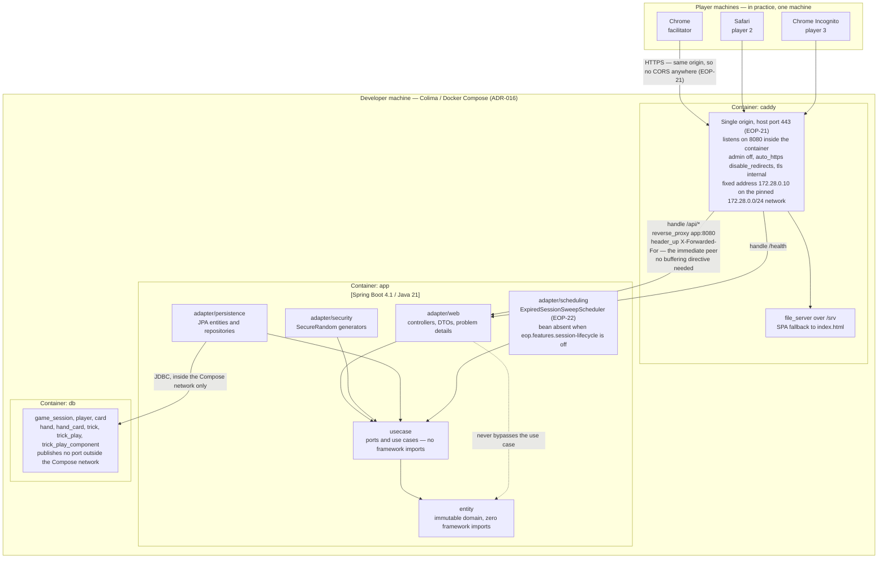
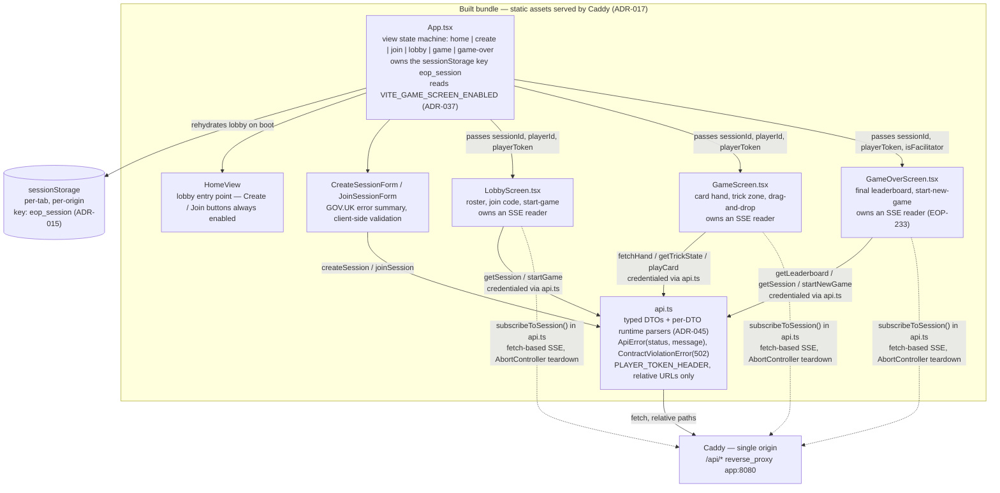
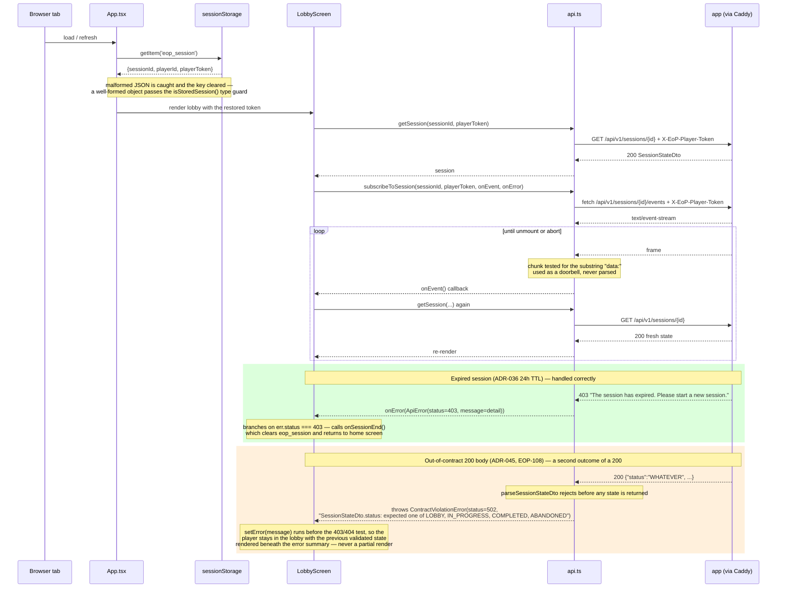
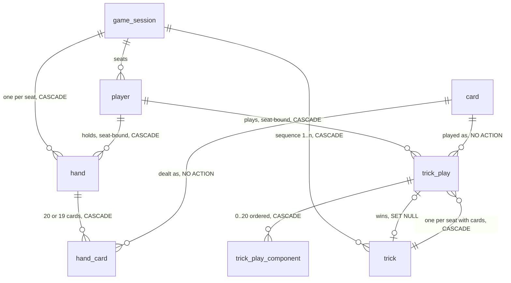

# C4 Diagrams

Visual architecture for the EoP threat-modelling card game, in
[Mermaid](https://mermaid.js.org) so that it version-controls and reviews as text.

**Scope of this document.** It contains the **C4 Level 2 (Container) view**, a Level 2
component detail for the session lifecycle, a **Level 3 view inside the single-page
application** (added by EOP-11, because the bundle stopped being an opaque static-file node
once it held a state machine and a credential), and — as of EOP-14 Slice B — one
entity-relationship view of the database schema, which is not a C4 level and says so where it
sits. No Level 1.

- **Level 1 (System Context) is deliberately deferred**, along with
  `building-blocks.md`, to a follow-up ticket (EOP-47). They are not missing by accident. A
  context diagram for this system is nearly trivial today — one facilitator, two to
  five other players, three browsers on one machine, no external system of any kind
  — and drawing it now would mostly restate the PRD. It becomes worth having when
  something external appears, which the PRD's "future capability — issue-tracker
  references" (§5) suggests is the first candidate.
- Dynamic behaviour lives in [`runtime-view.md`](runtime-view.md). This file shows
  what exists and how it is wired; that file shows what happens in what order.

Everything below reflects the code as it stands after **EOP-92** (`Hands.deal` deals every card
again, so the `POST /deal` row in the endpoint table below is a full deal with nothing discarded —
ADR-023 as amended by EOP-92; that row was stale for the whole EOP-72 equal-hands period and no
diagram statement other than that one is affected), on top of **EOP-82** (`eop.features.game-over`
flipped to `true`, so the game-over surface described below is live in the default configuration —
ADR-042), on top of **EOP-65** (game-over leaderboard,
new-game reset, `game_result` and `game_result_player` tables — changesets `2026-08-16--game-result`
001 and 002, ADR-039), on top of **EOP-11** (the lobby single-page application — the Level 3 view)
and **EOP-22** (session expiry, the sweep scheduler and the `expires_at` column — changeset `006`),
on top of EOP-14 Slice E (end of hand, the state-of-play read and the three broadcasts), Slice D's
trick-play HTTP routes, Slice C2's use-case layer, Slice C1's persistence layer (Liquibase changeset
`005`), the trick-play schema from Slice B (changeset `004`), the client-address resolution
introduced by EOP-26 (ADR-021) and the session lifecycle from EOP-10.

**EOP-65 added the game-over feature behind `eop.features.game-over`, and EOP-82 flipped that flag
to `true` — it is the shipped default in `application.yml`, and `application-prod.yml` carries no
`eop.features` block, so the game-over surface described here is live under
`SPRING_PROFILES_ACTIVE=prod` (ADR-042).** It shipped `false` from EOP-65 until EOP-82, during
which the routes below existed in the code but not in the running application. When the
last trick resolves, `ResolveTrickUseCase` calls `PersistGameResultUseCase` (best-effort, via
`Optional` injection) to write a `game_result` header row and one `game_result_player` row per
seated player. `GetLeaderboardUseCase` reads that record and re-derives scores from the live trick
history (ADR-030: a persisted standing is never read back to answer the score). `NewGameUseCase`
resets a COMPLETED session to IN_PROGRESS via a non-atomic four-step sequence (ADR-039): clear
tricks → clear hands → compare-and-swap status → re-deal. The new `GameOverController` exposes
`GET /{sessionId}/leaderboard` and `POST /{sessionId}/new-game`; both are absent when the flag is
off. `GameResultRepository` is the twelfth port. Slice B was schema-only.
Slice C1 added the persistence components — one adapter, two ports, five JPA entities and five
Spring Data interfaces — but no caller. Slice C2 wrote the caller: three use cases
(`DealHandsUseCase`, `PlayCardUseCase`, `ResolveTrickUseCase`), one new port — `DeckShuffler`, the
tenth — and one new adapter class (`SecureRandomDeckShuffler`). `CardRepository` is *not* new: it
has been the card-catalogue port since EOP-13, and Slice C2 only added a third method to it
(`findWholeDeck()`).

**Slice D wrote the route and Slice E widened it, and both are what the component view below
records.** Three earlier versions of this section said there was no controller, no request DTO and
no path reaching those use cases, and drew a `NOROUTE` node to make the missing caller visible; all
of it is now false and has been removed. Slice D added a second controller — `TrickController`,
with four routes (`POST /{sessionId}/deal`, `GET /{sessionId}/hand`, `POST /{sessionId}/plays`,
`POST /{sessionId}/tricks/current/resolve`) — four transport records (`HandDto`, `TrickDto`,
`TrickPlayDto`, `PlayCardRequest`) and one further use case, `ReadOwnHandUseCase`, the eleventh at
that date. That use case was the slice's one declared scope addition: Slice C promised a route
returning the caller's own hand and neither C1 nor C2 shipped it, so without it a player who had
been dealt cards could not see them. It needed **no new port method** —
`HandRepository.findBySessionId` then `Hands#handOf`.

**Slice E adds a fifth route, a twelfth use case and three edges that were not there before.** The
route is `GET /{sessionId}/tricks/current`, served by `GetTrickStateUseCase` — the twelfth use case
in the application and the fifth behind the flag — which returns a `TrickState` that the new
`TrickStateDto` carries over the wire. It is the first use case to join two aggregates: it reads
the hands *and* the current trick, so that `adapter/web` never has to learn how a trick and a hand
relate in order to answer whose turn it is. It needed no new port either, so **the port count below
is unchanged at ten** — what changed is who calls them. `TrickRepository` gains a third caller, and
`SessionEventPublisher` gains three: `DealHandsUseCase`, `PlayCardUseCase` and `ResolveTrickUseCase`
each now take the publisher and emit `HAND_DEALT`, `CARD_PLAYED` and `TRICK_RESOLVED` after their
write returns. Those three edges are drawn below; before Slice E the only use cases reaching that
port were `JoinSessionUseCase` and `StartSessionUseCase`.

Containment is still the feature flag, and the flag now withholds more than it did: six use-case
beans *and* the two controllers — eight beans in all — exist only while `eop.features.trick-play` is
`true`, and `application.yml` leaves it `false`
([`application.yml:75-112`](../../src/main/resources/application.yml)). It stays `false` on merge,
but no longer because a client could not play: Slice E's state-of-play read publishes whose turn it
is, whether the trick is complete, which seat leads next and whether the hand is over, so the
gameplay gap that kept the flag down through Slice D is closed. The reasons it stays down are now
elsewhere, and [ADR-028](../adr/ADR-028-end-of-hand-without-release-or-score.md) names three
predecessors for the story that flips it: ADR-026, still `Proposed`, which would give the
game-affecting writes the audit logging `observability.md` requires; EOP-48, which fixed the sibling
`session-lifecycle` flag failing open for want of a `havingValue` — **discharged by commit
`34d30d7`**, which also gated the four session use cases the controller alone had left registered,
so **two** of the three predecessors remain; and EOP-15, which scores a hand,
because until it lands a player can play every card and the session still reports `IN_PROGRESS` with
no score anywhere. See ADR-013 for the register entry and ADR-027 for why `/hand` is singular.

The component view below has also been completed in one respect that is not new work: the card
catalogue from EOP-13 (`CardController`, `GetCardUseCase`, `ListCardsUseCase`, `CardRepository`,
`CardRepositoryAdapter`) was missing from it, and Slice C2 makes that omission material rather than
merely untidy, because the deal now reads the deck through that same port. Where a diagram would
flatter the design, the prose underneath says so instead.

---

## Level 2 — Containers

Three containers, one origin, one process each.

Three things to read off this diagram rather than infer.

**One origin, therefore no CORS.** Caddy serves the built front end and proxies
`/api/*` and `/health` to the application, so the browser never makes a cross-origin
request. There is consequently **no CORS configuration anywhere in this project**, and
that is a property of the topology, not an omission (ADR-017). Splitting the origins
later would require CORS to be designed, not merely switched on.

**All arrows into `usecase` point inward, and `adapter/web` has no arrow to
`adapter/persistence`.** That is the Clean Architecture constraint holding: the web
layer talks to use cases, use cases talk to ports, and the persistence adapter
implements those ports. The dotted line to `entity` is drawn only to state that it is
not used as a shortcut.

**Caddy's address on the diagram is a fact the application depends on, not decoration.**
The Compose default network is pinned to `172.28.0.0/24` and the `caddy` service to
`172.28.0.10` so that the application has something stable to allow-list; the `app`
service carries `EOP_WEB_TRUSTED_PROXIES: 172.28.0.10/32` a few lines away in the same
file. `X-Forwarded-For` is read **only** from that peer, and the default is to trust
nobody, so this arrow is the whole trust boundary for client-address resolution
(ADR-021). The single-origin topology makes only Caddy *reachable in practice*; it does
not make the peer *provably* Caddy, and the application no longer assumes it does.

---

## Level 2 detail — components

The container view above is too coarse to show what these stories actually introduced.
This is the same `app` container, opened up: the session lifecycle from EOP-10, the card
catalogue from EOP-13, the trick-play persistence added by EOP-14 Slice C1, the three
trick-play use cases added by Slice C2, and the routes and transport records added by
Slice D, whose nodes say so in their labels.

```mermaid
flowchart LR
    subgraph web["adapter/web — Frameworks and Drivers"]
        SC["SessionController<br/>five routes<br/>@ConditionalOnProperty havingValue=true (EOP-48)<br/>bean absent when eop.features.session-lifecycle is off<br/>so are its four session use cases"]
        TC["TrickController<br/>EOP-14 Slice D, fifth route added by Slice E<br/>POST /deal · GET /hand · POST /plays<br/>GET /tricks/current · POST /tricks/current/resolve<br/>@ConditionalOnProperty havingValue=true<br/>bean absent when eop.features.trick-play is off<br/>the acting seat is never read from a request"]
        TDTO["HandDto · TrickDto · TrickPlayDto · PlayCardRequest · TrickStateDto<br/>EOP-14 Slice D, TrickStateDto added by Slice E<br/>PlayCardRequest carries no seat, no player, no suit, no rank<br/>TrickDto omits turn, completeness and next leader — it cannot know them<br/>TrickStateDto carries all four, from a use case that reads both aggregates"]
        SCORE["ScoreController<br/>EOP-15 Slice B — one route, the sixth behind this flag<br/>GET /score<br/>@ConditionalOnProperty havingValue=true<br/>bean absent when eop.features.trick-play is off<br/>separate from TrickController because a score is not a move<br/>names only cards already face up, which is what separates it from GET /hand (ADR-027)"]
        ESC["EndSessionController<br/>EOP-15 Slice C — one route, the seventh behind this flag<br/>POST /{sessionId}/end<br/>@ConditionalOnProperty havingValue=true<br/>bean absent when eop.features.trick-play is off<br/>facilitator-only: authz in the domain entity before the status check"]
        SDTO["ScoreSheetDto · ScoredPlayDto · StandingDto<br/>EOP-15 Slice B<br/>ScoredPlayDto is one row of the printed Score Card — name, points, card, component(s), notes<br/>the display name travels as a plain string; no token digest crosses this boundary<br/>StandingDto publishes position and tied, so a shared first place reads as a tie<br/>no winner field — position 1 held by two seats is the answer"]
        GOC["GameOverController<br/>EOP-65 — two routes<br/>GET /{sessionId}/leaderboard · POST /{sessionId}/new-game<br/>@ConditionalOnProperty havingValue=true<br/>bean absent when eop.features.game-over is off<br/>facilitator-only for new-game; any seated player may read the leaderboard"]
        GODTO["LeaderboardDto · LeaderboardRowDto<br/>EOP-65<br/>LeaderboardRowDto carries capturedBySuit — STRIDE breakdown per player<br/>derived from ScoreSheet.capturedBySuitByPlayer(), never from stored scores (ADR-030)"]
        CC["CardController<br/>EOP-13 — the card catalogue, read-only"]
        GEH["GlobalExceptionHandler<br/>RFC 9457 problem details"]
        SSE["SseSessionEventPublisher<br/>in-process subscriber registry"]
         LIM["InMemoryJoinAttemptLimiter<br/>process-local — A SECURITY CONTROL"]
         CLIM["InMemorySessionCreationLimiter<br/>process-local — A SECURITY CONTROL<br/>EOP-19 — counts successes, not failures<br/>reserve-before-work: slot reserved before DB write, refunded on failure"]
         CA["ClientAddressResolver<br/>the one answer to who the caller is<br/>ignores X-Forwarded-For unless the peer is allow-listed"]
        RRLI["ReadRateLimitInterceptor<br/>process-local — A SECURITY CONTROL<br/>EOP-88 — HandlerInterceptor over GET and HEAD under /api/v1<br/>registered by WebInterceptorConfiguration, the only WebMvcConfigurer<br/>keyed on the resolved client address, never a header, never the player token<br/>event stream excluded — bounded by the subscriber cap instead (ADR-034)"]
        SWC["SlidingWindowCounter<br/>EOP-88 — the counting mechanism, held by the interceptor rather than a bean<br/>60-second window, prune-check-insert under one lock<br/>fail-closed when the key table saturates (ADR-033)<br/>the join and creation limiters still carry their own copy of this algorithm"]
        TP["TrustedProxies + IpLiterals<br/>eop.web.trusted-proxies — empty by default, so deny-all<br/>malformed entry fails startup; addresses canonicalised"]
    end

    subgraph secpkg["adapter/security"]
        TOK["SecureRandomIdentityTokenGenerator<br/>256-bit token, base64url"]
        JC["SecureRandomJoinCodeGenerator<br/>8 chars, Crockford base32"]
        SHUF["SecureRandomDeckShuffler<br/>EOP-14 Slice C2<br/>no seed, no setter — a permutation, not an identifier<br/>@Component, NOT behind the flag"]
    end

    subgraph usecase["usecase — Application"]
        CREATE["CreateSessionUseCase"]
        JOIN["JoinSessionUseCase"]
        GET["GetSessionStateUseCase"]
        START["StartSessionUseCase"]
        RESOLVE["ResolvePlayerUseCase<br/>token to player, by digest"]
        GETCARD["GetCardUseCase"]
        LISTCARDS["ListCardsUseCase"]
        DEAL["DealHandsUseCase<br/>EOP-14 Slice C2<br/>facilitator only<br/>bean exists only while eop.features.trick-play is true"]
        PLAY["PlayCardUseCase<br/>EOP-14 Slice C2<br/>takes PlayCardCommand — no seat, no player, no suit, no rank<br/>bean exists only while eop.features.trick-play is true"]
        RESTRICK["ResolveTrickUseCase<br/>EOP-14 Slice C2<br/>any member, not just the facilitator<br/>bean exists only while eop.features.trick-play is true"]
        READHAND["ReadOwnHandUseCase<br/>EOP-14 Slice D — the eleventh use case at that date<br/>returns the caller's own hand and nothing else<br/>no sibling returns another player's hand or all hands<br/>bean exists only while eop.features.trick-play is true"]
        GETSTATE["GetTrickStateUseCase<br/>EOP-14 Slice E — the twelfth use case<br/>joins two aggregates: the hands and the current trick<br/>returns TrickState — turn, completeness, next leader, hand complete<br/>names no card any seat is holding<br/>bean exists only while eop.features.trick-play is true"]
        GETSCORE["GetScoreUseCase<br/>EOP-15 Slice B — the thirteenth use case<br/>reaches two collaborators only: resolving the caller already yields the session and its players<br/>derives the score from the whole trick history — nothing is accumulated (ADR-030)<br/>no HandRepository and no status check: before the deal, everybody on nothing is a true answer<br/>bean exists only while eop.features.trick-play is true"]
        ENDSESSION["EndSessionUseCase<br/>EOP-15 Slice C — the fourteenth use case<br/>facilitator-only: authz in the domain entity before the status check<br/>auto-complete also fires from ResolveTrickUseCase when nextLeaderSeat is empty<br/>bean exists only while eop.features.trick-play is true"]
        SWEEP["SweepExpiredSessionsUseCase<br/>EOP-22 — the fifteenth use case<br/>finds sessions where expires_at &lt; now and deletes them<br/>bean exists only while eop.features.session-lifecycle is true"]
        GETLEAD["GetLeaderboardUseCase<br/>EOP-65 — the sixteenth use case<br/>re-derives score from live trick history (ADR-030) — never reads stored scores<br/>bean exists only while eop.features.game-over is true"]
        PERSIST["PersistGameResultUseCase<br/>EOP-65 — the seventeenth use case<br/>called best-effort by ResolveTrickUseCase via Optional injection after last trick<br/>no authorisation check — caller already authorised<br/>bean exists only while eop.features.game-over is true"]
        NEWGAME["NewGameUseCase<br/>EOP-65 — the eighteenth use case<br/>facilitator-only; non-atomic 4-step reset (ADR-039)<br/>clears tricks then hands, resets session to IN_PROGRESS, re-deals<br/>bean exists only while eop.features.game-over is true"]

        P1(["SessionRepository"])
        P2(["SessionEventPublisher<br/>reached by six use cases since EOP-15 Slice C<br/>every trick-play write publishes after it returns"])
        P3(["IdentifierGenerator"])
        P4(["IdentityTokenGenerator"])
        P5(["JoinCodeGenerator"])
        P6(["JoinAttemptLimiter"])
        P11(["SessionCreationLimiter<br/>EOP-19 — checkAllowed · recordCreation · refundCreation"])
        P7(["HandRepository<br/>EOP-14 Slice C1<br/>called by all three Slice C2 use cases, by ReadOwnHandUseCase from Slice D<br/>and by GetTrickStateUseCase from Slice E — five callers"])
        P8(["TrickRepository<br/>EOP-14 Slice C1<br/>called by two Slice C2 use cases, by GetTrickStateUseCase from Slice E and by GetScoreUseCase from EOP-15 Slice B<br/>findTricks returns the session's whole history and filters nothing — an unresolved trick comes back unresolved<br/>recordResolution's next-leader parameter is an OptionalInt since Slice E"])
        P9(["CardRepository<br/>EOP-13 — third method findWholeDeck added by Slice C2"])
        P10(["DeckShuffler<br/>EOP-14 Slice C2<br/>a port so the security choice is made once, in one class"])
        P12(["GameResultRepository<br/>EOP-65 — the twelfth port<br/>save · findFirstByGameSessionIdOrderByFinalisedAtDesc<br/>returns the most recently finalised result for a session"])
    end

    subgraph persist["adapter/persistence"]
        SRA["SessionRepositoryAdapter<br/>the only class speaking both JPA and the domain"]
        GSR["GameSessionJpaRepository<br/>package-private"]
        PJR["PlayerJpaRepository<br/>package-private"]
        UUIDG["HibernateUuidV7IdentifierGenerator"]
        CRA["CardRepositoryAdapter<br/>EOP-13 — one aggregate, one adapter<br/>findWholeDeck() reuses its existing DECK_ORDER sort"]
        CJR["CardJpaRepository<br/>package-private"]
        TPRA["TrickPlayRepositoryAdapter<br/>EOP-14 Slice C1<br/>one class implementing both trick-play ports<br/>authorises nobody — no port method takes an acting player"]
        TPJR["trick-play JPA repositories ×5<br/>EOP-14 Slice C1<br/>hand, hand_card, trick, trick_play, trick_play_component<br/>all package-private"]
        GRA["GameResultRepositoryAdapter<br/>EOP-65 — implements GameResultRepository<br/>write-once rows; placeholder standings on read (ADR-030)<br/>findFirst...OrderByFinalisedAtDesc returns latest result for multi-game sessions"]
        GRJR["game_result JPA repositories ×2<br/>EOP-65<br/>GameResultJpaRepository · GameResultPlayerJpaRepository<br/>all package-private"]
    end

    subgraph sched["adapter/scheduling"]
        SCHEDCOMP["ExpiredSessionSweepScheduler<br/>EOP-22<br/>@ConditionalOnProperty havingValue=true<br/>bean absent when eop.features.session-lifecycle is off<br/>@Scheduled — fires every hour (configurable via eop.sweep.interval-ms)<br/>delegates entirely to SweepExpiredSessionsUseCase"]
    end

    DB[("PostgreSQL<br/>4 unique constraints and 2 range CHECKs on game_session and player<br/>version BIGINT DEFAULT 0<br/>game_result + game_result_player tables added by EOP-65")]

    SC --> CREATE
    SC --> JOIN
    SC --> GET
    SC --> START
    SC --> RESOLVE
    SC --> SSE
    SC -.->|"throws domain exceptions"| GEH
    SC -->|"resolves the client address before calling the use case"| CA
    CA --> TP

    RRLI -->|"admit(resolved client address) in preHandle — refused before any controller runs (EOP-88, ADR-051)"| SWC
    RRLI -->|"the same resolver the write limiters use, so no request header can move the bucket"| CA
    RRLI -->|"every GET and HEAD under /api/v1 passes here first — the event stream is excluded"| SC
    RRLI --> CC
    RRLI --> SCORE
    RRLI --> TC
    RRLI --> GOC

    CC --> GETCARD
    CC --> LISTCARDS

    TC --> DEAL
    TC --> READHAND
    TC --> PLAY
    TC --> GETSTATE
    TC --> RESTRICK
    TC -.->|"maps domain results through"| TDTO
    SCORE --> GETSCORE
    SCORE -.->|"maps domain results through"| SDTO
    ESC --> ENDSESSION
    TC -.->|"throws domain exceptions"| GEH
    READHAND --> RESOLVE
    READHAND --> P7
    GETSTATE -->|"first statement — authorise, then decide"| RESOLVE
    GETSTATE --> P7
    GETSTATE --> P8
    GETSCORE -->|"first statement — authorise, then decide"| RESOLVE
    GETSCORE --> P8

    ENDSESSION -->|"first statement — authorise, then decide"| RESOLVE
    ENDSESSION --> P1
    ENDSESSION -->|"EOP-15 Slice C — GAME_COMPLETED, after the write"| P2

    SCHEDCOMP --> SWEEP
    SWEEP --> P1

    CREATE --> P1
    CREATE --> P3
    CREATE --> P4
    CREATE --> P5
    CREATE --> P11
    JOIN --> P1
    JOIN --> P2
    JOIN --> P3
    JOIN --> P4
    JOIN --> P6
    GET --> RESOLVE
    START --> P1
    START --> P2
    RESOLVE --> P1
    GETCARD --> P9
    LISTCARDS --> P9

    DEAL -->|"first statement — authorise, then decide"| RESOLVE
    PLAY -->|"first port call — authorise, then decide"| RESOLVE
    RESTRICK -->|"first statement — authorise, then decide"| RESOLVE
    DEAL --> P9
    DEAL --> P10
    DEAL --> P7
    DEAL --> P3
    DEAL -->|"EOP-14 Slice E — HAND_DEALT, after the write"| P2
    PLAY --> P7
    PLAY --> P8
    PLAY --> P9
    PLAY --> P3
    PLAY -->|"EOP-14 Slice E — CARD_PLAYED, after the write"| P2
    RESTRICK --> P7
    RESTRICK --> P8
    RESTRICK --> P1
    RESTRICK -->|"EOP-14 Slice E — TRICK_RESOLVED, after the write"| P2

    P1 -.->|implements| SRA
    P2 -.->|implements| SSE
    P3 -.->|implements| UUIDG
    P4 -.->|implements| TOK
    P5 -.->|implements| JC
    P6 -.->|implements| LIM
    P11 -.->|implements| CLIM
    P7 -.->|implements| TPRA
    P8 -.->|implements| TPRA
    P9 -.->|implements| CRA
    P10 -.->|implements| SHUF
    P12 -.->|implements| GRA

    GOC --> GETLEAD
    GOC --> NEWGAME
    GOC -.->|"maps domain results through"| GODTO
    GOC -.->|"throws domain exceptions"| GEH
    GETLEAD -->|"first statement — authorise, then decide"| RESOLVE
    GETLEAD --> P12
    GETLEAD --> P8
    PERSIST --> P1
    PERSIST --> P8
    PERSIST --> P12
    PERSIST --> P3
    NEWGAME -->|"first statement — authorise, then decide"| RESOLVE
    NEWGAME --> P7
    NEWGAME --> P8
    NEWGAME --> P1
    NEWGAME --> P9
    NEWGAME --> P10
    NEWGAME --> P3
    NEWGAME -->|"EOP-65 — HAND_DEALT, after the write"| P2
    RESTRICK -.->|"EOP-65 — best-effort via Optional, after COMPLETED"| PERSIST

    SRA --> GSR
    SRA --> PJR
    GSR --> DB
    PJR --> DB
    CRA --> CJR
    CJR --> DB
    TPRA --> TPJR
    TPRA -->|"every write begins with a compare-and-set on the session row"| GSR
    TPJR --> DB
    GRA --> GRJR
    GRJR --> DB
```

The dotted `implements` edges are the important ones: **every arrow of dependency
still points inward**, and the outward-pointing arrows are inversions. `usecase`
declares ten ports; nothing in `usecase` names a Spring type, an HTTP type or a JPA
type, and that was re-measured for this slice —
`grep -rn "^import \(org.springframework\|jakarta\|javax\)"` over `entity/` and `usecase/`
returns nothing.

**Three of those ten ports gained a caller in Slice C2:** `HandRepository`, `TrickRepository` and the
new `DeckShuffler`. `HandRepository` is now called by five use cases — all three from Slice C2, plus
`ReadOwnHandUseCase` from Slice D and `GetTrickStateUseCase` from Slice E. `TrickRepository` had two
callers for two slices and has three since Slice E, because the state-of-play read is the first read
of a trick that is not also a write of one. **A fourth port changed hands in Slice E without gaining
a new implementation:** `SessionEventPublisher` was reached only by `JoinSessionUseCase` and
`StartSessionUseCase` until Slice E gave it three more callers, one per trick-play write. The
sentence this section carried for two slices — that nothing calls them, that the reachable surface of
five tables ended at a bean nothing injected — stopped being true in C2. What replaced it needs
restating now, because Slice D changed it again in the one way that matters, and Slice E finished the
job:

- **The routes exist, and they are now sufficient.** `TrickController` reaches all five use cases,
  `PlayCardRequest` is the request DTO a play was missing, and `docs/api/openapi.yml` carries all five
  trick-play paths among its twelve — each hand-authored and committed *before* the controller method
  that serves it, per ADR-004. Three earlier versions of this bullet said the opposite and pointed at
  a `NOROUTE` node to make the missing caller visible; the node and the claim are both gone. A fourth
  said that a client still could not play a whole trick unaided because `TrickDto` publishes no turn,
  completeness or next-leader field. That is no longer true either: Slice E added
  `GET /{sessionId}/tricks/current`, whose `TrickStateDto` carries all three and `handComplete` as
  well. What keeps the feature unreleased is now the flag alone, and the flag's reasons are not about
  gameplay — see the flag note below.
- **Ten beans do not exist unless a flag says so:** the seven use cases and the three controllers.
  `UseCaseConfiguration` declares the use cases behind
  `@ConditionalOnProperty(name = "eop.features.trick-play", havingValue = "true")`
  (`UseCaseConfiguration.java:264-373`), `TrickController`, `ScoreController` and `EndSessionController` carry the same condition with the same
  `havingValue`, and `application.yml` sets the flag `false`. Containment is a flag rather than an
  absent caller, which is a stronger guarantee under test and a weaker one under operator error — a
  flag can be flipped, an absent class cannot. `TrickPlayDisabledIntegrationTest` therefore asserts
  both halves: all ten beans absent *and* all seven routes answering 404, because the status is what a
  client is promised while the absence is what pins the mechanism.
- **A read is gated alongside the writers, and that is deliberate.** `ReadOwnHandUseCase` only reads,
  so gating it looks inconsistent until you ask what it would answer with the flag off: no hand was
  ever dealt, so the bean would exist solely to return 409. The earlier wording here — that only the
  use cases which write to the database are gated — described a rule this slice consciously departed
  from, and ADR-013 records the departure.
- **`SecureRandomDeckShuffler` is deliberately *not* behind the flag.** It is a `@Component`
  unconditionally, because it holds no session state and injecting it costs nothing. The asymmetry is
  between a stateless collaborator and the callers that would reach the database, not between reads
  and writes. `TrickPlayDisabledIntegrationTest` asserts that the shuffler bean survives the flag.
- **Every trick-play write still passes through the session row.** The edge from
  `TrickPlayRepositoryAdapter` to `GameSessionJpaRepository` is the compare-and-set of ADR-020:
  `claimDeal`, `touchWhileLeaderSeatIs` and `advanceLeaderSeat` each take the session row's lock
  before any hand or trick row, which is what serialises two simultaneous deals or two plays for the
  same seat. The use cases do not choose this; they cannot see it.
- **Every trick-play write now also broadcasts, and the edge direction is the point.** The three new
  `--> SessionEventPublisher` edges are outward from `usecase` to a port `usecase` owns, so the
  dependency still points inward; `SseSessionEventPublisher` in `adapter/web` implements it. Each
  `publish` sits *after* the port write returns — `HandDealer.java:143` (anchor: `HAND_DEALT`),
  `TrickJournal.java:125` (anchor: `CARD_PLAYED`), `TrickJournal.java:158` (anchor: `TRICK_RESOLVED`),
  the latter two having moved out of `PlayCardUseCase` and `ResolveTrickUseCase` into the shared
  journal in EOP-190 — so a broadcast can only describe a
  durable change and a throwing publisher cannot fail a request whose write succeeded. None of the
  three events carries any part of the change, which is what keeps a per-player hand off a fan-out
  transport (ADR-027) and what makes re-reading still the only way to learn *what* happened.
- **All seven use cases authorise before they decide anything.** The edges from `DealHandsUseCase`,
  `PlayCardUseCase`, `ResolveTrickUseCase`, `ReadOwnHandUseCase` from Slice D,
  `GetTrickStateUseCase` from Slice E, `GetScoreUseCase` from EOP-15 Slice B and `EndSessionUseCase` from EOP-15 Slice C into
  `ResolvePlayerUseCase` are drawn as first-class
  edges rather than left implicit because the *ordering* is the slice's main security property, and
  a component view that omitted them would hide it: `DealHandsUseCase.java:88`,
  `PlayCardUseCase.java:154`, `ResolveTrickUseCase.java:149`, `ReadOwnHandUseCase.java:64`,
  `GetTrickStateUseCase.java:83`, `GetScoreUseCase.java:72` and `EndSessionUseCase.java:70` are
  each the first port call of their `execute` method, before any read of a hand or a trick and before
  any state test
  ([ADR-024](../adr/ADR-024-trick-play-persistence-boundary.md) records why the adapter cannot do
  this for them — no port method takes an acting player). Every one of those six numbers moved in
  Slice E and four of them were wrong on this page until it was corrected; find them by the call, not
  by the line.
- **The new read is where two aggregates meet, and that is the only place they may.**
  `GetTrickStateUseCase` has edges to both `HandRepository` and `TrickRepository` because whose turn
  it is cannot be derived from either alone: `seatToPlay` comes from the cards already in an open
  trick, and from `HandRepository.findCurrentLeaderSeat` when no trick is open
  (`GetTrickStateUseCase.java:100-103`). A controller that fetched both and combined them would put
  that rule in `adapter/web`; `TrickStateDto` therefore maps a `TrickState` and computes nothing.

### `SessionController` — five routes that may not exist at all

| Method | Path | Purpose |
|---|---|---|
| `POST` | `/api/v1/sessions` | create; returns session id, join code, identity token |
| `POST` | `/api/v1/sessions/{joinCode}/players` | join by code |
| `GET` | `/api/v1/sessions/{sessionId}` | read state — **the reconnect path** |
| `GET` | `/api/v1/sessions/{sessionId}/events` | `text/event-stream` |
| `POST` | `/api/v1/sessions/{sessionId}/start` | facilitator closes the lobby |

The class is annotated `@ConditionalOnProperty(prefix = "eop.features", name = "session-lifecycle",
havingValue = "true")` with **`matchIfMissing` left at its default of `false`** — so an absent
property and any present value other than `true` both leave the bean unregistered
(`SessionController.java:69`, anchor: `havingValue`). This is drawn as one node
rather than two because there is no second state to draw: with the flag off **the bean
does not exist**, no handler is mapped, and Spring's own no-handler response — already
rendered as a problem detail — returns 404 for all five paths.

That distinction is worth being pedantic about. Flag-off behaviour is **not a runtime
branch that could be implemented incorrectly**; it is the absence of a bean. There is
no `if (enabled)` anywhere, and therefore no possibility of a half-enabled controller
(ADR-013, ADR-019).

The wart this section used to record has been fixed, and it is worth keeping the record of it
because it explains why the diagram now has more gated nodes than routes. Until EOP-48
(commit `34d30d7`) the condition above **omitted `havingValue`**, which matches any value that is
not literally `false`: `session-lifecycle: off` — YAML 1.1 boolean false, and the spelling an
operator is likeliest to reach for — *enabled* these five routes, and so did `no`, `0`, `disabled`
and the empty string. Worse, the four session use cases were registered **unconditionally**, so
nothing failed the context to say so: the off position was a property of the URL space only, and
the application behind it could still create and mutate sessions. EOP-48 closed both halves —
`havingValue = "true"` on the controller, and the same condition on `createSessionUseCase`,
`joinSessionUseCase`, `getSessionStateUseCase` and `startSessionUseCase`
(`UseCaseConfiguration.java:122` (anchor: `session-lifecycle`), `:145`, `:189`, `:204`) — so the flag then withheld **five beans
in all**, matching the arrangement `TrickController` has had since Slice D. It withholds **six** as of
EOP-190 (2026-09-04), which moved the SSE route out of `SessionController` into
`SessionStreamController` to bring the controller's constructor under the `java:S107` parameter
threshold, and **repeated** the same condition on the new bean rather than letting it inherit one —
`SessionStreamController.java:53` (anchor: `havingValue`). The route count is unchanged at five;
only the number of beans serving them moved. `resolvePlayerUseCase`
stays ungated on purpose: it writes nothing and is shared with all six trick-play use cases, so
gating it would make lobby-off/trick-play-on an unsatisfiable context rather than a withheld
feature — the same reasoning as the ungated `DeckShuffler` (ADR-013 records both the mandate and
that exception).

### `TrickController` — five routes that may not exist at all

Added by EOP-14 Slice D with four routes; Slice E added the fifth. The contract for all
five was hand-authored in `docs/api/openapi.yml` and committed **before** the method that
serves it (ADR-004).

| Method | Path | Purpose |
|---|---|---|
| `POST` | `/api/v1/sessions/{sessionId}/deal` | facilitator deals the whole deck; 204, no body |
| `GET` | `/api/v1/sessions/{sessionId}/hand` | the caller's **own** hand — and no other (ADR-027) |
| `POST` | `/api/v1/sessions/{sessionId}/plays` | play a card; 201 with the trick as it now stands |
| `GET` | `/api/v1/sessions/{sessionId}/tricks/current` | state of play — turn, completeness, next leader, hand complete; 200 |
| `POST` | `/api/v1/sessions/{sessionId}/tricks/current/resolve` | resolve a complete trick; 200 |

Annotated `@ConditionalOnProperty(prefix = "eop.features", name = "trick-play",
havingValue = "true")`, matching the condition on all five of its use-case beans, so the
flag cannot register the routes without their collaborators. With the flag off the bean
does not exist and all five paths answer 404.

Two properties of this class are load-bearing rather than incidental:

- **The acting seat is never read from a request.** `PlayCardRequest` carries a card id and
  two optional annotations, and no seat, player, suit or rank. The seat and player come
  from the identity token; the suit and rank come from the deck row the card id names. Two
  earlier defects were exactly a caller-supplied seat (playing out of another player's
  hand) and a caller-supplied suit and rank (a forged card taking a trick).
- **Each route reaches for one aggregate only, and where two are needed a use case joins
  them.** `TrickDto` publishes no field for whose turn it is, whether the trick is
  complete, or which seat leads next: all three depend on which seats still hold cards,
  which is a property of the hands rather than of the trick. A controller that fetched the
  hands to compute them would put the turn rule in `adapter/web`. Slice E answered that by
  adding a use case rather than a second fetch in the controller —
  `GetTrickStateUseCase` reads both aggregates and returns a `TrickState`, and
  `TrickStateDto` maps it without computing anything. The cost this bullet used to record —
  that the flag could not be turned on until a later slice added a read exposing those
  three answers — is paid: the read exists, `GET /tricks/current` publishes it, and the
  reasons the flag stays down are now the three predecessors ADR-028 names.

### `SseSessionEventPublisher` — a broadcast registry, and not a presence list

Implements the `SessionEventPublisher` port and `DisposableBean`. Its state:

- `ConcurrentHashMap` keyed by `sessionId`, each value a `CopyOnWriteArrayList` of
  `SseEmitter`. Copy-on-write because the list is iterated on every publish and
  mutated rarely, and because iteration must not fail while a dying subscriber is
  removed from it.
- `ConcurrentHashMap<UUID, Object> sessionLocks` — per-session lock objects for cap
  enforcement. Entries are never removed, so lock identity is stable across the
  lifetime of a session entry; this eliminates the race where a lock captured before
  `synchronized` could be replaced by a concurrent `forgetOne`.
- `AtomicInteger totalSubscriberCount` — tracks live subscribers across all sessions.
  The per-session cap is `MAX_SUBSCRIBERS_PER_SESSION = 12` (2× MAXIMUM_PLAYERS);
  the global cap is `MAX_TOTAL_SUBSCRIBERS = 500`. Both are enforced atomically in
  `subscribe()`: a `synchronized` block on a per-session lock object held in
  `sessionLocks` (`ConcurrentHashMap<UUID, Object>`) guards the per-session
  check and add, combined with a CAS loop on `totalSubscriberCount` for the global
  check and increment.
- A single-threaded scheduler on a **daemon** thread named `sse-heartbeat`, firing at
  `eop.realtime.heartbeat-interval`. Daemon so it can never hold the JVM open.
- An elastic `ThreadPoolExecutor` (`sse-send-N`, 4–500 threads, 60s keepalive,
  `SynchronousQueue`, `LoggingDiscardPolicy`) that receives one task per emitter per
  heartbeat sweep and per `publish()` call. The calling thread enqueues tasks and returns
  immediately; the pool threads do the actual `emitter.send()`. The pool grows on demand
  rather than queueing, so a healthy subscriber never waits behind a stalled one. A
  `SynchronousQueue` never accepts a task no thread is ready to take, so the pool creates
  a thread instead of queueing. Growth is bounded by `MAX_TOTAL_SUBSCRIBERS = 500`, the same
  number that already bounds subscribers and file descriptors. When every thread up to that
  ceiling is already parked on a write, `LoggingDiscardPolicy` logs at WARN and drops the
  task — a dropped heartbeat is harmless (the next sweep retries), but a dropped *event*
  means a subscriber can miss a notification outright and recovers only on its next read.
  No event history is kept and `Last-Event-ID` is not honoured.
- Every emitter is constructed `new SseEmitter(EMITTER_TIMEOUT_MILLIS)` — a
  **10-minute container timeout** (ADR-034). The heartbeat keeps live connections
  alive within that window; stale connections that have silently dropped are
  reclaimed at most 10 minutes after they disappear.
- `onCompletion`, `onTimeout`, and `onError` all deregister the emitter via
  `forgetOne()`, which captures the exact list reference at subscribe time to avoid
  registry/counter leaks under concurrent races.

Three deliberate absences, all of which a tidier diagram would hide:

**There is no event log.** Nothing persists what was published. A client that
reconnects with `Last-Event-ID` is asking for something the server never kept, so the
header is not honoured and reconnection is a full re-read instead (ADR-014). The
registry is the only record that a subscriber exists, and it is in memory.

**The registry is emphatically not a presence list.** An SSE server discovers a broken
client only when it next attempts a write, so **the subscriber list over-reports** —
measured in the EOP-8 spike, where a count of two was reported for two already-dead
clients. Anything resembling "who is connected" must therefore be treated as a display
hint that will sometimes be wrong, never as an input to a game rule. This is why the
node in the diagram says *subscriber registry* and not *presence*.

**Restart empties it.** Every connected client is dropped on every rebuild and must
reconnect. The `assemble` path in `SessionRepositoryAdapter` takes both of its reads
from the database precisely so that the first request after a restart is
indistinguishable from any other.

### `InMemoryJoinAttemptLimiter` — process-local mutable state that is a security control

This is the component most likely to be misread as incidental, so the diagram labels
it in capitals.

It holds two sliding windows of failed-attempt timestamps in `ConcurrentHashMap`s —
one keyed by client address, one keyed by the **join code being tried** — with an
injected `Clock` so the window is testable without sleeping. Per-code as well as
per-IP because an attacker spread across many addresses is still enumerating one
keyspace.

It is not a cache, and the project's caching rule ("never manual `ConcurrentHashMap`")
does not apply to it: there is no expensive computation being memoised. It is
enforcement state.

**Tracked-key cap and fail-closed saturation (EOP-18).** Each map is bounded at
`MAX_TRACKED_KEYS = 10 000` entries. When a map is full and a new key arrives,
`checkAllowed` first attempts to evict windows whose entries have all aged out of the
sliding window; if the map is still full after eviction, it throws
`TooManyJoinAttemptsException` immediately — before any database work. This is
fail-closed: an untracked address is refused, not silently admitted. The cost is that
a legitimate user whose address has never been seen before receives 429 during extreme
saturation; this is accepted because reaching 10 000 distinct keys requires a
sustained botnet and the window self-heals within one minute as entries age out.
`recordFailure` silently drops the record for a saturated map — the key stays
untracked while the table remains saturated, so this caller's subsequent attempts
are refused by `checkAllowed`'s saturation check — so the map stays at or near the cap. This is a soft
cap: concurrent new-key requests can transiently overshoot `MAX_TRACKED_KEYS` by the
number of in-flight threads; the overshoot is bounded by the Tomcat thread-pool size.

**Both windows are always evaluated.** `recordFailure` records in both the address
window and the code window regardless of which one is saturated. An attacker
distributed across many addresses is still enumerating one keyspace; silencing the
per-code counter under address-table saturation would disable exactly the control that
defends against that attack. The two windows are independent and neither suppresses the
other.

**Atomic check-and-record (EOP-18).** `recordFailure` acquires `synchronized(window)`
on the deque before pruning, checking the allowance, and appending the new timestamp.
This is the only site that mutates a window deque. `checkAllowed` is a best-effort
pre-check that takes no lock on the window deques; it may evict aged-out map entries
via `evictEmptyWindows` (a map mutation, not a deque mutation). It avoids database
work for clearly over-limit callers; the authoritative gate is `recordFailure`. Two concurrent threads
racing at the limit boundary cannot both pass: the second thread to acquire the monitor
sees the count already at the limit and is refused.

**Why it is load-bearing:** a join code is eight Crockford base32 characters, exactly
forty bits of entropy, still short enough that humans read it aloud on a video call.
Forty bits bounds *how much* of the keyspace a blind search must cover, and this
limiter bounds *how fast* any one address may cover it. Neither is sufficient alone,
which is the correction EOP-24 made: the code was six characters until then, and at
thirty bits a pool of about a thousand proxied addresses was expected to stumble onto
a live lobby within days. Widening the code multiplied that by 1024, so the limiter is
**a control the code's length bounds but does not replace** (ADR-019). Note the
per-code half of this limiter never fires against enumeration, because every guess is
a different code landing in its own fresh counter -- only the per-address half bites.

**Which makes the key it counts against part of the control.** Until EOP-26 the client
address came from `X-Forwarded-For` unconditionally, so a caller could pick its own
bucket and rotate it once per request; the limiter ran and enforced nothing.
`ClientAddressResolver` now reads that header only when the peer is on the
`eop.web.trusted-proxies` allow-list, which is empty by default, and canonicalises the
result before it becomes a map key — because two spellings of one address are two
buckets, which is the same defect by another route ([ADR-021](../adr/ADR-021-trusted-proxy-forwarded-for.md)).

**And why the diagram must not smooth this over:** the state is in process memory, so
**a restart forgets every counter, and protection is at its weakest in the moments
immediately after a restart.** Accepted rather than solved, on the stated ground that
a restart is operator-initiated and an attacker cannot trigger one. That argument is
sound today and depends on the deployment being local and manual; if this ever
restarts automatically — a crash loop, an orchestrator, a scale-out — the reasoning
expires and the limiter needs shared state.

### `InMemorySessionCreationLimiter` — process-local mutable state that is a security control (EOP-19)

This is the companion to `InMemoryJoinAttemptLimiter` and shares every structural
property: process-local `ConcurrentHashMap`, injected `Clock`, fail-closed saturation,
atomic gate under `synchronized(window)`. The differences are deliberate and documented
in ADR-033.

**Counts successes, not failures.** A facilitator who creates five lobbies in a minute
is the pattern being limited; there is no "wrong answer" equivalent to a failed join.
Counting failures would allow unlimited successful creations, which is the attack vector.

**One window, not two.** The join limiter uses two windows (per-address and per-code)
because a distributed guessing attack can rotate source addresses while targeting one
code. Session creation has no per-code analogue: a session does not exist until it is
created, so there is no code to walk. The per-address window alone is sufficient.

**Reserve-before-work pattern.** `recordCreation` (the authoritative atomic gate) is
called *before* `createSessionUseCase.execute`, so a refused request never commits a
row. `refundCreation` returns the slot if the use case throws after the slot was
reserved — preventing a transient failure from permanently consuming a creation
allowance.

**Fail-closed on saturation.** When the tracked-key table reaches
`DEFAULT_MAX_TRACKED_KEYS = 10 000` entries and a new address arrives, both
`checkAllowed` and `recordCreation` refuse the attempt before any database work.
Unlike the join limiter's `recordFailure` (which silently drops at saturation),
`recordCreation` throws — because a silent drop here would mean a creation succeeds
without being counted, defeating the control.

**Restart amnesia.** The same caveat as the join limiter applies: a restart resets
every counter. Accepted on the same grounds (ADR-033).

### `ReadRateLimitInterceptor` — the first cross-cutting control, and the only one on reads (EOP-88)

Until EOP-88 the two limiters above were the whole of the rate limiting, and both
guard writes: creating a session and joining one. Every read was uncounted at
every layer — the card catalogue, session state, a hand, the current trick, the
score and the leaderboard. There was no servlet filter, no MVC interceptor, no
`WebMvcConfigurer` at all, and no `rate_limit` directive in `ui/Caddyfile`.
`GET /api/v1/sessions/{sessionId}/leaderboard` was the worst of them, because it
re-derives every score from the whole trick history on each call (ADR-030), and
EOP-82 gave the browser a retry button that issued one such read per click with
no cap on the number of clicks.

**It is an interceptor rather than a filter, and that is the decision ADR-051
records.** A servlet filter runs outside the `DispatcherServlet`, so a
`RateLimitedException` thrown there would never reach `GlobalExceptionHandler`
and the RFC 9457 body would have to be serialised by hand — a second
error-rendering path, which the error-handling rules forbid.
`HandlerInterceptor.preHandle` runs inside it, so the throw is rendered by the
single `@ControllerAdvice` that already maps `RateLimitedException` to 429 with a
`Retry-After` header. Nothing here needs to run before request mapping, so a
filter would have bought nothing and cost a duplicate.

**The key is the resolved client address and nothing else.** It comes from the
same `ClientAddressResolver` the write limiters use, so with
`eop.web.trusted-proxies` empty — the shipped default — `X-Forwarded-For` is
ignored outright, and `server.forward-headers-strategy: none` stops the container
rewriting `getRemoteAddr()` from a header. `ReadRateLimitInterceptorTest` asserts
over twelve candidate headers that none of them moves an exhausted caller into a
fresh bucket, which is exactly the regression EOP-26 and ADR-021 exist to
prevent. The player token was considered and rejected as a key: the counter fails
closed when its key table saturates, and a caller can mint unlimited bogus
tokens, so keying on one would let a single attacker fill the table and have the
limiter refuse everybody. A spoofable identifier must not select the bucket a
fail-closed control counts in.

**Registration is by pattern, not by list.** `WebInterceptorConfiguration` — the
application's only `WebMvcConfigurer` — registers the interceptor on
`/api/v1/**` and excludes `/api/v1/sessions/*/events`. `preHandle` returns
immediately unless the method is `GET` or `HEAD`, so writes keep their own
dedicated limiters and no current behaviour changed, while a read route added
later is covered without anyone remembering to add it. `HEAD` counts because it
reaches the same handler and costs the same work. The event stream is excluded
because Spring runs `preHandle` again on the `ASYNC` dispatch and a long-lived
stream is not a request rate; its cost is bounded by the subscriber cap instead
(ADR-034), which leaves SSE reconnection unlimited — a real remaining gap,
recorded rather than papered over.

`SlidingWindowCounter` is the mechanism, held by the interceptor rather than
registered as a bean, so one process can run several independently configured
counters. It prunes, checks and inserts under one lock per key, so two threads
both sitting at the limit cannot both pass; it floors `Retry-After` at one
second, because `Retry-After: 0` reads as no wait at all; it does not count a
refused call, so a throttled caller cannot extend its own penalty; and it refuses
a new key once the table is full rather than admitting requests it cannot track.
It is a third copy of an algorithm the two limiters above already implement.
EOP-88 deliberately left them alone rather than refactor a control ADR-019 calls
primary alongside a new and untested one, and the migration is filed as a
follow-up.

There is no use-case port for this limiter, unlike `JoinAttemptLimiter` and
`SessionCreationLimiter`. Those exist because a *use case* calls them. The read
limiter is called by an interceptor, which is already an interface adapter, so a
port would be an inward-facing abstraction with no inward caller.

### `SessionRepositoryAdapter` — one class, two package-private repositories

`GameSessionJpaRepository` and `PlayerJpaRepository` are **package private on purpose**,
so nothing above `adapter.persistence` can reach a Spring Data type. The adapter is the
only class that speaks both JPA and the session domain; `DataIntegrityViolationException`,
`OffsetDateTime` and the JPA entities all stop at its boundary.

Its writes are conditional `UPDATE`s that report rows affected, and zero rows means the
world moved — turned into `SessionNotJoinableException` or `SessionNotFoundException`
after one disambiguating read. **The `@Version` column mapped on
`GameSessionJpaEntity` is not the enforcement mechanism**, and nothing anywhere handles
`OptimisticLockingFailureException`. The diagram shows `version BIGINT DEFAULT 0` on the
database node for exactly that reason — so a reader asks the question and finds the
answer in [ADR-020](../adr/ADR-020-session-concurrency-control.md) rather than assuming
optimistic locking is active.

The node's constraint annotation is qualified as **"on `game_session` and `player`"**, and the
qualification is the point: changeset `004` adds five of its six unique constraints to `hand`,
`trick` and `trick_play`, and changeset `005` puts its third range CHECK on `trick.sequence`. An
unqualified "4 unique constraints and 2 range CHECKs" would read as a claim about the whole
database and be wrong by six. Within the two tables it does scope itself to, the annotation is now
complete: changeset `005` adds `chk_player_seat_order` and `chk_game_session_current_leader_seat`
to exactly those two tables, both bounded by `GameSession.MAXIMUM_PLAYERS`, so the count had to
grow by two or stop being an inventory of anything.

The trick-play *tables* still get their own section below rather than being drawn on this node,
because a component view is the wrong place to enumerate a schema. The trick-play *components*,
by contrast, are now on the diagram above — `TrickPlayRepositoryAdapter` and the five package-private
Spring Data interfaces behind it, collapsed to one node because the diagram is already dense and
five near-identical nodes would cost more legibility than they buy. The old justification for
leaving them off, that this was the EOP-10 component view and Slice B added no component to it,
lapsed with Slice C1, which adds components to exactly this view. The second justification
lapsed with Slice C2: it used to be that nothing above these components called in, and now **five**
use cases do, so `HandRepository` is drawn with **five** inbound edges — from the deal, play and
resolve nodes, from `ReadOwnHandUseCase`, the reader Slice D added, and from `GetTrickStateUseCase`,
the reader Slice E added (`READHAND --> P7`, `GETSTATE --> P7`, `DEAL --> P7`, `PLAY --> P7`,
`RESTRICK --> P7`) — while `TrickRepository` has **four**, from play, from resolve, from the whole-history read EOP-15 Slice B added for the score, and from that
same Slice E reader (`GETSTATE --> P8`, `PLAY --> P8`, `RESTRICK --> P8`, `GETSCORE --> P8`): dealing never touches it,
and neither does reading a hand. An earlier
version of this sentence said three, and counted the Slice C2 callers rather than the edges the
diagram draws; a cardinal in this document is a claim about the artefact beside it, so re-derive it
from the edge list rather than reading it for plausibility. **It went wrong a second time in exactly
that way at EOP-14 Slice E**, which added `GETSTATE --> P7` and `GETSTATE --> P8` to the diagram
above and left this paragraph saying four and "play and resolve only", contradicting both the edge
list and the node labels beside it. Two corrections for one error class is the argument for deriving
these two numbers from the edge list of the diagram above before editing this sentence, not for
reading it more carefully — and note that this paragraph now quotes those edges, so a whole-file
`grep -c -- '--> P7'` counts the prose as well and answers 9 rather than 5; the five edges are the
ones inside the `flowchart` block.

The unique count on this node did have to move, from three to **four**, and it was the only number
Slice B changed anywhere in this diagram. Changeset `004` adds `uq_player_id_seat` on
`player (id, seat_order)` — a table it does not create and the only one of its constraints that
lands on a table this component view already draws. It exists purely as the referenceable
target for the two composite foreign keys described in the schema section below, and it adds no
invariant of its own, because `player.id` is already the primary key. Neither the session adapter
nor the trick-play one changes as a result: `PlayerJpaEntity` has no setter for `seatOrder` at all
(`PlayerJpaEntity.java:145-147` is the only accessor for it besides `getId()`, and the class declares no setters), and no
write path in this diagram touches a `player` row, so nothing here can produce a seat change for
that constraint to reject.

### `adapter/security` — three classes, one reason to be separate

`SecureRandomIdentityTokenGenerator` (256 bits, base64url, the plaintext leaving the
server exactly once), `SecureRandomJoinCodeGenerator` (eight Crockford base32
characters, `I`/`L`/`O`/`U` excluded) and, added by EOP-14 Slice C2,
`SecureRandomDeckShuffler`. They sit in their own package rather than in
`adapter/persistence` or `adapter/web` because they are neither storage nor transport:
they are the places where the security of the whole system reduces to the quality
of a random number source. Keeping them together makes "what generates our secrets"
answerable by listing one directory.

The third one is the odd member of the set and is worth naming precisely, because it does not
generate a secret at all: **it supplies a permutation rather than an identifier.** Nothing it
returns is confidential — the deck is published reference data, and every card in it is knowable
from `docs/requirements/` — so the property being defended is not secrecy of the output but
unpredictability of the *order*, which is what stops a player who has seen one deal inferring the
next. That is the same requirement on the random source and the same failure mode if it is weakened,
which is why it belongs in this package and not next to the deal. It is also why
`SecureRandomDeckShuffler` takes no seed and offers no setter (`SecureRandomDeckShuffler.java:41-49`
argues the point: a seed a test can set is a seed an operator can pin), and why the port it
implements takes no `Random` parameter — a `shuffle(List, Random)` signature would move the security
decision to every caller. Tests substitute the port, not the generator
(`RecordingDeckShuffler` in `src/test/java/org/maglez/eop/usecase/`).

Unlike the two generators, this one is registered unconditionally: it is a `@Component` regardless
of `eop.features.trick-play`, because it holds no state and reaches no table. What the flag gates is
the seven use cases and the three controllers — the ten beans that would reach the database or accept a
request — and `TrickPlayDisabledIntegrationTest` asserts all ten absent as well as all seven routes
answering 404 (`TrickPlayDisabledIntegrationTest.java:83-168`).

---

## Level 3 — inside the single-page application (EOP-11)

The container view models the front end as one opaque node: `STATIC`, a `file_server` over
`/srv` with an SPA fallback. That was accurate while `ui/` held a health-check shell. EOP-11
put a state machine, a credential and a stream reader in there, so the bundle now has an
internal structure worth constraining — and one boundary in it is load-bearing for
security.

**One boundary, and it is now fully respected.** `api.ts` is the SPA's interface adapter: it owns
every wire concern — the relative-URL rule from ADR-017, the DTO shapes, **the runtime validation
of every response body against those shapes (ADR-045)**, the
`X-EoP-Player-Token` header name, and the translation of a `problem+json` body into an
`ApiError` carrying a numeric `status`. Components hold view state and call it. All five
server calls honour this boundary: `createSession`, `joinSession`, `getSession`,
`startGame`, and `subscribeToSession` are all exported from `api.ts`. The dotted arrow
to Caddy represents the SSE stream, which is opened by `subscribeToSession` in `api.ts`
and handed back to `LobbyScreen` as an `AbortController` — the component holds only the
teardown handle, not the transport.

> **Amended 2026-08-19 (EOP-108): response validation is the fifth wire concern, and it is
> the reason the boundary is enforceable rather than merely documented.** Until EOP-108 the
> list above had four items and every helper ended `return (await response.json()) as SomeDto;` —
> a type assertion TypeScript erases at runtime, so `api.ts` owned the DTO *shapes* as a
> compile-time claim and validated nothing. Each of the ten JSON-returning helpers now passes its
> body through a **module-private** `parse*` function; the twelve parsers are deliberately not
> exported, which is what turns "`api.ts` is the only place a response is parsed" from a
> convention a reviewer must police into a property the compiler enforces — no component can
> reach for one. An out-of-contract body throws `ContractViolationError extends ApiError` with a
> synthetic `status = 502` (the server said `200`, so reusing its status would lie), which every
> existing `catch (e) { if (e instanceof ApiError) … }` already handles unchanged. Three helpers
> correctly have no parser and this is not an omission: `startNewGame` reads no body, `dealHands`
> returns `204`, and `subscribeToSession`'s `data:` frames carry no DTO — the re-fetch they
> trigger goes through a parsed helper. Strictness is bounded to structure and enum membership,
> **not** value formats, so the honest claim about these DTOs is that they are *structurally and
> enumerably* validated. See [ADR-045](../adr/ADR-045-frontend-response-validation.md).

**Build-time flag gates the game screen (ADR-037).** `App.tsx` (the view router) reads `VITE_GAME_SCREEN_ENABLED` at line 46 and gates the lobby-to-game transition at line 148 — `LobbyScreen` invokes the `onGameStarted` callback and `App.tsx` decides whether to advance to `{ screen: 'game' }`. The flag defaults to `false` (fail-closed) and is declared in
`ui/src/vite-env.d.ts`.

### Reconnect and live update — the runtime path

**A `200` now has two outcomes, and that is the change EOP-108 made to this path.** Before
EOP-108 the only arrow out of a `200` was `API-->>L: session`, because the body was cast rather
than parsed and therefore always "succeeded" — an out-of-contract enum flowed into React state
and every positive comparison against it silently evaluated `false`, forever, with nothing on
the diagram or in the UI to show it. The orange block is the branch that replaced that silence.
Three properties of it are worth stating because each was a deliberate choice recorded in
[ADR-045](../adr/ADR-045-frontend-response-validation.md):

- **It fails closed and stays closed.** `LobbyScreen`'s `catch` calls `setError(message)` *before*
  it tests `err.status === 403 || err.status === 404`, so a `502` renders the message and falls
  through without ejecting the player. The lifecycle transitions (`status === 'COMPLETED'` →
  `onSessionEnd()`, `'IN_PROGRESS'` → `onGameStarted`) sit *after* the parse inside the same
  `try`, so a rejected payload cannot fire one.
- **The previous state is stale-but-valid, never partial.** No component merges fields out of a
  rejected body; ADR-045 explicitly rejected degrading to a partial render, because that would
  reinstate the original defect of an out-of-contract value producing a plausible-looking UI.
- **The message names the DTO and the field, never the value.** These messages render into a
  GOV.UK `ErrorSummary`, so echoing the offending payload would launder a response body into
  rendered output.

**The stream is a doorbell, not a data channel.** Every frame triggers a fresh
credentialed `getSession`, so no state ever arrives over the stream and the SSE payload
shape is not a contract the client depends on. This is a defensible trade — it keeps
every read on the authorised path and removes any need to merge partial updates — but it
costs one extra round-trip per event and re-fetches on *every* chunk that happens to
contain `data:`, including heartbeats, which pushes against ADR-034's per-session
subscriber cap of 12 rather than easing it.

**The green block shows the reconnect path ADR-036 made routine.** Giving tokens a 24-hour
lifetime means "your session is gone" is an ordinary response to a reconnect, not an
edge case. The client handles it correctly: `subscribeToSession`'s `onError` callback
receives an `ApiError` with `status === 403`, calls `onSessionEnd()`, which clears
`eop_session` from `sessionStorage` and returns the player to the home screen.

---

## Data model — the trick-play schema added by EOP-14 Slice B

This is an **entity-relationship view, not a C4 level**, and it is here rather than in
`building-blocks.md` only because that file does not exist yet (see the scope note at the top).
When `building-blocks.md` lands, this section moves there and this heading becomes a link.

It exists because Slice B's whole deliverable is schema: a slice that creates five tables, alters
one, constrains a sixth and adds no components at all would otherwise leave no trace in this
document, which is the staleness the freshness sentence above is meant to prevent. `erDiagram`
rather than `flowchart` because what matters here is cardinality and the delete behaviour on each
edge.

**The counts this diagram must agree with, and does:** changeset `004` touches **7 tables**
(`hand`, `hand_card`, `trick`, `trick_play` and `trick_play_component` created; `game_session`
altered to add `current_leader_seat`; `player` given one unique constraint and otherwise
untouched) and creates **6 unique constraints**, **2 composite primary keys** (`pk_hand_card`,
`pk_trick_play_component`) and **10 foreign keys**. `card` appears above as a referenced parent
and is **not** modified by `004`. `player` is the one table `004` reaches into without owning:
it is created by the merged, immutable `003-session-lifecycle.xml`, so `uq_player_id_seat` on
`player (id, seat_order)` arrives in a changeset of its own (`008`) and the rollback of `004`
must drop that constraint while leaving `player` standing.

Four edges carry a decision rather than a default, and all four are the reason this diagram is
worth its space:

- **`player → hand` and `player → trick_play`, both `ON DELETE CASCADE`, and both keyed on the
  *pair* `(player_id, seat_order)` → `player (id, seat_order)`** — `fk_hand_player_seat` and
  `fk_trick_play_player_seat`. They do two jobs. Without any key there, a hand or a play could
  reference a player that does not exist, and no uniqueness constraint would notice, because
  uniqueness constrains how often an identifier appears and not whether it resolves. Because the
  key is composite, they additionally make a hand or a play at a seat its player does not hold
  **unrepresentable**, which closes @security-auditor's seat-forgery chain in storage rather than
  leaving it to a use case. The single-column forms — `fk_hand_player`, `fk_trick_play_player` —
  are deliberately **not** declared alongside them: both columns are `NOT NULL`, so satisfying
  the composite key already implies a resolvable `player_id`, and declaring both would buy a
  second referential check per insert for no extra guarantee. They are two of the ten foreign
  keys, not two more on top.
- **`card → hand_card` and `card → trick_play`, deliberately `NO ACTION`** — the card
  catalogue is seeded reference data and is never deleted at runtime, so a delete that would
  orphan a dealt or played card should fail loudly rather than cascade or nullify.
- **`trick.winner_play_id → trick_play`, `ON DELETE SET NULL`** — the one cycle in the
  diagram, and the only edge whose behaviour was decided by measurement rather than argument.
  Under `NO ACTION` a *resolved* trick could not be deleted at all (H2 raised `23503`, because
  the trick's own cascade to its plays cannot run while the trick still points at one of
  them), and once `player → trick_play` cascaded, session deletion broke the same way one
  level up. **The cost, stated because it is a real one:** deleting a winning play directly
  nulls `winner_play_id` and silently leaves its trick *unresolved*. That is a consistent
  state rather than a dangling pointer, and no application path deletes a single play — plays
  go only by cascade, with their trick or their session.

**What this schema deliberately does not enforce.** Nothing confines a play to its own session:
`trick_play` has no session column and reaches `game_session` only through `trick`, so storage
accepts a play by a player from a different session, provided that player exists and holds the
seat named there — and since seats are numbered `0..5` in every session
(`GameSession.MAXIMUM_PLAYERS = 6`), that is an easy condition to meet, so such a play can still
take this session's occupant of that seat out of play through `uq_trick_play_trick_seat`. Seat
binding narrows the seat-lockout denial of service to cross-session attackers; it does not
eliminate it. Closing it needs `game_session_id` denormalised onto `trick_play`, which was
constructible and was declined, because a copy that can disagree with `trick.game_session_id`
constrains the copy rather than the truth; enforcement is Slice C2's play use case, which **as of
that slice does resolve** the acting player from the identity token instead of trusting a request
field — `PlayCardCommand` has no seat and no player component at all
(`PlayCardCommand.java:35-41`), so `PlayCardUseCase.java:154-167` can only take the seat from the
player `ResolvePlayerUseCase` returned. The storage gap is unchanged and still real; what has
changed is that no request can express the seat needed to reach it from outside the process. Nor is a card
scoped to one hand or one trick *per session* — only per hand and per trick — which is the other
half of the same hand-off.

**Three further consequences of that same gap, measured rather than reasoned, because "narrowed
to the same seat number" reads as narrower than it is.** `hand` has the identical shape and the
identical gap — it carries `game_session_id`, but nothing ties that column to the player's own
session, so a foreign player can hold a seat in this session's deal and lock its legitimate
occupant out through `uq_hand_session_seat`. The lockout is also **not seat-shaped only**: because
`uq_trick_play_trick_card` is keyed on `(trick_id, card_id)`, an attacker playing from its *own*
honest seat can block a *different* seat's card, so every card in a trick is a lockout token and
the vector is wider than the seat one. And the seat-binding cascades cross the boundary in the
delete direction too: deleting a foreign player removes its planted play from *this* session's
trick and nulls that trick's `winner_play_id`, unresolving a trick in a session the deletion never
named. All three are transient denial rather than loss — no victim's own row is destroyed, and the
last is self-healing once the attacker's session is torn down. The full measurements, and the four
Slice C obligations that discharge them — each of which now names its exception type and the HTTP
status that refusal carries — are in
[ADR-023](../adr/ADR-023-deal-remainder-and-turn-order.md).

**One more, which is *not* an instance of the cross-session gap.** `fk_trick_winner_play` proves
only that `trick.winner_play_id` names some `trick_play` row — not one of *this* trick's plays, and
not one from this session. That needs neither a second session nor a second player, so no
cross-session fix bounds it, and Slice C's resolve-trick use case owed the check. **Slice C2
discharges it:** `ResolveTrickUseCase.java:146-157` refuses a resolution whose winning play is not
one of the plays of the trick being resolved, throwing `WinningPlayNotInTrickException` (422) at
`:155-156`. Slice E moved that guard down the file without changing it — it stood at `:131-135` when
this paragraph was written — so find it by the `anyMatch`, not by the number. The
guard is unreachable through today's domain — `Trick`'s constructor already refuses a foreign winner
— and was written anyway, because the constraint that would confine the winner to *this* trick's
plays is a composite key Liquibase cannot express. Two checks in two rings is defence in depth, not
redundancy: the constructor's refusal protects the object, and the use case's refusal protects the
*write*, which is the thing `fk_trick_winner_play` fails to constrain. The use case is where the
write is composed, so it is where a guard on the write belongs.

**What contains all of this today — a feature flag, since EOP-14 Slice C2.** As of EOP-14
Slice C1 all five tables are mapped: `@Table` appears on **eight** classes, not three —
`CardJpaEntity`, `GameSessionJpaEntity` and `PlayerJpaEntity` as before, plus `HandJpaEntity`,
`HandCardJpaEntity`, `TrickJpaEntity`, `TrickPlayJpaEntity` and `TrickPlayComponentJpaEntity` — and
`TrickPlayRepositoryAdapter` writes all five behind the `HandRepository` and `TrickRepository`
ports. So **every gap enumerated above is now reachable by any bean that injects either port**, in
ordinary JPA, in a transaction, with no raw JDBC connection. The probes above were run over raw
JDBC because that was the only way to reach these tables at the time; that fact says something
about how the measurements were taken and nothing any longer about reachability.

What contains those gaps today **is** a feature flag, and naming it precisely matters as much as
naming its absence did. `HandRepository` and `TrickRepository` now have callers:
`DealHandsUseCase`, `PlayCardUseCase` and `ResolveTrickUseCase`, added by EOP-14 Slice C2,
`ReadOwnHandUseCase`, added by Slice D, `GetTrickStateUseCase`, added by Slice E — which is the
first caller to read both ports in one request — and `GetScoreUseCase`, added by EOP-15 Slice B,
which reads the whole trick history of a session. There **is** now a path from an HTTP request to a
trick-play row: `TrickController` injects five and publishes five routes,
`ScoreController` injects the sixth and publishes the sixth, and
`EndSessionController` injects the seventh and publishes the seventh. An earlier version of this
paragraph said no controller injected any of them and no route existed, and called that Slice D's
work; Slice D did it, so containment by absence of a caller is over twice over — once because the
callers exist and once because the caller of the callers does. What replaces it is
`eop.features.trick-play`. `application.yml` declares **three** flags, and as of EOP-82 all three
are `true`: `session-lifecycle` (on since EOP-25, 2026-08-16, `application.yml:195` (anchor: `session-lifecycle`)), `trick-play`
(on since EOP-70, `application.yml:212` (anchor: `trick-play`), ADR-040) and `game-over` (on since EOP-82, `application.yml:224` (anchor: `game-over`), ADR-042). The seven
use-case beans carry
`@ConditionalOnProperty(name = "eop.features.trick-play", havingValue = "true")` with
`matchIfMissing` left at its default of `false` (`UseCaseConfiguration.java:264-373`), as do
`TrickController`, `ScoreController` and `EndSessionController`. With the flag
off the beans do not exist, so the ports have no caller again; with it on they do, and only in-process
code can call them. The flag is now on, so that second case is the shipped one.

That is a different kind of guarantee from the one this section used to describe, and it is worth
being honest about the direction of the change. An absent class cannot be injected by anybody; a flag
can be flipped by an operator, and `matchIfMissing = false` means the safe state survives a missing
property but not a wrong one. Against the gaps enumerated above the flag is nevertheless the stronger
control in the only respect that matters here, because the use cases it gates are the layer that
authorises: neither port takes an acting-player parameter, so the adapter still authorises nobody and
the seat check it performs is a check on the *row*, not on the requester
([ADR-024](../adr/ADR-024-trick-play-persistence-boundary.md)).

Two of ADR-023's four cross-session obligations are discharged by Slice C2 and two are not.
Discharged: the play path cannot express a foreign seat (`PlayCardCommand.java:35-41`), and the
winning play is confined to its own trick (`ResolveTrickUseCase.java:146-157`). Not discharged, and
still storage-shaped: `trick_play` and `hand` still accept a row naming a player from another
session, so the seat- and card-lockout denial of service enumerated above survives any use-case
check, because it does not depend on a forged request — it depends on a genuine request from a
genuine member of a *different* session. Slice D's route makes those two reachable from outside the
process for the first time, and Slice E neither widened nor narrowed them: the state-of-play read
writes nothing, and the end-of-hand change moves a value inside an existing `UPDATE` rather than
adding a row that could name a foreign player.
[ADR-023](../adr/ADR-023-deal-remainder-and-turn-order.md) holds the measurements.

> **Corrected 2026-08-13, EOP-14 Slice C2.** The four paragraphs above previously said that no use
> case and no route called either trick-play port, that containment was "thinner than a flag", and
> that `application.yml` "still declares exactly one" flag. All three statements were true of Slice
> C1 and are false as of Slice C2, which writes the three callers and adds the second flag. The
> heading above ("not a feature flag, and only until Slice C2") named the condition that would end it
> and that condition has now been met, so the heading has been rewritten rather than annotated. The
> correction is recorded here, at the claim, because a containment claim sitting directly above an
> enumeration of open gaps decides whether a reader treats those gaps as urgent — and the two that
> remain open are still open.

> **Corrected 2026-08-13.** This block previously read "What contains all of this today, and it is
> not a feature flag", and claimed that none of the five new tables had a JPA entity, that `@Table`
> appeared on three classes "and nowhere else", that "no application code can write them at all",
> and that this was "strictly stronger than a disabled flag". **All four statements are false as of
> EOP-14 Slice C1**, which mapped every one of the five tables and added the two ports and the
> adapter that reach them. The claim was true of Slice B and was left standing when Slice C1 landed
> — directly above the enumeration of still-open cross-session gaps, where a containment claim
> decides whether those gaps read as urgent, which is why @architecture-guardian treated it as a
> blocker rather than a stale line. It is corrected in place rather than deleted so that the record
> shows the inversion. The freshness note at the top of this document had also named this slice as
> its own trigger condition and was corrected in the same pass.

> **Reversed 2026-08-12.** This block previously listed seat binding here too, as constructible
> and declined for the same reason. **Seat binding is now enforced**, by the composite foreign
> keys above: a play or a hand at a seat its player does not hold cannot be stored. The
> denormalisation objection turned out not to reach that half at all, because `seat_order` is
> already on both tables and the composite key *forbids* the disagreement rather than creating
> the opportunity for one. The full audit trail — original deferral, the finding against it, the
> user's reversal, and what it cost — is in
> [ADR-023](../adr/ADR-023-deal-remainder-and-turn-order.md).

Read the diagram above as referential integrity, per-trick uniqueness **and** seat binding, and
not as a guarantee about which session a play belongs to. The full reasoning and the obligations
the remaining hand-off creates are in
[ADR-023](../adr/ADR-023-deal-remainder-and-turn-order.md).

**Two things that are not on the diagram, deliberately.** The **write and lock order** is a
tree rooted on `game_session` and is recorded once, in ADR-023 — not restated here, because a
second copy of an ordering rule is a second authority that can drift from the first. And the
schema carries only **three indexes** (`idx_hand_player`, `idx_trick_play_player`,
`idx_trick_winner_play`): five more were written and then dropped —
`idx_hand_game_session`, `idx_hand_card_hand`, `idx_trick_game_session`,
`idx_trick_play_trick`, `idx_trick_play_component_trick_play` — because each duplicated the
leading column of a primary key or unique constraint already on that table, which buys nothing
and costs a write on every insert. The three survivors are not prefixes of any key.

---

## Related

- [`runtime-view.md`](runtime-view.md) — the reconnect, subscribe and create/join/start sequences
- [ADR-024](../adr/ADR-024-trick-play-persistence-boundary.md) — why one adapter implements both trick-play ports, and why neither port authorises anybody: the boundary the two components added to the component view above actually draw
- [ADR-023](../adr/ADR-023-deal-remainder-and-turn-order.md) — the decisions behind the trick-play schema above: the lock-order tree, the `SET NULL` on the winner and its cost, the redundant-index rule that dropped five indexes, the reversal that put seat binding into storage after first deferring it, and the cross-session invariant still left to Slice C
- [ADR-018](../adr/ADR-018-uuid-v7-identifiers.md) — why `hand`, `trick` and `trick_play` carry UUID v7 keys while `hand_card` and `trick_play_component` carry composite natural keys and no UUID
- [ADR-008](../adr/ADR-008-database-migration-liquibase.md) — Liquibase changesets `004` and `005` are together the only authority for the schema drawn above: `004` creates the five tables and their keys, and `005` adds the three range CHECKs, in a file of its own rather than by editing `004`, because a merged changeset is immutable
- [ADR-017](../adr/ADR-017-frontend-delivery-topology.md) — Caddy, one origin, and why there is no CORS
- [ADR-016](../adr/ADR-016-local-container-runtime.md) — the local container runtime this all runs on
- [ADR-014](../adr/ADR-014-realtime-transport.md) — SSE, the heartbeat, and the over-reporting subscriber list
- [ADR-019](../adr/ADR-019-session-lifecycle-and-join-codes.md) — the five routes, the join code, and why the limiter is a primary control
- [ADR-020](../adr/ADR-020-session-concurrency-control.md) — compare-and-set on `status`, and why `@Version` is not the gate
- [ADR-021](../adr/ADR-021-trusted-proxy-forwarded-for.md) — the trusted-proxy allow-list, the pinned Compose subnet, and why the limiter's key is part of the control
- [ADR-013](../adr/ADR-013-feature-flags.md) — the flag that decides whether `SessionController` exists
- [ADR-037](../adr/ADR-037-frontend-build-time-feature-flags.md) — the front-end flag in the Level 3 view above: why it is a build-time Vite variable rather than a Spring property, why it is world-readable and therefore not a security control, and the "gate at every entry" rule the rehydration edge does not yet meet
- [ADR-015](../adr/ADR-015-player-identity.md) — the `sessionStorage` custody and header replay drawn in the Level 3 view, and the `fetch`-over-`EventSource` question that EOP-11 closes
- [ADR-036](../adr/ADR-036-session-expiry-and-sweep.md) — the 24-hour TTL that makes the red reconnect path above an ordinary response rather than an edge case
- [PRD §5](../requirements/PRD-eop-card-game.md) — the domain concepts these containers persist
